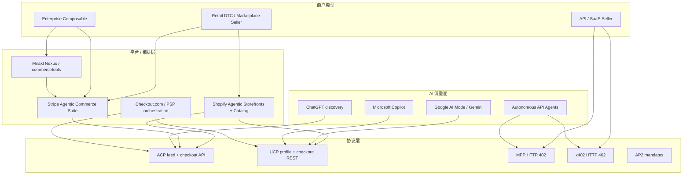

# 深度搜索报告 — Agentic Payments 商户 / 店家 / 平台侧

> **检索基准日**：2026-08-24  
> **时间范围**：2025-09 ACP 首发 → 2026-08 现状（重点 2026-01 UCP、2026-03 OpenAI pivot、2026-03 MPP）  
> **检索约束**：按 web-deep-search-spec v1.3，未读取 `clients/` 本地客户文档  
> **Loop 轮次**：6 轮（R0 意图拆解 → R1 英文广度 → R2 Google/Shopify 平台 → R3 OpenAI pivot/商户痛点 → R4 双协议/平台商 → R5 API 卖方 MPP/x402 → R6 中文补充）  
> **来源统计**：Tier 0 · 14 · Tier 1 · 11 · Tier 2 · 3  
> **置信度摘要**：MoR 归商户、ACS/Agentic Storefronts 接入路径、OpenAI 2026-03 转向 discovery 均已 Tier 0 互证；「双协议 +40% 流量」「ChatGPT 4% 平台费」仅 SEO/T1 单源链，未进执行摘要事实句。

---

## 1. 执行摘要

Agentic Payments 的**商户侧**在 2026 年分裂为三条清晰路径，而非「一套 API 打天下」：

1. **零售 / DTC（Shopify 生态）**：`Agentic Storefronts` 一次配置，Catalog  syndicate 到 ChatGPT、Copilot、Google AI Mode；UCP profile 由 Shopify 托管；checkout 可在各渠道开关。商户仍为 **Merchant of Record（MoR）**。
2. **Stripe 商户 / 企业（ACS 路径）**：**Agentic Commerce Suite** 提供 hosted ACP endpoint + catalog syndication + SPT 收款；也可自建 ACP REST。与 Wix、Mirakl、commercetools 等平台_partner 分发。
3. **API / SaaS 卖方（机器买方）**：不走 ACP/UCP 购物车，而走 **MPP / x402** HTTP 402——PaymentIntents + Dashboard 或 permissionless stablecoin。

**2026-03 行业拐点**：OpenAI **deprioritize 独立 Instant Checkout**，转向 **product discovery + 商户自有 checkout**（in-app browser / 商户站）。CNBC/TechCrunch 引述：catalog 不准、库存/税费/loyalty 复杂度、仅约 **12–30 家 Shopify 商户**曾 in-chat live。协议（ACP）继续演进，但**商户 playbook 从「在 ChatGPT 里结账」变成「在 ChatGPT 里被找到，在自己栈里成交」**。

**平台战争**：Google **UCP**（waitlist + Native REST + GPay）vs OpenAI **ACP discovery** vs **Stripe ACS** 作中立 syndication 层。Checkout.com、Visa/Mastercard 推动 **双协议（ACP+UCP）** 叙事；Google 官方称 UCP 与 ACP **coexist**。商户/engineering 真实成本是 **shared catalog + 双 endpoint**，不是选一个协议就结束。

**Clink 内容方向**：在已有协议 definition 系列（AP2/x402/MPP/ACP/UCP）之上，商户/平台线应写 **决策框架 + 接入 playbook + MoR/费率/数据**——面向 RevOps、电商负责人、平台 PM，而非再写一篇协议科普。

---

## 2. 搜索过程摘要

| 轮次 | 新增 query 示例 | 本轮增量发现 |
|------|----------------|--------------|
| R1 | `Stripe Agentic Commerce Suite merchant onboarding` | ACS modular；waitlist；6 个月/agent 定制集成痛点 |
| R2 | `Shopify Agentic Storefronts UCP 2026` | Admin 统一管理；Copilot/Google 分渠道 checkout 开关 |
| R2 | `site:developers.google.com UCP merchant waitlist` | 3 REST endpoints；SLO；Merchant Center 前置 |
| R3 | `CNBC OpenAI Instant Checkout merchants March 2026` | pivot 原因；~30 Shopify live；discovery-first |
| R3 | `site:checkout.com OpenAI ACP Google UCP merchant` | MoR；merchant-owned checkout 原则 |
| R4 | `Mirakl commercetools Stripe Agentic Commerce Suite` | 平台 orchestration 层（marketplace/enterprise） |
| R4 | `ACP UCP dual implementation merchant 2026` | 「one backend two protocols」行业建议（多 T1/SEO） |
| R5 | `B2B SaaS API MPP x402 merchant seller` | API 卖方走 MPP/x402，非 ACP cart |
| R6 | `agentic commerce 商户 Shopify 36氪 虎嗅` | 中文：Shopify/Stripe 受益者；MoR 光谱；数字税讨论 |

---

## 3. 搜索意图拆解

| 意图 | 检索词示例 | 结果状态 |
|------|------------|----------|
| 商户是谁：MoR、chargeback、PSP | `site:developers.openai.com merchant of record` | **已覆盖** T0 |
| Stripe 商户接入 ACS/ACP | `site:stripe.com Agentic Commerce Suite` | **已覆盖** T0 |
| Shopify 商户 Agentic Storefronts | `site:shopify.com agentic commerce` | **已覆盖** T0 |
| Google 商户 UCP 工程要求 | `site:developers.google.com merchant ucp checkout` | **已覆盖** T0 |
| 双协议策略 | `checkout.com ACP UCP difference` | **已覆盖** T1 |
| OpenAI pivot 对商户含义 | CNBC/TechCrunch March 2026 | **已覆盖** T1 |
| 平台/marketplace 中间层 | Mirakl Nexus, commercetools | **已覆盖** T0/T1 |
| API/SaaS 卖方 | MPP docs, Zuplo, Crossmint | **已覆盖** T0/T1 |
| 费率与平台抽成 | PYMNTS 4% ChatGPT fee | **部分**（单源 T1） |
| 双协议 +40% 流量 | Stellagent/Koddi 引用 | **待核实**（非 T0/T1 互证） |
| 中文商户实操 | 36氪/虎嗅/Shopify 中文稿 | **已覆盖** T1 |

---

## 4. 核心发现（多源验证）

### 4.1 三类「商户」 persona（Clink 选题轴）

| Persona | 典型主体 | 主协议/产品 | 接入形态 | 置信度 |
|---------|---------|------------|---------|--------|
| **Retail DTC** | Shopify 品牌、Etsy | UCP + ACP discovery | Agentic Storefronts；`/.well-known/ucp` | 已确认 |
| **Stripe / composable 零售** | DTC on Stripe, headless | ACP (+ UCP if Google) | ACS waitlist 或自研 5 endpoints | 已确认 |
| **Enterprise / Marketplace** | Mirakl, commercetools 客户 | ACS + 平台 orchestration | 平台 syndication，非单店自建 | 已确认 |
| **API / SaaS 卖方** | API、MCP tool、数据商 | **MPP / x402** | HTTP 402 + PaymentIntents | 已确认 |
| **Marketplace 平台方** | Mirakl Nexus | ACS + catalog AI | 帮 third-party sellers 上 agent 渠道 | 已确认 |

来源：[Shopify How agentic commerce works](https://www.shopify.com/blog/how-agentic-commerce-works) T0 · [Stripe ACS blog](https://stripe.com/blog/agentic-commerce-suite) T0 · [Crossmint protocols compared](https://www.crossmint.com/learn/agentic-payments-protocols-compared) T1

### 4.2 Merchant of Record：什么变了、什么没变

| 结论 | 来源 A | 来源 B | 置信度 |
|------|--------|--------|--------|
| **MoR 始终是商户**；OpenAI/Google 非 MoR | [OpenAI production FAQ](https://developers.openai.com/commerce/guides/production) T0 | [Checkout.com ACP vs UCP](https://www.checkout.com/blog/openai-acp-google-ucp-difference) T1 | **已确认** |
| Refund、chargeback、合规、对账单商户名 | OpenAI Key Concepts T0 | Checkout.com agentic Q&A T1 | **已确认** |
| 支付经商户 PSP；SPT / GPay cryptogram 为 delegated token | [Stripe SPT docs](https://docs.stripe.com/agentic-commerce/concepts/shared-payment-tokens) T0 | OpenAI Delegated Payment Spec T0 | **已确认** |

**写作要点**：Agentic 不改变 MoR——改变的是 **discovery 面与 checkout 面分离**、**agent 代客授权**、**机器流量风控**。

### 4.3 Stripe 商户路径：Agentic Commerce Suite（ACS）

| 能力 | 说明 | 来源 |
|------|------|------|
| Catalog → syndication | 上传/连接 PIM，Stripe hosted **ACP endpoint** | Stripe ACS blog T0 |
| Agent 选择 | Dashboard 选择要销售的 AI agents | 同上 |
| Checkout | Checkout Sessions + **SPT** | 同上 |
| 模块化 | discovery / checkout / payments 可拆开 | 同上 |
| 分发 | Wix、WooCommerce、BigCommerce、Mirakl、commercetools 等 | 同上 |
| 状态 | **Waitlist** rollout（非全员 GA） | Stripe blog T0 |

Stripe 官方痛点表述：每接一个新 agent 自建 public ACP endpoints + catalog 规范，**可达 ~6 个月**——ACS 卖点是 **single integration**。

### 4.4 Shopify 商户路径：Agentic Storefronts + Catalog

| 渠道 | 2026 状态（Shopify 官方） | Checkout 形态 |
|------|-------------------------|---------------|
| **ChatGPT** | 数百万 Shopify 商户 US buyer discoverable | **In-app browser → 商户自有 checkout**（post-March pivot） |
| **Microsoft Copilot** | Catalog discoverable；eligible 商户 Copilot Checkout | UCP + ECP |
| **Google AI Mode / Gemini** | Select US brands；逐步 rollout | UCP Native checkout |
| **Admin** | Settings → Agentic Storefronts；分渠道 Direct checkout 开关 | T0 |

Shopify Spring '26：**开发者无需 approval** 即可 register agent + 调用 public MCP Catalog endpoint（platform 侧开放）。

非 Shopify 品牌：**Agentic Plan** → 产品进 Shopify Catalog，卖进 AI channels。

### 4.5 Google 商户路径：UCP Native Checkout

**前置**：Active Merchant Center、合格 product feed、`native_commerce(checkout_eligibility)`、**waitlist 审批**。

**工程**：发布 `/.well-known/ucp`；实现 3 核心 REST：
- `POST /checkout-sessions`
- `PUT /checkout-sessions/{id}`
- `POST /checkout-sessions/{id}/complete`

**SLO（Google 要求）**：Create ≥95% 可用、p50 ≤1s；Complete p95 ≤10s 等。

**支付**：独立配置 **Google Pay payment handler**（非简单复用网站 GPay）。

来源：[Google UCP Overview](https://developers.google.com/merchant/ucp/guides) T0 · [Native checkout](https://developers.google.com/merchant/ucp/guides/checkout) T0

### 4.6 OpenAI 2026-03 Pivot：对商户的实际含义

| 之前叙事 | 2026-03 后 | 来源 |
|---------|-----------|------|
| In-chat Instant Checkout | **Discovery-first**；checkout 在商户 App/站 | CNBC 2026-03-24 T1 |
| 100 万 Shopify pipeline | ~**12–30** Shopify in-chat live（Forrester 引述） | CNBC/TechCrunch T1 |
| ACP = 在 ChatGPT 成交 | ACP = **feed + 可选 checkout API**；商户控 checkout | OpenAI merchant page T0 |
| 平台 completion fee 叙事 | Discovery 跳转自有站：**无平台成交费**（OpenAI FAQ，mid-2026） | CNBC + chatgpt.com/merchants |

OpenAI 原话（CNBC 引述）：*"initial version of Instant Checkout did not offer the level of flexibility… allowing merchants to use their own checkout experiences while we focus on product discovery."*

**商户必做**：structured **product feed**、实时 inventory/pricing、tax/shipping/loyalty 规则——否则 discovery 也会翻车。

### 4.7 双协议：ACP + UCP「One Backend, Two Protocols」

| 维度 | ACP（OpenAI 系） | UCP（Google/Shopify 系） |
|------|-----------------|------------------------|
| 2026 主职能 | **Demand / discovery**（ChatGPT） | **Transaction infra** + Google 面 checkout |
| 商户工程 | 5× `/checkout_sessions` + webhooks + feed | `/.well-known/ucp` + 3× checkout-sessions REST |
| 平台费 | Historic Instant Checkout ~**4%**（PYMNTS 引 Shopify 发言人，**单源 T1**） | Google 侧强调 **processor fees only**（PYMNTS 对比，单源） |
| 关系 | **互补** | Google 称与 ACP **coexist** |

Checkout.com（T1）：商户应同时捕获 OpenAI 生态与 Google 高意图流量；Checkout 提供 ACP/UCP/AP2 翻译层。

**「双协议 +40% agent traffic」**：见于 Stellagent/SEO 文引 Koddi——**无 Tier 0/1 独立互证** → 仅作行业猜测，不可作硬事实。

### 4.8 平台 / Marketplace 中间层

| 平台 | 角色 | 来源 |
|------|------|------|
| **Mirakl Nexus** | Marketplace 卖家 agentic catalog  enrichment + Stripe ACS 连接 | Mirakl T0 |
| **commercetools AI Hub** | Enterprise composable + ACS；catalog 一致性 | commercetools press T0 |
| **Checkout.com** | Enterprise PSP；ACP 支持（2025-11）+ UCP/AP2 | Checkout newsroom T0 |
| **Stripe** | ACS + MPP + x402 + ACP co-maintainer + UCP Tech Council | 多 T0 |

平台型商户的决策不是「要不要 UCP」，而是 **谁来做 catalog normalization 与 multi-seller syndication**。

### 4.9 API / SaaS 卖方（非零售 cart）

| 场景 | 协议 | 商户动作 |
|------|------|---------|
| Agent 按次调 API | **MPP** 或 **x402** | `mppx` middleware / 402 handler；Dashboard 见账 |
| Agent 买零售商品 | **ACP / UCP** | Feed + checkout sessions |
| 高合规 delegated spend | **AP2** mandates | 叠加在 MPP/ACP 之上 |

来源：[Stripe machine payments](https://docs.stripe.com/payments/machine) T0 · [Crossmint](https://www.crossmint.com/learn/agentic-payments-protocols-compared) T1 · [Zuplo gateway guide](https://zuplo.com/learning-center/api-gateway-agentic-payments) T1

---

## 5. 时间线（商户视角）

| 日期 | 事件 | 商户影响 |
|------|------|---------|
| 2025-09 | ACP + ChatGPT Instant Checkout；Etsy live | 零售试点 MoR 不变 |
| 2025-12 | Stripe **ACS** 发布；Mirakl/commercetools 合作 | Stripe 商户 waitlist |
| 2026-01 | **UCP** NRF 发布；Shopify Agentic Storefronts | Shopify 一键 syndicate |
| 2026-02 | Buy it in ChatGPT 扩至 Free 用户 | Demand↑，supply 未同步 |
| 2026-03 | OpenAI **deprioritize** standalone Instant Checkout | **Discovery + 自有 checkout** 成默认 |
| 2026-03-18 | **MPP** + Tempo；Visa card MPP spec | API 卖方新收款面 |
| 2026-04 | UCP Tech Council + Amazon/Meta/MSFT；ACP spec 2026-04-17 | 双协议常态化 |
| 2026-07 | Shopify Spring '26：公开 MCP Catalog | Agent 开发者自助接入 |
| 2026-08 | Google UCP checkout 仍 selective + waitlist | Enterprise 工程向 |

---

## 6. 实体关系（商户 / 平台 / 协议）

---

## 7. 增量信息

### 7.0 增量对照表

| 增量主张 | 相对 Tier 0 的新增点 | 首见来源 | 互证 | 验证结果 | 置信度 |
|---------|---------------------|---------|------|---------|--------|
| Instant Checkout 仅 ~30 Shopify live | 官方称 100 万+ pipeline | CNBC T1 | TechCrunch T1 | 很可能 | 很可能 |
| Discovery 无平台成交费 | OpenAI 未强调 fee 结构 | chatgpt.com/merchants T0 | CNBC T1 | 已确认 | 已确认 |
| ACS 每 agent ~6 个月自建 | 官方未写数字 | Stripe ACS blog T0 | Marcel van Oost T2 | 很可能（官方有 pain，数字单源） | 很可能 |
| 双协议 +40% traffic | 无 Google/Stripe 官方 | Stellagent SEO T? | 无 T0/T1 | **验证失败** | — |
| ChatGPT ~4% platform fee | OpenAI 称 "small fee" | PYMNTS T1 | The Information 转引 | 很可能（单源链） | 很可能 |
| Shopify AI 转化 2× generic AI search | 官方未写 | 36氪引 Shopify 财报电话 T1 | 无第二 T1 | 待核实 | 待核实 |
| Modern Retail：零售商要 loyalty/BOPI 才 prime time | OpenAI roadmap 未列全 | Modern Retail T1 | CNBC 同类痛点 T1 | 很可能 | 很可能 |

### 7.1 已验证增量信息

- **March 2026 pivot** 是商户 playbook 分水岭：从 in-chat 成交 → discovery + merchant checkout（OpenAI + CNBC + TechCrunch）。
- **Shopify 默认 opt-out Agentic Storefronts**（ansezz/Shopify 生态 T1 + Shopify dev docs T0 方向一致）：商户应主动验证 Admin 开关与 `/.well-known/ucp`。
- **Checkout.com** 明确：ACP 演进为 enablement layer，**merchant owns checkout**（T1，与 OpenAI T0 一致）。
- **Instacart 模式**（Modern Retail）：discovery in agent，**transaction on own site**——代表 grocery 复杂 basket 商户的首选架构。

### 7.2 未通过验证的传闻

| 传闻 | 拒绝原因 |
|------|---------|
| Dual-stack 精确 +40% agent traffic | 仅 SEO/Consulting 引 Koddi；无 Tier 0/1 |
| 「ACP 已死」 | 与 OpenAI/Stripe spec 2026-04-17 维护矛盾 |

### 7.3 权威媒体解读

- **Checkout.com**：ACP = OpenAI 生态 demand；UCP = Google 高意图转化；商户应 **both**。
- **CNBC/Modern Retail**：失败主因是 **merchant readiness**（inventory、tax、loyalty），不是 lack of demand。
- **虎嗅/a16z 引用文**（T1 评论）：MoR 光谱决定平台天花板；Stripe/Shopify 是基础设施受益者；ChatGPT 抽佣可能从 2% 升至 10–15%——**分析/opinion，非事实**。

### 7.4 社区反响

检索范围内 **HN 商户向 deep thread 有限**；舆论主要在 Tier 1 零售媒体。商户 C-suite 引述（Modern Retail）：不愿把 checkout 完全交给 agent，除非 real-time inventory + promotions + loyalty 就绪。

### 7.5 争议与风险

| 风险 | 说明 |
|------|------|
| **Catalog 质量** | 不准 inventory/price → discovery 也损品牌 |
| **Dual-stack 工程税** | ACP 5 endpoints + UCP 3 endpoints + feed 同步 |
| **Agent fraud / bot traffic** | Stripe Radar bot abuse preview；需区分合法 agent |
| **数据黑洞** | 站外/agent 成交 → 第一方行为数据减弱（虎嗅讨论，opinion） |
| **Waitlist 不确定** | ACS、Google UCP 非 self-serve GA |
| **平台费不透明** | Instant Checkout 时代 4% 是否延续到 App 模式 unclear |

### 7.6 竞品与行业对照

| 路径 | 适合商户 | 不适合 |
|------|---------|--------|
| Shopify Agentic Storefronts | 已在 Shopify 的 DTC | Headless 非 Shopify |
| Stripe ACS | 已在 Stripe + catalog | 纯 API 无 SKU |
| 自研 ACP/UCP | Enterprise、custom stack | SMB 无工程带宽 |
| MPP/x402 only | API/MCP monetization | 物理商品 retail |
| Mirakl/commercetools | Marketplace / enterprise | 单店 |

### 7.7 中文语境

- **36氪**：Shopify Catalog + Sidekick + Agentic Storefronts；AI 搜索转化 2×（单源，待互证）。
- **虎嗅**：MoR 与「数字税」框架；Stripe/Shopify 为基础设施赢家。
- **ansezz 等技术博客**：Shopify UCP quick-start 实操（验证 manifest、Agentic 开关）。

---

## 8. 分歧与待核实

| 项 | 说法 A | 说法 B | 建议 |
|----|--------|--------|------|
| 商户优先顺序 | SEO 文：UCP first | SEO 文：ACP first for ChatGPT reach | 按 **流量来源**：Google 强→UCP；ChatGPT 强→ACP feed |
| Shopify in-chat | 2025 营销「Copilot/Google checkout」 | 2026-03 后 ChatGPT 仅 browser checkout | 以 **2026-03 后** Shopify 公告为准 |
| 4% fee | PYMNTS 引 Shopify 发言人 | OpenAI "small fee" | 引用时标注 **Instant Checkout 时期**、单源 |
| +40% dual-stack | Koddi/Stellagent | 无官方 | **不写进 Clink 事实句** |

---

## 9. 对用户问题的直接回答

### 9.1 「店家 / 商户 / 平台」在 Agentic Payments 里指什么？

- **Merchant（商户/店家）**：仍是对客销售、收单、MoR、处理 refund/dispute 的主体——OpenAI、Google、Shopify 文档一致。
- **Platform（平台）** 有三层：(1) **Commerce platform** — Shopify、Mirakl、commercetools；(2) **Payment platform** — Stripe ACS、Checkout.com；(3) **AI surface** — ChatGPT、Google、Copilot（流量与 discovery，非 MoR）。
- **Seller（卖方）** 在 marketplace 场景由 Mirakl 等 orchestration 代表；在 API 场景卖方是 **API provider**，协议是 MPP/x402 而非 ACP cart。

### 9.2 2026 年商户应先做什么？

1. **Retail on Shopify**：确认 Agentic Storefronts + Catalog 质量（GTIN、库存、结构化 metafields）。
2. **Stripe retail**：评估 ACS waitlist vs 自研 ACP；准备 catalog feed + SPT。
3. **Google 意图流量**：Merchant Center + UCP waitlist + 3 REST endpoints（工程向）。
4. **API/SaaS**：MPP 或 x402 pilot（与零售协议正交）。
5. **所有类型**：接受 **discovery / checkout 分离**；投资 **feed 新鲜度** 胜过 in-chat UI 幻想。

---

## 10. Clink 内容选题建议（商户 / 平台线）

> 与现有 `agentic-payments/` 协议 definition（26–29, 33）及 `industry-news/`（15, 18）互补。

### P0 — Definition / Playbook（`agentic-payments/` 或根目录 Product）

| 建议 slug | 类型 | 主关键词 | 核心论点 |
|-----------|------|---------|---------|
| `merchant-of-record-agentic-payments` | Product/Research | merchant of record agentic payments | MoR 不变；chargeback/PSP/对账单 |
| `how-to-prepare-catalog-agentic-commerce` | Product | agentic commerce product feed | Feed 质量 = discovery 成败 |
| `shopify-vs-stripe-agentic-commerce` | Comparison | Shopify Agentic Storefronts vs Stripe ACS | 两条商户高速公路 |
| `acp-ucp-dual-stack-merchants` | Product | ACP UCP dual implementation | One backend, two protocols 工程清单 |
| `retail-vs-api-agentic-payments` | Comparison | agentic payments retail vs SaaS API | ACP/UCP vs MPP/x402 决策树 |

### P1 — Industry News / Opinion

| 建议 slug | 类型 | 触发事件 |
|-----------|------|---------|
| `openai-discovery-pivot-merchants` | Industry News | 2026-03 pivot（可更新 18 号 OpenRouter 文互链） |
| `google-ucp-merchant-waitlist-guide` | Product | UCP SLO + waitlist |
| `stripe-agentic-commerce-suite-waitlist` | Product | ACS 模块化与 waitlist |
| `marketplace-agentic-commerce-mirakl` | Industry News | 平台 seller 视角 |

### P2 — 与 Clink 产品衔接（≤25% Clink）

| 角度 | 说明 |
|------|------|
| Multi-PSP + agent traffic | 人类 checkout vs agent SPT/402 并存 → [smart routing](/blog/smart-routing) |
| Agent buyer harness | 买方 guardrails（15 号 Cloudflare 文）vs 卖方 MPP（28 号） |
| Subscription SaaS | Agent 买 API ≠ 替代 subscription billing → [what-is-clink](/blog/what-is-clink) 边界 |

### 建议下一篇 NN

根目录 pipeline **24** 或 agentic 簇 **31**（跳过 30 stripe-risk）：首推 **`merchant-of-record-agentic-payments`** 或 **`retail-vs-api-agentic-payments`**（与五协议文形成「栈 + 商户决策」闭环）。

---

## 11. 参考链接（按 Tier）

### Tier 0

- https://stripe.com/blog/agentic-commerce-suite
- https://stripe.com/use-cases/agentic-commerce
- https://docs.stripe.com/agentic-commerce/acp
- https://docs.stripe.com/payments/machine
- https://www.shopify.com/blog/how-agentic-commerce-works
- https://www.shopify.com/news/ai-commerce-at-scale
- https://www.shopify.com/news/spring-26-edition-dev
- https://shopify.dev/docs/agents
- https://developers.google.com/merchant/ucp/guides
- https://developers.google.com/merchant/ucp/guides/checkout
- https://developers.openai.com/commerce/guides/key-concepts
- https://developers.openai.com/commerce/guides/production
- https://chatgpt.com/merchants/
- https://www.mirakl.com/news/agentic-commerce-mirakl-stripe-partnership

### Tier 1

- https://www.cnbc.com/2026/03/24/openai-revamps-shopping-experience-in-chatgpt-after-instant-checkout.html
- https://techcrunch.com/2026/03/24/openais-plans-to-make-chatgpt-more-like-amazon-arent-going-so-well/
- https://www.modernretail.co/technology/what-went-wrong-with-chatgpts-instant-checkout/
- https://www.checkout.com/blog/openai-acp-google-ucp-difference
- https://www.checkout.com/blog/openai-agentic-commerce-shift
- https://www.pymnts.com/news/ecommerce/2026/shopify-merchants-to-pay-4percent-fee-on-sales-made-through-chatgpt-checkout/
- https://bhalli.dev/blogs/stripe-agentic-commerce-integration
- https://www.crossmint.com/learn/agentic-payments-protocols-compared
- https://zuplo.com/learning-center/api-gateway-agentic-payments
- https://www.huxiu.com/article/4826272.html
- https://36kr.com/p/3864201751385351

### Tier 2

- https://stellagent.ai/insights/ucp-vs-acp-commerce-protocol-comparison（含未验证 +40% 主张，引用时谨慎）

---

*本报告按 web-deep-search-spec v1.3 生成，检索日 2026-08-24，共 6 轮 loop。*
