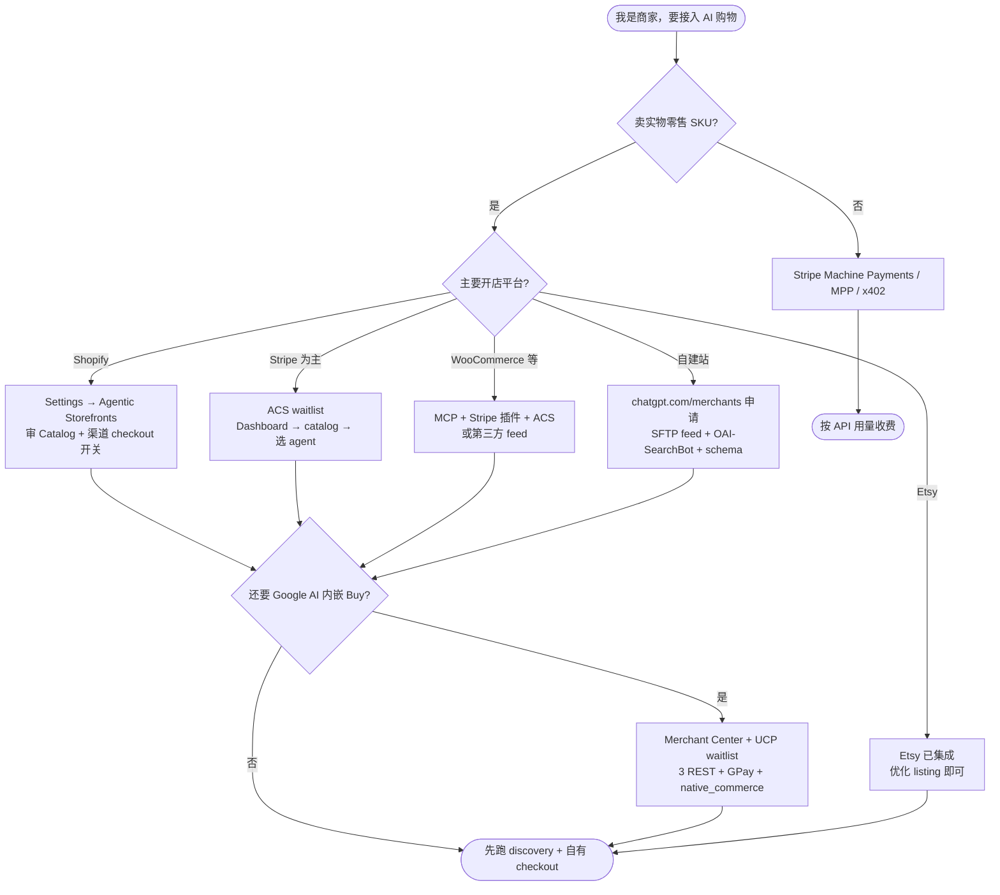

# 商户视角：我会搜什么？如何接入 Agentic Payments？

> **检索基准日**：2026-08-24  
> **定位**：站在**电商负责人 / 店主 / RevOps** 角度，还原真实搜索词 → 对应官方答案 → 分平台接入步骤  
> **与上一版关系**：[`agentic-payments-merchant-platform-web-search-2026-08-24.md`](./agentic-payments-merchant-platform-web-search-2026-08-24.md) 偏行业分析；本文偏 **「我是商家，今晚就要动手」**

---

## 1. 先说人话：Agentic Payments 对商家意味着什么？

**你不需要先懂 ACP、UCP、MPP。** 商家真正关心的是三件事：

| 商家问题 | 2026 年答案（一句话） |
|---------|---------------------|
| 我的货怎么出现在 ChatGPT / Google AI 里？ | 交 **商品 feed（目录）**，或让 **Shopify / Etsy** 自动同步 |
| 顾客在哪付钱？ | **默认在你自己的网站/App 结账**（2026-03 后 OpenAI 主流路径）；Google/Copilot 可选 **AI 内嵌 checkout** |
| 谁负责退款、chargeback、开发票？ | **始终是你（商户）**，不是 OpenAI/Google |

**「接入 Agentic Payments」≠ 接一个新支付网关。** 更准确说是：

1. **被发现**（feed + 爬虫 + 目录质量）  
2. **被信任**（政策页、库存/价格准确、Shop Pay / GPay 等）  
3. **能成交**（自有 checkout 或协议 checkout + 你现有 PSP）

---

## 2. 商家会搜什么？（Query 矩阵）

按 **购买旅程阶段** 分组。Clink 写稿时，**标题应尽量贴近左列 query**，而不是协议名。

### 2.1 认知阶段 —「这是什么，跟我有关系吗？」

| 商家真实 query（EN） | 商家真实 query（中文） | 他们在找什么 | 官方/权威落点 |
|---------------------|----------------------|-------------|--------------|
| `what is agentic commerce for merchants` | `AI 购物 商家 是什么` | 概念、要不要跟进 | [Shopify How agentic commerce works](https://www.shopify.com/blog/how-agentic-commerce-works) |
| `sell products on ChatGPT merchant` | `ChatGPT 卖东西 商家` | 能不能卖、怎么卖 | [chatgpt.com/merchants](https://chatgpt.com/merchants/) |
| `ChatGPT shopping for small business` | `ChatGPT 购物 小店` | SMB 是否 eligible | 同上 + Shopify Help |
| `AI shopping Google Gemini merchant` | `Google AI 购物 商家 接入` | Google 面机会 | [Google UCP Help](https://support.google.com/merchants/answer/16837055) |
| `is ChatGPT checkout still available` | `ChatGPT 即时结账 还有吗` | Instant Checkout 是否还在 | OpenAI FAQ：**已转向 discovery** |
| `agentic commerce vs Amazon marketplace fees` | `AI 购物 平台费 对比亚马逊` | 费率对比 | OpenAI：**自有站成交无平台费**；historic Instant Checkout 4% 见 §5 |

### 2.2 决策阶段 —「我用哪条路最省事？」

| 商家真实 query | 隐含条件 | 推荐路径 |
|---------------|---------|---------|
| `Shopify ChatGPT setup` / `Shopify agentic storefronts enable` | 已在 Shopify | **Settings → Sales channels → Agentic**（多数已默认开启） |
| `Etsy ChatGPT shopping` | Etsy 卖家 | **已集成**，无需单独申请 OpenAI |
| `Stripe agentic commerce suite waitlist` | 用 Stripe、非 Shopify | [ACS waitlist](https://go.stripe.global/agentic-commerce-contact-sales) |
| `WooCommerce sell on ChatGPT` | WooCommerce | MCP + Stripe for WooCommerce + ACS（**无一键**，偏 DIY） |
| `BigCommerce ChatGPT integration` | BigCommerce | Stripe ACS 或 Storefront MCP |
| `how to submit product feed ChatGPT` | 自建站 / Magento / 独立品牌 | [chatgpt.com/merchants](https://chatgpt.com/merchants/) 申请 → SFTP feed |
| `Google UCP merchant waitlist apply` | 想 Google AI Mode 内购 | Merchant Center + [兴趣表单](https://support.google.com/merchants/contact/ucp_integration_interest) + **工程实现 3 个 API** |
| `sell API to AI agents payments` | SaaS/API 卖方 | **不是 retail 路径** → Stripe [Machine payments](https://docs.stripe.com/payments/machine)（MPP/x402） |

### 2.3 实操阶段 —「具体点哪、交什么文件？」

| 商家真实 query | 任务类型 | 关键动作 |
|---------------|---------|---------|
| `Shopify agentic storefronts requirements Shop Pay` | 资格检查 | US 买家、Catalog 合格、Shop Pay、三份政策页 |
| `OpenAI product feed spec SFTP` | Feed 搭建 | CSV/JSON + `is_eligible_search` + 每日/15min 刷新 |
| `robots.txt OAI-SearchBot allow` | 爬虫 | 允许 `OAI-SearchBot`，否则 feed 也可能不展示 |
| `JSON-LD Product schema ChatGPT` | 页面结构化 | Product schema + 与 feed 字段一致 |
| `Google Merchant Center native_commerce attribute` | Google UCP 商品标记 | Supplemental feed 设 `native_commerce` |
| `Stripe dashboard agentic commerce get started` | Stripe 零售商户 | Dashboard → Agentic commerce → Profile + catalog + 选 agent |
| `how to opt out Shopify agentic storefronts` | 退出/控渠道 | 关 `Allow Shopify to manage for me`；分渠道关 direct checkout |

### 2.4 成本与风险阶段 —「我要花多少钱？会不会被坑？」

| 商家真实 query | 2026-08 事实（商户口径） | 来源 |
|---------------|------------------------|------|
| `ChatGPT merchant fees 2026` | **Discovery + 跳转自有站：OpenAI 称无成交平台费** | [chatgpt.com/merchants](https://chatgpt.com/merchants/) T0 |
| `ChatGPT 4 percent fee Shopify` | **Instant Checkout 时代** Shopify 发言人确认 4%（2026-01）；**2026-03 pivot 后 in-chat 非主流** | PYMNTS / SmartCompany T1 |
| `Google AI Mode checkout fees merchant` | Google 叙事：**processor fees only**（与 ChatGPT 4% 对比文） | PYMNTS、SEO 对比文 T1 |
| `who is merchant of record ChatGPT` | **商户**；OpenAI 非 MoR | OpenAI Key Concepts T0 |
| `ChatGPT shopping chargeback who pays` | **商户 + 自有 PSP** | OpenAI production guide T0 |
| `agentic commerce product feed wrong inventory` | Catalog 不准 → 推荐错/超卖 → 品牌损伤 | CNBC/Modern Retail T1 |

### 2.5 工程师会被老板丢来的 query（商户侧技术）

| Query | 说明 |
|-------|------|
| `ACP checkout_sessions API merchant implement` | 自研 ACP 5 endpoints（非 ACS hosted 时） |
| `UCP checkout-sessions REST merchant SLO` | Google Native checkout 3 endpoints + p50≤1s 等 |
| `Stripe shared payment token SPT merchant` | Agent 代客支付时的 scoped token |
| `WooCommerce MCP enable REST API key` | WooCommerce 10.3+ MCP beta |

---

## 3. 三十秒自检：你是哪类商家？

```
                    ┌─────────────────────────────────────┐
                    │  我卖的是实物/零售 SKU 吗？          │
                    └──────────────┬──────────────────────┘
                           是 │              │ 否（卖 API/SaaS/数据）
                              ▼              ▼
                    ┌──────────────┐   ┌──────────────────┐
                    │ 用什么开店？  │   │ MPP / x402 路径   │
                    └──────┬───────┘   │ 见 §6            │
           Shopify ────────┤           └──────────────────┘
           Stripe ─────────┤
           WooCommerce ────┤
           自建/其他 ───────┘
                              │
                              ▼
              读 §4 对应平台的「商家步骤清单」
```

---

## 4. 分平台接入：商家步骤清单

> 原则：**先让商品能被 AI 找到，再考虑 AI 内结账。** 2026 年多数 ChatGPT 流量会 **跳转到你的店**。

### 4.1 Shopify 商家（最低摩擦 — 多数 DTC 从这里开始）

**你会搜**：`how to sell Shopify products in ChatGPT` · `Shopify agentic storefronts settings`

| 步骤 | 做什么 | 在哪 |
|------|--------|------|
| 1 | 确认已 eligible（卖美国买家、Shop Pay、政策页齐全） | [Shopify requirements](https://help.shopify.com/en/manual/online-sales-channels/agentic-storefronts/requirements) |
| 2 | 打开 **Settings → Sales channels → Agentic**，审阅渠道开关 | [Managing agentic storefronts](https://help.shopify.com/en/manual/online-sales-channels/agentic-storefronts/agentic-home) |
| 3 | 检查 **Shopify Catalog** 里 top SKU 是否 eligible（不合格=静默不展示） | Admin → Catalog |
| 4 | **ChatGPT**：discovery → 顾客 **in-app browser 到你店 checkout**（无 per-channel 开关） | Shopify 官方 2026-03 后 |
| 5 | **Copilot / Google AI Mode / Gemini**：决定是否开 **Direct checkout**（AI 内嵌 vs 跳店） | 同上 Agentic 各渠道设置 |
| 6 | 优化 listing：真实标题、完整描述、GTIN/variant、库存准 | — |
| 7 | GA4 加 `utm_source=chatgpt.com` 等监测 referral | — |

**不需要**：单独去 OpenAI 申请 feed（Shopify Catalog 已 syndicate）。

**常见误区**：
- 「我什么都没做就应该已经在 ChatGPT 里了」→ 2026-03 起 **opt-out 默认开启**，但仍需满足 Catalog/政策/Shop Pay。
- 「4% 平台费是常态」→ **仅 historic in-chat Instant Checkout**；discovery 跳自有站 **OpenAI 称无成交费**（与 SEO 文写 4% Agentic fee 冲突 → 以 OpenAI 官方 FAQ 为准，4% 标注为旧模式）。

---

### 4.2 Etsy 商家

**你会搜**：`Etsy ChatGPT shopping integration`

| 步骤 | 做什么 |
|------|--------|
| 1 | **无需** chatgpt.com/merchants 申请 |
| 2 | 保证 listing 质量、美国可售、库存准确 |
| 3 | 成交在 Etsy 自有 flow（discovery in ChatGPT） |

来源：[chatgpt.com/merchants](https://chatgpt.com/merchants/) — *"If you sell through Shopify or Etsy, your catalog is already integrated."*

---

### 4.3 非 Shopify 零售（自建 Magento、独立站、DTC 自研）

**你会搜**：`how to get products into ChatGPT shopping` · `OpenAI merchant application` · `product feed ChatGPT SFTP`

| 步骤 | 做什么 | 备注 |
|------|--------|------|
| 1 | **robots.txt 允许 `OAI-SearchBot`** |  blocked = 隐形 |
| 2 | 全站 **JSON-LD Product** schema，与 feed 字段一致 | 爬虫 + feed 双路径 |
| 3 | 到 **[chatgpt.com/merchants](https://chatgpt.com/merchants/)** 填表申请 | 批准前无法传 feed |
| 4 | 按 [Product Feed Spec](https://developers.openai.com/commerce/specs/file-upload/products) 建 CSV/JSON | 必填 `is_eligible_search`；checkout  flag 2026 多数商户设 false |
| 5 | 获批后拿 **SFTP 凭证**，至少 **每日全量**，快周转可 **~15 分钟** | 非 Merchant Center 上传 |
| 6 | 顾客从 ChatGPT **跳你网站 checkout** | 无 OpenAI 成交费（官方） |
| 7 | （可选）大型零售商：**ChatGPT App** 深集成（Walmart 模式） | 工程量大 |

**并行路径**：通过 **Stripe / Salesforce** 等 approved provider 交 feed（OpenAI 官方提及，仍须 onboarding）。

---

### 4.4 Stripe 零售商户 — Agentic Commerce Suite（ACS）

**你会搜**：`Stripe agentic commerce how to get started` · `sell through AI agents Stripe dashboard`

| 步骤 | 做什么 |
|------|--------|
| 1 | [Join waitlist](https://go.stripe.global/agentic-commerce-contact-sales)（**private preview**，非自助全开） |
| 2 | Stripe 账户激活 + 2FA + 银行账户 |
| 3 | Dashboard → **[Agentic commerce](https://dashboard.stripe.com/agentic-commerce)** → 创建 **Stripe Profile**（ToS/隐私/退货政策） |
| 4 | 上传 **catalog feed**；配 tax code（Stripe Tax 或 Anrok） |
| 5 | 选择要卖的 **AI agent** → **Request connection**（agent 侧也要 accept） |
| 6 | 订单事件回你现有 OMS；MoR 仍是你 |

**平台伙伴捷径**（你在这些平台上）：Wix、WooCommerce、BigCommerce、Squarespace、commercetools — 通过平台内 Stripe 集成接 ACS，而非从零写 ACP。

**自研栈（高工程）**：ACS **custom** 路径 — 自建 ACP checkout endpoints + SPT confirmation hook + 自有 PSP。

来源：[Stripe for sellers](https://docs.stripe.com/agentic-commerce/for-sellers) T0

---

### 4.5 WooCommerce / BigCommerce / Wix 商家

**你会搜**：`WooCommerce ChatGPT agentic commerce setup` · `BigCommerce Stripe agentic commerce`

| 平台 | 商家动作（2026） |
|------|-----------------|
| **WooCommerce** | ① 结构化 product data ② 可选开 **MCP**（Settings → Advanced → Features）③ **Stripe for WooCommerce** → ACS waitlist ④ Google 面：Merchant Center feed + 第三方 UCP 插件（**无 core UCP**） |
| **BigCommerce** | Stripe ACS **单连接** syndicate 多 agent；或 Storefront MCP + UCP 路线 |
| **Wix / Squarespace** | Stripe ACS 平台集成（waitlist/rollout 依账户） |

**商户体感**：比 Shopify **多几步、可能要开发者**；卖点是 **不被单一平台锁死**。

---

### 4.6 Google 商家 — UCP Native Checkout（要「Buy」按钮在 AI Mode 里）

**你会搜**：`Google UCP merchant how to apply` · `Universal Commerce Protocol checkout setup`

> ⚠️ **这是零售里工程最重的一条路**，适合已有 Google Shopping 体量、有 dev 资源的品牌。

| 步骤 | 做什么 |
|------|--------|
| 1 | **Merchant Center** 账户健康、feed 合规、退货/客服信息完整 |
| 2 | Supplemental feed 标记 **`native_commerce(checkout_eligibility)`** |
| 3 | 填 **[UCP Integration Interest Form](https://support.google.com/merchants/contact/ucp_integration_interest)**（美国/加/澳/英 fulfillment） |
| 4 | **先完成** [UCP developer guide](https://developers.google.com/merchant/ucp/guides) 技术实现，再等审批 |
| 5 | 发布 **`/.well-known/ucp`** profile |
| 6 | 实现 **3 个 REST**：create / update / complete checkout session |
| 7 | 配置 **Google Pay payment handler**（可与网站 GPay 分开配） |
| 8 | Merchant Center sandbox 验证 → go live |

**商户仍 MoR**；checkout 可在 Google 面完成，但订单/退款归你。

---

### 4.7 API / SaaS 卖方（不是零售 cart）

**你会搜**：`charge AI agents for API calls` · `HTTP 402 payment API` · `Stripe machine payments`

| 步骤 | 做什么 |
|------|--------|
| 1 | 确认你是 **按次/按量卖 API、MCP tool、数据** — 不是卖 T 恤 |
| 2 | Stripe Dashboard → **Machine payments** / MPP；或接 **x402** middleware |
| 3 | Agent 发 HTTP 402 → PaymentIntent → 你 Dashboard 见账 |
| 4 | **不要**去 chatgpt.com/merchants 交 retail feed |

与 retail 的 ACP/UCP **正交**；Clink 已有 [what-is-mpp](/blog/what-is-machine-payments-protocol) / [what-is-x402](/blog/what-is-x402) 可互链。

---

## 5. 商家最关心的费用表（2026-08 口径）

| 场景 | 平台额外费 | 你还付什么 | 置信度 |
|------|-----------|-----------|--------|
| ChatGPT **发现** → 顾客在你 **网站/App** 成交 | **OpenAI 称无成交平台费** | 正常 PSP（Shopify Payments 等） | T0 官方 |
| ChatGPT **Instant Checkout**（in-chat，已 deprioritize） | 曾报 **~4%**（Shopify 发言人） | + ~2.9% 处理费 | T1 单源链 |
| Google AI Mode UCP checkout | 叙事：**仅 processor** | GPay/PSP | T1 |
| Copilot checkout（Shopify 路径） | SEO 对比文常写 **0% 额外** | Shopify 处理费 | T1 |
| OpenAI **product feed** 提交 | **无 per-transaction feed 费**（官方 merchants 页） | 内部 feed 运维成本 | T0 |
| ChatGPT **Ads** | 自助 CPC，**$50k 起**（SEO 文引 OpenAI） | 广告预算 | T2 待互证 |

**给财务的一句话**：2026 年默认模型是 **「AI 引流，店里收钱」** — 平台成交费压力小于 2025-09 Instant Checkout 叙事，但 **feed 质量与归因** 变成隐性成本。

---

## 6. 商家接入决策树（一图流）



---

## 7. 商家第一周 Checklist（不分平台）

| # | 任务 | 为什么 |
|---|------|--------|
| 1 | 查清自己平台 **Agentic / ACS / Agentic Storefronts** 开关状态 | 很多 Shopify 店已 live 但 owner 不知道 |
| 2 | Top 50 SKU：**价格、库存、图片、GTIN** 与后台一致 | AI 推荐错一次 = 永久不信任 |
| 3 | **robots.txt** 未 block `OAI-SearchBot` | 非 Shopify 必做 |
| 4 | 退货/隐私/ToS 政策 URL 可访问 | OpenAI feed checkout flag、Stripe Profile 都要 |
| 5 | GA4 / Shopify Analytics 监测 **chatgpt.com / google AI referral** | 否则无法算 ROI |
| 6 | 与客服对齐：**「我在 ChatGPT 看到你们商品」** 话术 | 新渠道客诉 |
| 7 | 财务对齐：**MoR 不变**；historic 4% 仅旧 in-chat 模式 | 避免错误预算 |

---

## 8. Clink 文章：商户 keyword-first 选题

> 标题用 **商家会搜的 query**，正文再映射到 ACP/UCP/ACS。slug 仍 `/blog/{slug}`。

### P0（强烈建议下一篇）

| 建议 title（含 primary keyword） | 对应 merchant query 簇 | slug 建议 |
|-----------------------------------|----------------------|-----------|
| **How to Sell on ChatGPT in 2026: A Merchant Setup Guide** | `how to sell on ChatGPT merchant` | `how-to-sell-on-chatgpt-merchant-guide` |
| **Shopify Agentic Storefronts: Setup, Fees, and Checkout Options** | `Shopify agentic storefronts setup fees` | `shopify-agentic-storefronts-merchant-guide` |
| **How to Connect Agentic Payments on Stripe (ACS Waitlist Explained)** | `Stripe agentic commerce suite merchant` | `stripe-agentic-commerce-merchant-setup` |
| **ChatGPT Product Feed Setup for Non-Shopify Merchants** | `OpenAI product feed SFTP merchant` | `chatgpt-product-feed-merchant-setup` |
| **Retail vs API: Which Agentic Payment Path Is Right for Your Business?** | `agentic payments merchant vs API seller` | `retail-vs-api-agentic-payments-merchants` |

### P1

| title 方向 | query |
|-----------|-------|
| Google UCP Merchant Waitlist: What to Prepare Before You Apply | `Google UCP merchant waitlist` |
| WooCommerce Agentic Commerce: MCP, Stripe, and What Shopify Does Automatically | `WooCommerce ChatGPT setup` |
| ChatGPT Shopping Fees in 2026: Discovery vs Instant Checkout | `ChatGPT merchant fees 2026` |
| Who Pays Chargebacks in Agentic Checkout? (Merchant of Record Explained) | `merchant of record ChatGPT` |

### 与现有协议文内链策略

- 商户文 **正文前 30%** 只讲步骤与 query；**中段** 用 1 段链到 [what-is-acp](/blog/what-is-agentic-commerce-protocol) / [what-is-ucp](/blog/what-is-universal-commerce-protocol)
- Hub [`agent-payments`](/blog/agent-payments) 增加 **「For merchants」** 区块链 P0 文

---

## 9. 参考链接（商户优先序）

| 优先级 | URL | 谁该读 |
|--------|-----|--------|
| ★★★ | https://chatgpt.com/merchants/ | 所有想上 ChatGPT 的零售商户 |
| ★★★ | https://help.shopify.com/en/manual/online-sales-channels/agentic-storefronts/ | Shopify 店主 |
| ★★★ | https://docs.stripe.com/agentic-commerce/for-sellers | Stripe 零售商户 |
| ★★ | https://support.google.com/merchants/answer/16992327 | 想 Google UCP 的品牌 |
| ★★ | https://developers.openai.com/commerce/specs/file-upload/products | 自建 feed 工程/代理 |
| ★ | https://docs.stripe.com/payments/machine | API 卖方 |

---

*按 web-deep-search-spec v1.3 商户 query 轴补充检索 · 2026-08-24*
