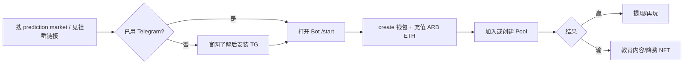

# Yoyo Market 使用场景

> **本文档职责**：**谁**在**什么情境**用；功能能力见 [yoyomarket-features.md](./yoyomarket-features.md)。  
> 遵循 [客户文档规范](../../client-template.md)  
> **引用**：[yoyomarket.md](./yoyomarket.md) | [yoyomarket-keywords.md](./yoyomarket-keywords.md)

**Last updated**: 2026-06-04 | 模式：冷启动

---

## 互链表

| 文档 | 链接 |
|------|------|
| 主文档 | [yoyomarket.md](./yoyomarket.md) |
| 功能 | [yoyomarket-features.md](./yoyomarket-features.md) |
| 关键词 | [yoyomarket-keywords.md](./yoyomarket-keywords.md) |
| 竞品 | [yoyomarket-competitors.md](./yoyomarket-competitors.md) |
| 网站结构 | [yoyomarket-site-structure.md](./yoyomarket-site-structure.md) |
| 增长策略 | [yoyomarket-growth-strategy.md](./yoyomarket-growth-strategy.md) |

**Use Cases vs Features**：本文档讲情境与 JTBD；功能文档讲模块与费用。

---

## 一、Persona（≥3）

### Persona 1：Telegram Degen 交易员

| 字段 | 内容 |
|------|------|
| **谁** | 20–35 岁，常驻 crypto Telegram 群，熟悉 Bot、链上转账 |
| **目标** | 用小额资金表达对 BTC/ETH 短线方向的观点 |
| **痛点** | CEX 合约复杂；Polymarket 事件与入金路径重 |
| **常用功能** | Pools、Chainlink 主流币对、Bot 钱包 |
| **建议落地页** | `/for/crypto-traders` |
| **关键词** | bet on crypto price telegram, prediction market for degens |

**JTBD**

1. 看盘后在群里「押一波」方向 → 打开 Mini App 加入 Pool  
2. 跟 KOL 池子 → 通过 Telegram 链接进入同一池  

### Persona 2：亚洲时区散户（中文社群）

| 字段 | 内容 |
|------|------|
| **谁** | 25–45 岁，台港新马等，中文 UI 偏好 |
| **目标** | 参与「亚洲自己的」预测市场叙事，有归属感 |
| **痛点** | 全球平台英文为主、客服时区不对 |
| **常用功能** | 中文社群 portal、官网中文 Slogan |
| **建议落地页** | `/zh/`、`/zh/for/beginners` |
| **关键词** | 預測市場、亚洲预测市场、加密预测 |

**JTBD**

1. 第一次了解预测市场 → 阅读 `/zh/learn` 再进 Bot  
2. 担心合规 → 阅读监管说明后自行判断（须法务页）  

### Persona 3：社群运营者 / 项目方（B2B2C）

| 字段 | 内容 |
|------|------|
| **谁** | 小型协议、Meme 币、社群 KOL 团队 |
| **目标** | 在自有 Telegram 群增加互动与留存 |
| **痛点** | 自制 Bot 成本高；通用博彩合规风险 |
| **常用功能** | 白标预测 Mini App（**待验证** 商务条款） |
| **建议落地页** | `/for/communities`、`/partners` |
| **关键词** | whitelabel prediction market telegram |

**JTBD**

1. 为粉丝提供「押价格」互动 → 接入 Yoyo 白标  
2. 活动期间创建专属 Pool → 运营复盘传播  

### Persona 4：早期支持者（NFT / Token）

| 字段 | 内容 |
|------|------|
| **谁** | 已达成 $150 交易量门槛的早期用户（Beta 规则） |
| **目标** | 降费、早鸟功能、收藏 Yoyonians |
| **痛点** | 普通用户手续费敏感 |
| **常用功能** | Yoyonians NFT、YOYO 质押（**待验证**） |
| **建议落地页** | `/nft`、`/token` |
| **关键词** | yoyonians nft, yoyo token |

**JTBD**

1. 刷量达标领 NFT → 长期降费  
2. 参与治理/质押 → 持有 YOYO  

---

## 二、场景-功能-关键词映射

| 场景 | Persona | 功能模块 | 典型关键词 | 承接 URL |
|------|---------|----------|------------|----------|
| 群内短线押方向 | Degen | Pools | bet on btc telegram | /for/crypto-traders |
| 新手第一次玩 | 亚洲散户 | Bot onboarding | how to use prediction market | /how-it-works |
| 对比 Polymarket | 尝鲜者 | 全产品 | polymarket alternative | /vs/polymarket |
| 社群活动池 | 运营者 | Pools + 白标 | telegram community prediction | /for/communities |
| 降费与忠诚 | 早期用户 | NFT | yoyonians nft | /nft |
| 长尾币押注 | Degen | Dexscreener | shitcoin price pool | /features/data |

---

## 三、/for/* 页面规划

| 路径 | Persona | 核心信息 | 优先级 |
|------|---------|----------|--------|
| `/for/crypto-traders` | Degen | 币价池、速度、费用 | P0 |
| `/for/beginners` | 新手 | 3 步开始、风险披露 | P0 |
| `/for/communities` | 运营者 | 白标、案例 | P1 |
| `/zh/for/beginners` | 中文新手 | 亚洲叙事、合规提示 | P0 |

---

## 四、用户旅程（简图）

---

## 五、缺口识别

| 缺口 | 影响 | 建议 |
|------|------|------|
| 无法押政治/体育事件 | 流失至 Polymarket | 明确「币价预测」定位或路线图 |
| 官网过薄 | organic 承接差 | Phase 1 落地页 |
| 合规说明缺失 | 亚洲用户信任风险 | `/learn/regulation-asia` |
| 英文为主文档 | 中文词承接弱 | `/zh/*` 子树 |

---

*与 [yoyomarket-growth-strategy.md](./yoyomarket-growth-strategy.md) 内容战役对齐*
