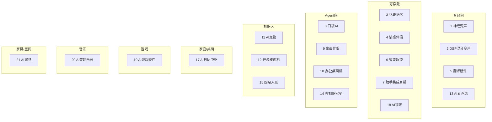

# 消费级 AI 硬件调研地图

> 结构：**全部类型** → **各类型对应产品与官网** · 2026-08-31  
> 关联：[dubbingai-hardware.md](./dubbingai-hardware.md)（Dubbing 产品线深研）  
> 收录范围：**现售、预售、候补 waitlist、已官宣准备上线** 均可；停售 / 实验 / 无 SKU 页项见附录。  
> 状态标记：`现售` · `预售` · `候补` · `即将上线` · `缺货` · `区域限制` · `已停产`

---

# 一、全部类型

共 **21 类**（含 1 类相邻对照）。按「硬件是否以 AI 为核心卖点」与「主要用途」划分。

| # | 类型 | 一句话定义 | 典型形态 | 边界说明 |
|---|------|------------|----------|----------|
| 1 | **神经 AI 变声 / Soundboard 硬件** | 实时神经变声或 Soundboard，独立硬件或桥接器 | USB-C 盒子、变声耳机、主机桥接键 | 不含纯 DSP  pitch 变调（见类型 2） |
| 2 | **游戏 / 直播混音变声（DSP，非神经 AI）** | 机内 DSP 变调/特效，非 LLM/神经声线 | 桌面混音台、游戏音频接口 | 与类型 1 场景重叠但技术路线不同 |
| 3 | **AI 纪要 / 记忆捕获可穿戴** | 拾音 → 转写 / 摘要 / 任务 / 跨会话记忆 | 卡片、胸针、项链、手环、微型录音豆 | 指环见类型 18；不含纯情感伴侣（类型 4） |
| 4 | **AI 情感 / 社交伴侣可穿戴** | 始终在线倾听 + 外放对话，偏陪伴 | AI 项链、部分开放耳机 | 非以会议纪要为主场景 |
| 5 | **AI 翻译硬件** | 多语言同传 / 离线翻译，硬件独立或耳机形态 | 翻译耳机、手持翻译机 | 与变声、纪要品类不同 |
| 6 | **AI 智能眼镜 / AR / XR** | 摄像头 / 显示 / 语音 + AI 助手或 AR 内容 | 音频 AI 镜、波导 AR 镜、 tethered XR 屏 | 不含手机自带 AI（无独立硬件 SKU） |
| 7 | **AI 助手集成耳机** | 普通 TWS + 品牌 App 接 ChatGPT 等 | 开放式 / 入耳耳机 | 无专用 AI 芯片，属「软集成」对照 |
| 8 | **口袋 AI / 独立 Agent 设备** | 脱离手机形态的专用 AI 终端 | 掌上设备、胸针（已失败品类） | 不含通用智能手机 |
| 9 | **AI 桌面伴侣（全息 / 屏上 Agent）** | 固定桌面，人格化 AI + 视觉形象 | 全息屏、毛绒 AI 生命体 | 不含可移动四足（见类型 14） |
| 10 | **AI 办公桌面机器人** | 桌面可动 + LLM，偏生产力 / 充电 / 日程 | 小型桌面机器人 | 与宠物机器人（类型 11）按主场景区分 |
| 11 | **AI 宠物 / 情感陪伴机器人** | 触摸、表情、移动，偏情感与娱乐 | 毛绒、桌面宠物、四足宠物 | 不含工业 / 研究人形（类型 14 边缘） |
| 12 | **开源 / 教育桌面机器人** | 可编程、开源、HRI / RL 实验 | 桌面表情机、双足开发套件 | 价格可消费但偏开发者 |
| 13 | **AI 麦克风 / 直播音频** | 机内 AI 降噪 / 电平 / DSP 处理 | USB / XLR 麦克风 | 不变声、不纪要 |
| 14 | **AI 控制器 / 宏垫 / MCP 面板** | 物理键触发 Agent、Soundboard、自动化 | 宏键盘、联名宏垫 | 非完整 AI 终端 |
| 15 | **消费级四足 / 人形机器人** | 可个人下单的腿式 / 人形，Embodied AI | 机器狗、家用人形预购 | 单价通常 $1.6k+ |
| 16 | **AI PC / NPU 平台** | 笔记本 / 平板内置 NPU，跑本地 Copilot+ 等 | Copilot+ PC、Apple Silicon | 平台品类，非单一 AI _gadget_ |
| 17 | **AI 日历 / 家庭中枢 / 桌面规划屏** | 固定屏 + LLM：日程、家务、餐食、专注规划 | 厨房屏、冰箱贴屏、墙挂日历、墨水屏桌历 | 不含纯 App（无硬件 SKU）；Echo Show 等泛智能屏作边界外 |
| 18 | **AI 智能戒指 / 指环** | 指环形态 + AI 纪要、语音 Agent 或健康洞察 | 钛指环、换电指环 | 纯心率环无 AI 叙事不收录；眼镜交互配件（如 Even R1）不算独立指环品类 |
| 19 | **AI 游戏硬件（掌机 / 次世代主机）** | 以玩游戏为主，SoC 含 NPU 或神经渲染；或官方定义为 AI 游戏掌机 | Windows 游戏掌机、Xbox 联名掌机 | 不含纯 GPU 掌机无 AI 叙事（Steam Deck）；PS5/Xbox Series 现世代不算 AI 主机 |
| 20 | **AI / 智能乐器** | 吉他 / 键盘 / 鼓等，机内 OS 或 AI 教练 / 转谱 / 神经建模 | 智能吉他、AI 钢琴系统、数字鼓面 | 不含纯 MIDI 控制器无乐器叙事；LED 配件（Fret Zealot）不算独立品类 |
| 21 | **AI 家具 / 智能家居家具** | 床、床垫、墙挂木屏、模块化房间等，AI 调环境 / 睡眠 / 空间编排 | 智能床、AI 床垫垫层、木质 Matter 中枢 | 不含仅升降桌 / USB 沙发（无 AI）；纯设计服务无 SKU 见附录 |
| — | **未上市 / 实验 / 已停产** | 传闻或已终止、无稳定零售 | 实验室项目、停服设备 | 单独附录 |

### 类型关系（简图）

---

# 二、各类型 → 产品与官网

### 收录规则：产品线 ≠ SKU

| 列什么 | 不列什么 |
|--------|----------|
| **产品线**：形态 / 用途 / 代际不同的系列（如 Plaud **Note** vs **NotePin**；RayNeo **Air** vs **X**） | 尺寸、颜色、戒围、内存档、同系列 Pro/Max 升级、Finish 配色 |
| 同一官网下：**一行 = 一条产品线** | 把 10"/15" 屏、Gen 1/Gen 2 同用途迭代拆成多行 |

格式：**官网** → `产品线 | 描述`（含检索日状态）

---

## 类型 1 · 神经 AI 变声 / Soundboard 硬件

### [shop.dubbingai.io](https://shop.dubbingai.io/)

| 产品线 | 描述 |
|--------|------|
| Dubbing Box | USB-C 端侧神经变声盒；约 300ms、500+ 声线；Android / Switch / Xbox / PS5 / PC；需自配蓝牙耳机。 |
| Dubbing AI Earbuds | **预售** · USB-C 有线变声耳机；内置麦 + 双单元；Android / USB-C iPhone·iPad。 |

### [voicemod.net](https://www.voicemod.net/en/vmkey/)

| 产品线 | 描述 |
|--------|------|
| Voicemod Key (VMKey) | 手机跑 Voicemod App + 3.5mm 桥接主机；**非端侧 NPU**；桌面变声软件另售。 |

---

## 类型 2 · 游戏 / 直播混音变声（DSP，非神经 AI）

### [yamaha.com](https://ca.yamaha.com/en/audio/streaming-gaming/products/mixers/zg/zg01/)（ZG 系列）

| 产品线 | 描述 |
|--------|------|
| ZG 游戏 / 直播混音台 | Voice Changer、对讲机 / 电台音效、环绕声；**传统 DSP**（含 ZG01 等同系列）。 |

### [roland.com](https://www.roland.com/us/products/bridge_cast_one/) — BRIDGE CAST 系列

| 产品线 | 描述 |
|--------|------|
| BRIDGE CAST 混音台 | VT 衍生 Voice Changer + 降噪 / 压缩；32-bit DSP（含 ONE 等型号）。 |

---

## 类型 3 · AI 纪要 / 记忆捕获可穿戴

> 指环形态见 **类型 18**。

### [plaud.ai](https://www.plaud.ai/pages/shop-plaud)

| 产品线 | 描述 |
|--------|------|
| Plaud Note | 卡片贴手机；AI 纪要 / 转写；含 Note Pro 等同系列升级。 |
| Plaud NotePin | 胸针 / 吊坠可穿戴录音；含 NotePin S。 |
| Plaud One | **限量预购** · 对话式可穿戴 AI（非纯录音笔）。 |

### [mobvoi.com](https://www.mobvoi.com/)

| 产品线 | 描述 |
|--------|------|
| TicNote | 便携 AI 录音笔；转写、摘要、思维导图、Agent。 |
| TicNote Pods | 4G AI 纪要耳机；内置连接 + 实时转写。 |

### [soundcore.com](https://www.soundcore.com/soundcore-work-ai-voice-recorder)

| 产品线 | 描述 |
|--------|------|
| soundcore Work | 硬币型 AI 录音豆；MFi；GPT 摘要；夹领 / 项链 / 贴手机。 |

### [vibe.us](https://vibe.us/products/vibe-dot/)

| 产品线 | 描述 |
|--------|------|
| Vibe Dot | 圆盘 AI 录音可穿戴；MCP → ChatGPT / Claude；300 分钟/月免费。 |

### [fieldy.ai](https://www.fieldy.ai/)

| 产品线 | 描述 |
|--------|------|
| Fieldy | 项链 / 手表两用 AI 纪要；100+ 语言（当前代 Fieldy 3）。 |

### [omi.me](https://www.omi.me/)

| 产品线 | 描述 |
|--------|------|
| Omi | 开源 AI 项链；**曾缺货 / 预购**，以商店页为准。 |

### [legendmemory.ai](https://legendmemory.ai/products/legend-one)

| 产品线 | 描述 |
|--------|------|
| Legend One | **预售** · $499/年含硬件；ADHD 向 AI 记忆吊坠；Q3 2026 发货。 |

### [bee.computer](https://bee.computer/)

| 产品线 | 描述 |
|--------|------|
| Bee Pioneer | 手环 / 夹扣始终监听；**现售** · **区域限制** 仅美国。 |

### [memoket.ai](https://memoket.ai/)

| 产品线 | 描述 |
|--------|------|
| Memoket Gem | 腕带 / Apple Watch 共戴 / 胸针；跨会话记忆 + MCP；约 $199。 |

### rabbit r1（见类型 8）

含录音 / 转写 / 摘要；主场景归口袋 Agent。

---

## 类型 4 · AI 情感 / 社交伴侣可穿戴

### [friend.com](https://friend.com/)

| 产品线 | 描述 |
|--------|------|
| Friend | 约 $249；AI 伴侣项链；始终监听 + 外放。 |

### Ola Friend（中国区 · oladance 官网暂不可用）

| 产品线 | 描述 |
|--------|------|
| Ola Friend | 豆包开放式 AI 耳机；约 ¥1199；**仅中国**。 |

> Ola Friend 形态是耳机，但主场景是 AI 对话陪伴，归入类型 4；若仅当「豆包入口」也可对照类型 7。

---

## 类型 5 · AI 翻译硬件

### [timekettle.co](https://www.timekettle.co/)

| 产品线 | 描述 |
|--------|------|
| W 系列翻译耳机 | 骨传导 / 开放佩戴同传；含 W4、W4 Pro 等；BabelOS。 |
| M 系列翻译耳机 | 入门翻译豆；在线 + 部分离线语言对。 |
| T 系列手持翻译机 | 手持 AI 翻译；离线语言包；约 $299 级。 |

---

## 类型 6 · AI 智能眼镜 / AR / XR

### 6A · 无显示 AI 眼镜（音频 + 相机 + 助手）

#### [meta.com/ai-glasses](https://www.meta.com/ai-glasses/)

| 产品线 | 描述 |
|--------|------|
| Ray-Ban Meta | **现售** · 音频 AI 眼镜 + 相机；Meta AI；Wayfarer / Headliner 等为镜架 SKU。 |
| Meta Ray-Ban Display | **现售** · 单目全彩波导 + Neural Band。 |
| Oakley Meta | **现售** · 运动线 AI 眼镜（HSTN / Vanguard 等）。 |

#### [global.rokid.com](https://global.rokid.com/) · [store.rokid.com](https://store.rokid.com/)

| 产品线 | 描述 |
|--------|------|
| Rokid Glasses | **现售** · 带显示 AI+AR；翻译、导航、12MP 等。 |
| Rokid AI Glasses Style | **现售** · 无显示音频 AI 镜；Gemini / ChatGPT。 |
| Rokid Max | **现售** · tethered AR 观影；需 Station 等。 |

#### [mi.com](https://www.mi.com/)（中国区）

| 产品线 | 描述 |
|--------|------|
| Xiaomi AI Glasses | **现售** · 约 ¥1999；Hyper XiaoAi；**主要中国**。 |

#### [blog.google](https://blog.google/products-and-platforms/platforms/android/android-xr-io-2026/)

| 产品线 | 描述 |
|--------|------|
| Samsung × Google Intelligent Eyewear | **即将上线** · 2026 秋；Gemini；Gentle Monster / Warby Parker；无 SKU 页。 |

#### [brilliant.xyz](https://brilliant.xyz/)

| 产品线 | 描述 |
|--------|------|
| Halo | **现售/预订** · 开源 AI 眼镜平台；Noa；microOLED + 端侧 NPU。 |
| Frame | 前代开源 AI 镜 + Noa。 |

### 6B · AR / XR 虚拟屏眼镜（ tethered 或一体显示）

#### [us.shop.xreal.com](https://us.shop.xreal.com/)

| 产品线 | 描述 |
|--------|------|
| XREAL One 系列 | **现售** · 自研 X1；1080p 虚拟屏；含 One Pro 等同系列。 |

#### [rayneo.com](https://www.rayneo.com/)

| 产品线 | 描述 |
|--------|------|
| RayNeo Air | **现售** · USB-C tethered 巨幕 AR 观影 / 游戏（2 / 2s / 3s / 4 Pro 同系列迭代）。 |
| RayNeo X | **现售** · AI+AR 一体眼镜（如 X3 Pro）。 |
| RayNeo iO | **即将上线** · 2026-09-04；microLED 字幕 / 翻译 / 生活日志；无扬声器。 |
| RayNeo GT | 影院级 AR；检索日部分 SKU Sold Out。 |

#### [evenrealities.com](https://www.evenrealities.com/store)

| 产品线 | 描述 |
|--------|------|
| Even G | **现售** · microLED 抬头显示 + 语音 AI（G1 / G2 / G2 A·B 镜架与镜片为 SKU）。 |
| Even R1 | 交互戒指配件，配合 G2；见 **类型 18** 相邻表。 |

#### [viture.com](https://www.viture.com/product/viture-luma-ultra-xr-glasses)

| 产品线 | 描述 |
|--------|------|
| VITURE Luma | **现售** · XR / AR 眼镜；6DoF + 深度相机；Pro Neckband 配 AI。 |

### 6C · 真 AR 一体眼镜（高价位 / 预购）

#### [specs.com](https://www.specs.com/smart-glasses/specs-27)

| 产品线 | 描述 |
|--------|------|
| Snap Specs | **预售** · $2195；51° FOV 无线 AR；2026 秋；美 / 英 / 法。 |

---

## 类型 7 · AI 助手集成耳机

### [nothing.tech](https://nothing.tech/)

| 产品线 | 描述 |
|--------|------|
| Nothing Ear (Open) | 开放式；Nothing X 集成 ChatGPT；约 $149。 |

### Ola Friend（见类型 4）

豆包 AI 开放式耳机，中国区 ¥1199。

---

## 类型 8 · 口袋 AI / 独立 Agent 设备

### [rabbit.tech](https://www.rabbit.tech/rabbit-r1)

| 产品线 | 描述 |
|--------|------|
| rabbit r1 | **现售** · LAM / Agent OS；无限录音 / 转写 / 摘要。 |

### [violoop.ai](https://violoop.ai/)

| 产品线 | 描述 |
|--------|------|
| Violoop | **预订** · HDMI 桌面 Agent；本地 Qwen 8B；未大规模发货。 |

---

## 类型 9 · AI 桌面伴侣（全息 / 屏上 Agent）

### [razer.com/razer-ava](https://www.razer.com/razer-ava)

| 产品线 | 描述 |
|--------|------|
| Razer AVA | **即将上线** · 5.5" 全息 AI 伴侣；2026 H2；现 Beta。

### [pophie.com](https://pophie.com/)

| 产品线 | 描述 |
|--------|------|
| Pophie | **现售** · 桌面 AI 生命体；**部分区域限售**（情感场景见类型 11）。 |

---

## 类型 10 · AI 办公桌面机器人

### [keyirobot.com](https://keyirobot.com/en-us/products/deskmate)

| 产品线 | 描述 |
|--------|------|
| Loona Deskmate | **现售** · $299；桌面 AI 实习生；MagSafe 无线充；**仅 iPhone 12+**；同站 **Loona** 宠物线见类型 11。 |

---

## 类型 11 · AI 宠物 / 情感陪伴机器人

### [casio.com/us/moflin](https://www.casio.com/us/moflin/)

| 产品线 | 描述 |
|--------|------|
| Moflin | **现售** · $429；情感 AI 毛绒；官方站 + Amazon。

### [keyirobot.com](https://keyirobot.com/)

| 产品线 | 描述 |
|--------|------|
| Loona | **现售** · 四足 AI 宠物；ChatGPT、手势识别。

### [living.ai](https://living.ai/)

| 产品线 | 描述 |
|--------|------|
| EMO | **现售** · 桌面 AI 宠物；Go Home 自充底座为同系列升级。

### [us.switch-bot.com](https://us.switch-bot.com/products/katafriends)

| 产品线 | 描述 |
|--------|------|
| KATA Friends | **现售** · $699；进化 AI 宠物；Noa / Niko 等为角色 SKU。

### Pophie（见类型 9）

桌面毛绒 AI 伴侣，偏情感互动。

---

## 类型 12 · 开源 / 教育桌面机器人

### [store.pollen-robotics.com](https://store.pollen-robotics.com/) · [pollen-robotics.com](https://pollen-robotics.com/)

| 产品线 | 描述 |
|--------|------|
| Reachy Mini | **现售** · $399–499；桌面表情机器人；Lite / Wireless 为连接方式 SKU。 |
| Microduck | **预售** · $399；25 cm 双足 RL 机器人。 |
| Reachy 2 | 约 $70,000；研究级人形；邮件订购。 |

---

## 类型 13 · AI 麦克风 / 直播音频

### [razer.com](https://www.razer.com/streaming-microphones/razer-seiren-v3-pro)

| 产品线 | 描述 |
|--------|------|
| Seiren V3 | AI 降噪 + DSP 直播麦（Pro / Chroma 等同系列）。

### [shure.com](https://www.shure.com/en-US/products/microphones/mv7)

| 产品线 | 描述 |
|--------|------|
| MV7+ | 约 $279；Auto Level + 实时 Denoiser（DSP）。 |

---

## 类型 14 · AI 控制器 / 宏垫 / MCP 面板

### [elgato.com](https://www.elgato.com/) · [MCP 说明](https://www.elgato.com/us/en/explorer/products/stream-deck/sd-mcp-setup/)

| 产品线 | 描述 |
|--------|------|
| Stream Deck | 可编程宏键盘；7.4+ MCP → Claude / G-Assist 等（Mini / XL 等为尺寸 SKU）。

### [openai.com/supply](https://openai.com/supply/) · [worklouder.cc](https://worklouder.cc/)

| 产品线 | 描述 |
|--------|------|
| Codex Micro | **缺货** · OpenAI × Work Louder 宏垫。 |

---

## 类型 15 · 消费级四足 / 人形机器人

### [unitree.com](https://www.unitree.com/)

| 产品线 | 描述 |
|--------|------|
| Go2 | **现售** · 四足机器狗；Air / Pro / Edu 等为 tier SKU；Air 约 $1600 级。

### [1x.tech](https://www.1x.tech/order)

| 产品线 | 描述 |
|--------|------|
| NEO | **预售** · 家用人形；$20k 断或 $499/月；2026 美国交付目标。 |

---

## 类型 16 · AI PC / NPU 平台

> 非单一 gadget，按**平台 + 代表厂商页**收录。游戏掌机形态见 **类型 19**。

| 官网 | 平台 / 产品 | 描述 |
|------|-------------|------|
| [microsoft.com](https://www.microsoft.com/en-us/windows/shop-pcs/high-performance-computers) | Copilot+ PC | NPU ≥40 TOPS；Studio Effects、Live Captions、Recall 等（因机型而异）。 |
| [apple.com/mac](https://www.apple.com/mac/) | Apple Silicon Mac | Neural Engine；Apple Intelligence 端侧能力。 |
| [qualcomm.com](https://www.qualcomm.com/snapdragon/laptops) | Snapdragon X Elite / Plus | 驱动大量 Copilot+ 笔记本。 |

---

## 类型 17 · AI 日历 / 家庭中枢 / 桌面规划屏

固定触控或 e-ink 屏，同步 Google / Apple / Outlook 等日历，叠加 **AI 语音、Magic Import、餐食规划、家务奖励、专注规划** 等；形态分 **家庭墙挂/厨房中枢** 与 **个人桌面规划**。

### 17A · 家庭 AI 中枢（厨房 / 墙面 / 冰箱）

#### [heynori.com](https://heynori.com/) · [Family Hub](https://heynori.com/familyhub)

| 产品线 | 描述 |
|--------|------|
| Nori Family Hub | **现售** · $339–449；15.6" 家庭 AI 中枢；Hey Nori 语音；日历 / 家务 / 餐食 / SuperNori；**无摄像头**；US & CA。 |
| Nori App | 免费 App（20 万+ 家庭）；Hub 硬件延伸。 |

#### [cozyla.com](https://www.cozyla.com/)

| 产品线 | 描述 |
|--------|------|
| Calendar Neo | **现售** · $169 级；15.6" 入门家庭屏；Hey Cozyla 语音 Agent。 |
| Calendar+ 2 | **现售** · $350–1100；Android + Play Store；多尺寸 / 4K 为 SKU。 |
| Calendar+ Go | **现售** · 32" 滚轮电池移动版。 |

#### [myskylight.com](https://myskylight.com/calendar/)

| 产品线 | 描述 |
|--------|------|
| Skylight Calendar | **现售** · 10" / 15" 家庭日历；Plus $79/年含 Magic Import AI 等。 |
| Skylight Calendar 2 | **现售** · Calendar 同软件生态硬件升级版（Snap Frame 等为 SKU）。 |
| Skylight Calendar Max | **现售** · 27" 大屏家庭日历。 |

#### [fridgecal.com](https://fridgecal.com/)

| 产品线 | 描述 |
|--------|------|
| FridgeCal | **现售** · 约 $249；磁吸冰箱屏；AI Smart Fridge Manager + 日历（Everblog 品牌）。 |
| HomeCal | **现售** · 21.5" 墙挂家庭中枢；日历 / 家务 / 餐食；**everblog.com 官网暂不可用**。 |

#### [apolosign.com](https://www.apolosign.com/)

| 产品线 | 描述 |
|--------|------|
| Apolosign Digital Calendar | **现售** · 从约 $399；Android 双模式；Gemini 语音；15.6"–27" 为尺寸 SKU。 |

### 17B · 个人桌面 AI 规划

#### [ziea.net](https://ziea.net/)

| 产品线 | 描述 |
|--------|------|
| ZIEA One | **现售** · e-ink 桌面 AI 日历 + 专注模式；160W 充电坞；Kickstarter 2026-03 结束。 |

#### [inkboard.ink](https://inkboard.ink/products/inku-calendar)

| 产品线 | 描述 |
|--------|------|
| Inku Calendar | **候补** · $275；彩色 e-ink 桌历；AI 每日摘要；**Second Drop 2026 中**；7" / 4" 为尺寸 SKU。 |

> 边界见 **§一 #17**（Echo Show 等泛智能屏未收录）。

---

## 类型 18 · AI 智能戒指 / 指环

指环形态；按 **AI 主场景** 分两类（同一官网只列一行产品线）。Even R1 等眼镜配件见 **18C 相邻**。

### 18A · 纪要 / 语音捕获 / AI Agent 输入

| 官网 | 产品线 | 描述 |
|------|--------|------|
| [vocci.ai](https://vocci.ai/) | Vocci Ring | **现售** · $249；双击录制；转写 + MCP；8h 连续录音；钛合金。 |
| [repebble.com](https://repebble.com/index) | Pebble Index | **预售** · $75–99；按键 + 麦；**本地 LLM**、开源、换电（数年）。 |
| [meetzero.ai](https://meetzero.ai/) | Zero Ring | **现售** · 约 $99；双麦 ANC 纪要指环；8h 续航。 |
| [sparkring.ai](https://sparkring.ai/) | Spark Ring | **候补** · 2026-09 KS / **2026-11 发货**；双击捕获；端侧转写 + AI 分任务 / 笔记。 |
| [vtouch.io](https://www.vtouch.io/en-us/products/wizpr-ring) | WIZPR RING | **众筹** · whisper → ChatGPT / Gemini；**传 2027 交付**；依赖手机 App。 |

### 18B · 健康传感 + AI 洞察（App 侧）

> 硬件主卖生物传感；AI 在配套 App。与 18A「拾音纪要」区分。

| 官网 | 产品线 | 描述 |
|------|--------|------|
| [ouraring.com](https://ouraring.com/) | Oura Ring | **现售** · 睡眠 / 恢复 / 压力；Membership + **Health Radar** 等 AI；Ring 4 / 5 / Ceramic 同系列。 |
| [samsung.com](https://www.samsung.com/us/rings/galaxy-ring/) | Galaxy Ring | **现售** · **Galaxy AI** Energy Score、Wellness Tips；需 Samsung Health + 兼容 Galaxy 手机。 |
| [shop.circular.xyz](https://shop.circular.xyz/products/circular-ring-2) | Circular Ring | **现售** · $299 级；ECG / 睡眠等；**Kira AI** 教练；无强制订阅。 |
| [ringconn.com](https://ringconn.com/) | RingConn | **现售** · Gen 2 / Gen 3 / Air；血管 / 睡眠等健康 intelligence；AI 叙事弱于 Oura / Samsung。 |

### 18C · 相邻（非独立 AI 指环）

| 官网 | 说明 |
|------|------|
| [evenrealities.com](https://www.evenrealities.com/store) | **Even R1** 为 G2 眼镜交互戒指配件，非独立 AI 终端（类型 6 Even G 配）。 |

---

## 类型 19 · AI 游戏硬件（掌机 / 次世代主机）

> **结论**：无单独「纯 AI 游戏主机」品类；现售以 **NPU 游戏掌机** 为主。边界见 **§一 #19**；次世代客厅主机（Project Helix、PS6）见 **§三**。

### 现售 / 预售 · AI 游戏掌机

#### [xbox.com](https://www.xbox.com/en-US/handhelds/rog-xbox-ally) · [rog.asus.com](https://rog.asus.com/articles/rog-ally/)

| 产品线 | 描述 |
|--------|------|
| ROG Xbox Ally | **现售** · AMD Ryzen Z2 A；Windows 11 + Xbox 全屏体验；入门款。 |
| ROG Xbox Ally X | **现售** · Ryzen **AI Z2 Extreme** + ~50 TOPS NPU；Auto Super Resolution（NPU 超分）、AI 高光剪辑；Gaming Copilot（Beta，Game Bar）。 |
| ROG Xbox Ally X20 | **预售** · 2026-10-15 起；同 Z2 Extreme；7.4" OLED、TMR 摇杆；20 周年款。 |

#### [msi.com](https://www.msi.com/Handheld/Claw-8-AI-Plus)

| 产品线 | 描述 |
|--------|------|
| Claw 8 AI+ | **现售** · Intel Core Ultra 7 258V（Copilot+ PC）；XeSS；MSI AI Engine；Windows 掌机。 |
| Claw 8 EX AI+ | **现售** · Intel **Arc G3 Extreme**（Panther Lake）；XeSS 3 多帧生成、Endurance Gaming；中国区约 ¥11999。 |

#### [lenovo.com](https://www.lenovo.com/us/en/legion/) — Legion Go

| 产品线 | 描述 |
|--------|------|
| Legion Go 2 | **现售** · AMD Ryzen Z2 Extreme；144Hz OLED 可选；**Windows 11** 与 **SteamOS** 为系统 SKU，算同一产品线。 |

#### [ayaneo.com](https://ayaneo.com/)

| 产品线 | 描述 |
|--------|------|
| AYANEO NEXT 2 | **预售** · Ryzen AI Max+ 395；126 TOPS 级 AI 算力叙事；2026-06 起发货。 |
| AYANEO 3 | **现售/预订** · Ryzen AI 9 HX 370 / 8840U；AYASpace 3.0；模块化手柄；[中文站 next.ayaneo.com.cn](https://next.ayaneo.com.cn/product/AYANEO-3)。 |

#### [onexplayer.com](https://onexplayer.com/)

| 产品线 | 描述 |
|--------|------|
| OneXPlayer 3 | **现售** · 三合一 PC 掌机；Arc / 高功耗移动平台；8999 元级起。 |
| X2 Mini Pro | **现售** · Ryzen AI Max+ 388；8.8" OLED；$2499 起。 |

---

## 类型 20 · AI / 智能乐器

> **结论**：**AI 吉他 / 智能吉他** 已是成熟消费品类（LAVA、LiberLive、Enya 等）；**AI 钢琴教练** 以 ROLI Spatial AI 为代表；多数「智能乐器」实为 **机内 DSP/OS + App**，仅部分标 **lavaAI / AI Music Coach**。边界见 **§一 #20**；与类型 1 变声、类型 13 直播麦无重叠。

### 20A · 智能 / AI 吉他

#### [lavamusic.com](https://www.lavamusic.com/) · [store.lavamusic.com](https://store.lavamusic.com/)

| 产品线 | 描述 |
|--------|------|
| LAVA ME | **现售** · 真吉他 + 触摸屏 **HILAVA 2.0**；机内效果 / Looper / 鼓机 / 练习 App；含 ME 4 / ME play 等同系列。 |
| LAVA GENIE | **现售** · 无弦折叠智能吉他；500+ 音色预设；**lavaAI** 和弦转谱（LAVA+ 订阅）；TapPad 一人乐队。 |

#### [liberlive.com](https://liberlive.com/)

| 产品线 | 描述 |
|--------|------|
| LiberLive C1 | **现售** · 约 $339–449；无弦和弦垫 + 拨片；LiberLive App 万级曲库（**无订阅**）；偏弹唱伴奏。 |

#### [enya-music.com](https://www.enya-music.com/) · [enyamusicglobal.com](https://enyamusicglobal.com/)

| 产品线 | 描述 |
|--------|------|
| Nova Go Sonic | **现售** · 约 $370；碳纤电吉他 + 内置喇叭；**ES1 Pro** DSP 预设；App 混音 / OTG 录音；弱 AI 叙事。 |

### 20B · AI 钢琴 / 键盘学习

#### [roli.com](https://roli.com/us/experience/roli-piano-system)

| 产品线 | 描述 |
|--------|------|
| ROLI Piano System | **现售** · Piano + **Airwave** 手追相机；**ROLI Vision AI** + **AI Music Coach** 实时对话反馈；ROLI Learn App。 |

#### [theonemusic.com](https://theonemusic.com/collections/smart-piano)

| 产品线 | 描述 |
|--------|------|
| The ONE Smart Piano | **现售** · 发光键 + Smart Piano App 课程 / 曲库；含 COLOR 便携、PLAY/TOP 立式等；**智能学习**对照（非 LLM 教练）。 |

### 20C · 智能鼓 / 打击

#### [druml.ai](https://druml.ai/)

| 产品线 | 描述 |
|--------|------|
| DruML S1 | **现售** · 14" 数字军鼓；自研信号引擎 + 位置 / 手势传感；USB/MIDI；DruML Studio 配置。 |

#### [theodots.com](https://theodots.com/products/hyperdrum)

| 产品线 | 描述 |
|--------|------|
| HyperDrum | **现售** · 便携空气鼓；手势识别 + 蓝牙 MIDI；算法优化延迟；偏 MIDI 触发非 AI 品牌叙事。 |

### 20D · 相邻（MIDI / 生产向）

| 官网 | 产品线 | 说明 |
|------|--------|------|
| [jamstik.com](https://jamstik.com/) | Jamstik | **现售/预订** · Studio / Standard / Deluxe 等 MIDI 吉他；Jamstik Portal  arcade 学习；**非 AI 主打**。 |

---

## 类型 21 · AI 家具 / 智能家居家具

> **结论**：**AI 床 / 睡眠系统**（Eight Sleep、Nitetronic 等）与 **AI 原生空间**（LiveLarge L-Space）可购买或预订；**mui Board** 为木质 Matter 墙挂家具形态中枢。**纯 IoT 升降桌、带 USB 沙发** 不在此列。与类型 17（大屏日历中枢）分工：17 = 触控规划屏优先；21 = 家具 / 睡眠 / 空间本体。边界见 **§一 #21**。

### 21A · AI 睡眠 / 床 / 床垫

#### [eightsleep.com](https://www.eightsleep.com/product/pod-cover/)

| 产品线 | 描述 |
|--------|------|
| Pod | **现售** · Pod 5 Cover / Base / Blanket 系统；**Autopilot AI** 逐侧温控 / 止鼾抬升；睡眠生物指标。 |

#### [nitetronic.com](https://www.nitetronic.com/products/nitetronic-g1-smart-mattress-pad)

| 产品线 | 描述 |
|--------|------|
| Nitetronic G1 | **现售** · 智能床垫垫层；**Airfloating AI** 深睡系统；气囊按摩 + 无接触心率 / 呼吸监测。 |

#### [shop.ergomotion.com](https://shop.ergomotion.com/products/ergosportive)

| 产品线 | 描述 |
|--------|------|
| ErgoSportive | **现售** · 智能可调床架；非接触传感；**SleepGPT** App 恢复建议；可接 Garmin。 |

### 21B · 木质 / 墙挂智能家居家具

#### [muiboard.com](https://muiboard.com/products/mui-board-gen-2)

| 产品线 | 描述 |
|--------|------|
| mui Board Gen 2 | **现售** · 约 $799；天然木 Matter 中枢；手写留言 / 日历 / 智能家居触控；**Spatial AI** 叙事。 |
| mui Board Calm Sleep | **候补** · 2026 Q4 预购；内置 mmWave 睡眠传感 + 自动化；Calm Sleep Platform。 |

### 21C · AI 原生模块化空间

#### [livelargetech.com](https://livelargetech.com/)

| 产品线 | 描述 |
|--------|------|
| Flagship L-Space | **即将上线** · 加州 made-to-order；**Space AI** + 助手 Lila；灯光 / 音效 / 新风 / 4K 投影一体；**无公开标价页**。 |

---

# 三、附录 · 未上市 / 实验 / 已停产

> 无产品页、已终止或纯实验。**正文已收录**的预售 / 候补 / 现售项不在此重复；**无 SKU 页的即将上线**（如次世代主机）放此。

| 类型归属 | 官网 / 来源 | 产品线 | 状态 |
|----------|-------------|------|------|
| 移动家庭机器人 | samsung.com（曾） | Samsung Ballie | **已搁置**；注册页下线，2026 无零售 |
| 口袋 AI | humane.com | Humane AI Pin | **2025-02 停服**；不可作 AI 设备使用 |
| AI 纪要 | developers.limitless.ai | Limitless Pendant | Meta 收购；**2025-12 起停售新客** |
| 消费硬件 | 媒体口径 | OpenAI × Jony Ive 设备 | **无产品页**；传 2026 亮相 / 2027 出货 |
| 消费硬件 | 媒体口径 | OpenAI Sweetpea 耳机 | **未官宣** |
| 实验 | anthropic.com/research | Project Vend | 办公室 AI 售货实验，**非商品** |
| 周边 | andonlabs.com/store | 小型周边 / waitlist | 非 Claude 品牌消费售货机 |
| AI 游戏主机 | [news.xbox.com](https://news.xbox.com/) / GDC 2026 | Xbox **Project Helix** | **即将上线** · 传 2027–2028；Win11 + Xbox Mode；独立 NPU + FSR Diamond；**无消费预订页** |
| AI 游戏主机 | [amd.com](https://www.amd.com/) / Sony | **PS6**（Project Amethyst） | **即将上线** · 传 2028 前；RDNA 5 + Neural Arrays；**无 SKU 页** |
| AI 家具 | [knuslabs.com](https://knuslabs.com/ai-room-design) | Knuslabs 定制家具 | **无硬件 SKU** · AI 出图 + BOM；生产传 2026 后开放 |

---

## 文档元数据

**检索基准日**：2026-08-31（类型 20–21 增量检索同日；独立站 URL 校验修正 2026-08-31）  
**材料范围**：全球消费级 AI 硬件独立站与知名 AI 公司 D2C；含预售 / 候补 / 无 SKU 页官宣  
**用途**：类型 taxonomy + 产品线官网入口  
**与相邻主题分工**：Dubbing 产品线深研 → [dubbingai-hardware.md](./dubbingai-hardware.md)  
**路径**：`dubbingai/dubbingai-ai-hardware-consumer.md`
