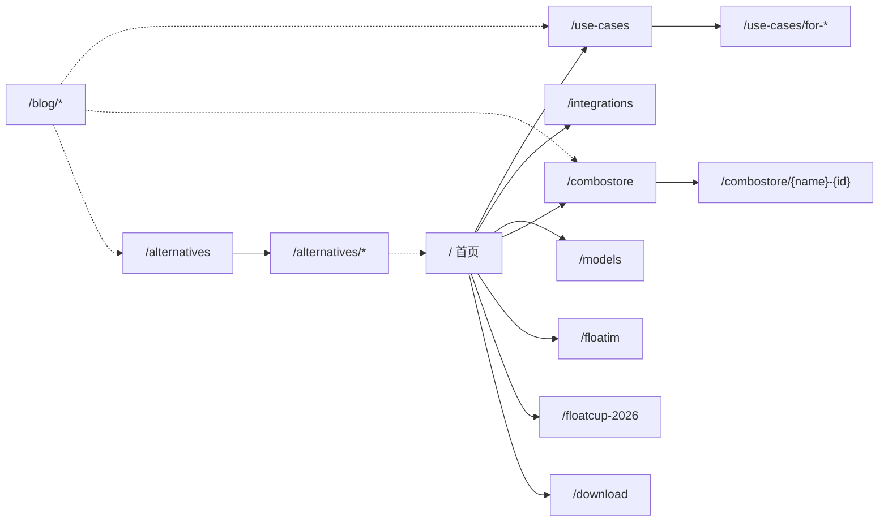

# Floatboat 站点页面结构

**站点**：[floatboat.ai](https://floatboat.ai/) · **更新**：2026-06-29 · **数据来源**：`sitemap.xml`（623 条 URL）+ 首页聚合页内链补全 + HTTP 200 校验

---

## 站点概览

| 项 | 值 |
|----|-----|
| 主域 | [https://floatboat.ai/](https://floatboat.ai/) |
| 已上线页面 | **630**（英文路径） |
| Sitemap 收录 | **620** 条 URL（不含 `/zh/*`、`/use-cases/*`、`/integrations`、`/models`、`/floatim`、`/floatcup-2026`） |
| 首页内链补全 | `/use-cases` + 4 子页、`/integrations`、`/models`、`/floatim`、`/floatcup-2026`（HTTP 200 确认在线但 sitemap 未收录） |
| 下载 / App | [Download](https://floatboat.ai/download) · [App](https://floatboat.ai/app) |
| FloatIM（站外） | [im.floatboat.ai](https://im.floatboat.ai/)（独立产品；站内落地页 `/floatim`） |

> **已移除**（旧版记录项但本次未确认在线或已不存在）：`/download/success`（sitemap 无记录）、`/docs`、`/timeshop`、`/developer`、`/sign-in`、`/may-ai-festival`、`/zh`、`/features`（旧版标记 404）。这些页面均未在 sitemap 或首页/博客聚合页内链中出现，不在本次已上线清单中。

首页 `/` 营销区块（Who it's for、Integrations、Models、Combo Store、FloatIM、FloatCup、Download 等）以**锚点 / 页内链**呈现；部分区块链至独立 URL。全站 SEO 页共用同一套 Header / Footer。

**`<title>`（首页）**：`Floatboat — Proactive Agent OS for Calendar-Driven Work`

---

## 导航结构

### Header

| 标签 | 目标 | 状态 |
|------|------|------|
| Logo | `/` | 在线 |
| About Us | `/about` | 在线 |
| Discover → Combo Store | `/combostore` | 在线 |
| Resources → Blog | `/blog` | 在线 |
| Resources → Wishlist | `/wishlist` | 在线 |
| Pricing | `/pricing` | 在线 |
| Download | `/download` | 在线（Header CTA） |

### 首页 `/` 区块（页内锚点 + 独立页内链）

| 区块 | 内链目标 | 状态 |
|------|---------|------|
| Who it's for | `/use-cases` | 在线（sitemap 未收录） |
| Integrations | `/integrations` | 在线（sitemap 未收录） |
| Models | `/models` | 在线（sitemap 未收录） |
| Combo Store | `/combostore` | 在线 |
| FloatIM | `/floatim` | 在线（sitemap 未收录） |
| FloatCup | `/floatcup-2026` | 在线（sitemap 未收录） |
| Download | `/download` | 在线 |

### Footer

| 区块 | 链接 |
|------|------|
| 主导航 | [About](/about) · [Blog](/blog) · [Pricing](/pricing) |
| 法律 | [Privacy](/privacy) · [Terms](/terms) |

---

## 已上线页面清单

| 栏目 | 页面数 | 数据来源 |
|------|--------|---------|
| 核心页面 | 13 | sitemap |
| Alternatives | 13 | sitemap |
| Blog | 88 | sitemap |
| Combo Store | 507 | sitemap |
| Use Cases | 5 | 首页内链 + HTTP 200 |
| Product / Landing（未收录） | 4 | 首页内链 + HTTP 200 |
| **合计** | **630** | |

### 核心页面（13）

| 路径 | 说明 |
|------|------|
| `/` | 营销首页 |
| `/about` | 关于我们 |
| `/ai-agent-workspace` | AI Agent Workspace 落地页 |
| `/ai-workspace-for-consultants` | 顾问人群工作区页 |
| `/nano-banana2` | Nano Banana 2 产品页 |
| `/pricing` | 定价 |
| `/download` | 下载页 |
| `/app` | Web App 入口 |
| `/wishlist` | 功能投票 / 路线图 |
| `/privacy` | Privacy Policy |
| `/terms` | Terms of Service |
| `/user-protection-program-terms` | 用户保护计划条款 |
| `/selfware.md` | Selfware 介绍（Markdown 页） |

### Use Cases（5，sitemap 未收录）

| 路径 | 人群 |
|------|------|
| `/use-cases` | Hub |
| `/use-cases/for-solopreneur` | Solopreneur |
| `/use-cases/for-creators` | Creators |
| `/use-cases/for-small-business` | Small business |
| `/use-cases/for-studio` | Studio |

### Product / Landing — Sitemap 未收录（4）

| 路径 | 说明 |
|------|------|
| `/integrations` | 集成（模型 / 工具 / 协议） |
| `/models` | 模型支持页 |
| `/floatim` | FloatIM 产品介绍（链至 im.floatboat.ai） |
| `/floatcup-2026` | FloatCup 世界杯日历订阅 |

### Alternatives（13）

| 路径 | 竞品 |
|------|------|
| `/alternatives` | Hub |
| `/alternatives/airtable-alternative` | Airtable |
| `/alternatives/asana-alternative` | Asana |
| `/alternatives/chatgpt-alternative` | ChatGPT |
| `/alternatives/clickup-alternative` | ClickUp |
| `/alternatives/cursor-alternative` | Cursor |
| `/alternatives/github-copilot-alternative` | GitHub Copilot |
| `/alternatives/lovable-alternative` | Lovable |
| `/alternatives/monday-alternative` | Monday |
| `/alternatives/n8n-alternative` | n8n |
| `/alternatives/notion-alternative` | Notion |
| `/alternatives/todoist-alternative` | Todoist |
| `/alternatives/zapier-alternative` | Zapier |

### Blog（88）

| 路径 | slug |
|------|------|
| `/blog` | Hub |
| `/blog/agentic-ai-tools` | agentic-ai-tools |
| `/blog/ai-agent-development-services` | ai-agent-development-services |
| `/blog/ai-agent-solo-operators` | ai-agent-solo-operators |
| `/blog/ai-agent-use-cases-real-examples` | ai-agent-use-cases-real-examples |
| `/blog/ai-agent-vs-ai-assistant` | ai-agent-vs-ai-assistant |
| `/blog/ai-agent-vs-chatbot` | ai-agent-vs-chatbot |
| `/blog/ai-agent-workflow-vibe-coding` | ai-agent-workflow-vibe-coding |
| `/blog/ai-agents-2026-solo-operators` | ai-agents-2026-solo-operators |
| `/blog/ai-assistant-for-personal-use-at-work` | ai-assistant-for-personal-use-at-work |
| `/blog/ai-automation-agency-do-you-need-one` | ai-automation-agency-do-you-need-one |
| `/blog/ai-automation-agency-pricing` | ai-automation-agency-pricing |
| `/blog/ai-browser-agent-vs-ai-browser-vs-ai-workspace` | ai-browser-agent-vs-ai-browser-vs-ai-workspace |
| `/blog/ai-follow-up-automation` | ai-follow-up-automation |
| `/blog/ai-follow-up-email-opus-4-8` | ai-follow-up-email-opus-4-8 |
| `/blog/ai-meeting-preparation` | ai-meeting-preparation |
| `/blog/ai-scheduling-agent` | ai-scheduling-agent |
| `/blog/ai-tools-for-business-automation-2026` | ai-tools-for-business-automation-2026 |
| `/blog/ai-workflow-for-solo-founders` | ai-workflow-for-solo-founders |
| `/blog/ai-workflow-solo-founders` | ai-workflow-solo-founders |
| `/blog/ai-workspace-agents` | ai-workspace-agents |
| `/blog/best-ai-agent-builder-2026` | best-ai-agent-builder-2026 |
| `/blog/best-ai-agent-platform-2026` | best-ai-agent-platform-2026 |
| `/blog/best-ai-scheduling-assistant` | best-ai-scheduling-assistant |
| `/blog/best-ai-scheduling-assistants` | best-ai-scheduling-assistants |
| `/blog/best-calendar-app-solo-operators` | best-calendar-app-solo-operators |
| `/blog/browser-ai-agent-security-questions` | browser-ai-agent-security-questions |
| `/blog/browser-ai-agent-what-it-can-do` | browser-ai-agent-what-it-can-do |
| `/blog/building-agentic-ai-systems-build-or-buy` | building-agentic-ai-systems-build-or-buy |
| `/blog/calendar-driven-ai-vs-chat-ai` | calendar-driven-ai-vs-chat-ai |
| `/blog/claude-code-non-developers-solo-operators` | claude-code-non-developers-solo-operators |
| `/blog/claude-managed-agents-one-person-company` | claude-managed-agents-one-person-company |
| `/blog/codex-for-chrome-vs-claude-for-chrome` | codex-for-chrome-vs-claude-for-chrome |
| `/blog/custom-ai-agent-development` | custom-ai-agent-development |
| `/blog/deepseek-v4-api-solo-operator` | deepseek-v4-api-solo-operator |
| `/blog/dynamic-workflows-build-or-use-workspace` | dynamic-workflows-build-or-use-workspace |
| `/blog/effort-control-fast-mode-ai-work` | effort-control-fast-mode-ai-work |
| `/blog/feishu-cli-solo-work-setup` | feishu-cli-solo-work-setup |
| `/blog/first-100-customers-solo-founder` | first-100-customers-solo-founder |
| `/blog/floatcup-world-cup-2026-calendar-subscribe` | floatcup-world-cup-2026-calendar-subscribe |
| `/blog/gemini-3-5-integration-solo-operators` | gemini-3-5-integration-solo-operators |
| `/blog/genspark-ai-pricing` | genspark-ai-pricing |
| `/blog/genspark-super-agent-explained` | genspark-super-agent-explained |
| `/blog/genspark-vs-manus` | genspark-vs-manus |
| `/blog/google-calendar-vs-apple-calendar` | google-calendar-vs-apple-calendar |
| `/blog/google-calendar-vs-outlook` | google-calendar-vs-outlook |
| `/blog/gpt-image-2-manga-comic-workflow` | gpt-image-2-manga-comic-workflow |
| `/blog/gpt-image-2-storyboard-solo` | gpt-image-2-storyboard-solo |
| `/blog/gpt-image-2-vs-midjourney-nano-banana-2` | gpt-image-2-vs-midjourney-nano-banana-2 |
| `/blog/grok-3-api-solo-operator` | grok-3-api-solo-operator |
| `/blog/gumloop-alternatives-2026` | gumloop-alternatives-2026 |
| `/blog/gumloop-review-2026` | gumloop-review-2026 |
| `/blog/how-one-person-businesses-work-like-a-team-with-ai` | how-one-person-businesses-work-like-a-team-with-ai |
| `/blog/how-to-build-ai-agents-for-repeated-work` | how-to-build-ai-agents-for-repeated-work |
| `/blog/how-to-build-an-ai-agent` | how-to-build-an-ai-agent |
| `/blog/how-to-build-an-ai-agent-with-chatgpt` | how-to-build-an-ai-agent-with-chatgpt |
| `/blog/html-anything-review-2026` | html-anything-review-2026 |
| `/blog/html-is-the-new-markdown` | html-is-the-new-markdown |
| `/blog/html-vs-markdown-ai-output` | html-vs-markdown-ai-output |
| `/blog/introducing-floatim` | introducing-floatim |
| `/blog/lark-cli-when-to-use-it` | lark-cli-when-to-use-it |
| `/blog/lindy-vs-gumloop` | lindy-vs-gumloop |
| `/blog/llm-knowledge-base-solo-operators` | llm-knowledge-base-solo-operators |
| `/blog/manus-ai-alternatives-2026` | manus-ai-alternatives-2026 |
| `/blog/meta-muse-spark-one-person-company` | meta-muse-spark-one-person-company |
| `/blog/no-code-ai-agent-builder` | no-code-ai-agent-builder |
| `/blog/oh-my-codex-vs-superpowers` | oh-my-codex-vs-superpowers |
| `/blog/openai-4-day-work-week-one-person-company` | openai-4-day-work-week-one-person-company |
| `/blog/openai-gpt-6-one-person-company` | openai-gpt-6-one-person-company |
| `/blog/relevance-ai-vs-n8n` | relevance-ai-vs-n8n |
| `/blog/scale-one-person-business-without-hiring` | scale-one-person-business-without-hiring |
| `/blog/solopreneur-pricing-day-one` | solopreneur-pricing-day-one |
| `/blog/stop-context-switching-workspace-agent` | stop-context-switching-workspace-agent |
| `/blog/what-are-claude-managed-agents` | what-are-claude-managed-agents |
| `/blog/what-gstack-gets-right-about-one-person-businesses` | what-gstack-gets-right-about-one-person-businesses |
| `/blog/what-is-llm-wiki` | what-is-llm-wiki |
| `/blog/what-is-persistent-ai-agent` | what-is-persistent-ai-agent |
| `/blog/what-is-vibe-coding` | what-is-vibe-coding |
| `/blog/why-ai-forgets-between-sessions` | why-ai-forgets-between-sessions |
| `/blog/why-ai-forgets-every-session` | why-ai-forgets-every-session |
| `/blog/workflow-builder-vs-ai-workspace` | workflow-builder-vs-ai-workspace |
| `/blog/workspace-agents-for-solo-operators` | workspace-agents-for-solo-operators |
| `/blog/workspace-agents-vs-chat-assistants` | workspace-agents-vs-chat-assistants |
| `/blog/workspace-agents-vs-workflow-builders` | workspace-agents-vs-workflow-builders |
| `/blog/world-cup-2026-google-calendar-ics` | world-cup-2026-google-calendar-ics |
| `/blog/world-cup-2026-guide` | world-cup-2026-guide |
| `/blog/world-cup-2026-schedule` | world-cup-2026-schedule |
| `/blog/world-cup-2026-schedule-usa` | world-cup-2026-schedule-usa |

> sitemap 收录 88 条 blog URL（含 `/blog` Hub + 87 篇博文）。

### Combo Store（507）

| 路径 | 说明 |
|------|------|
| `/combostore` | Hub（列表 / 筛选；Skills 由客户端加载） |
| `/combostore/{name}-{shortId}` | Skill 详情页，**506** 个已上线 |

> sitemap 收录 507 条 combo store URL（含 Hub + 506 个 Skill 详情页）。URL 含中英文混合命名（如 `/combostore/bracket-boss-1nKR69`、`/combostore/产品发布策略-3NfyPG`），命名格式固定为 `{name}-{shortId}`（6 位 Base62）。

---

## 内链枢纽

- **首页 Pillars**：串联 Use Cases、Integrations、Models、Combo Store、FloatIM、FloatCup、Download
- **Header**：Combo Store、Blog、Wishlist、Pricing
- **Alternatives Hub → Vertical**：Hub 卡片链至 12 个竞品对比页
- **Combo Store Hub → Skill**：列表卡片链至 `{name}-{shortId}` 详情页
- **Blog ↔ 全站**：文章内链至 Use Cases、Combo Store、Alternatives 等

---

*sitemap 索引：[floatboat.ai/sitemap.xml](https://floatboat.ai/sitemap.xml)*
