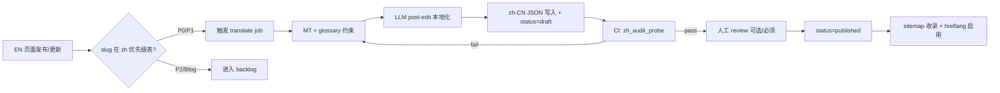

# Floatboat 任务单 — 中文站完整本地化优化（内容 + i18n + 维护流程）

> **任务类型**：多语言本地化 / i18n 架构 / 内容规范 / Technical SEO  
> **目标域名**：floatboat.ai（`/zh/*` 中文子目录）  
> **状态**：待处理  
> **优先级**：P0  
> **提交**：2026-08-25  
> **关联审计工具**：`site-seo-geo-audit/tools/zh_coverage_full.py`、`zh_audit_probe.py`

---

## 1. 任务目标

将 Floatboat 中文站从当前的 **「中文 URL + 英文正文 fallback」** 升级为 **可维护、可验收、可持续自动化** 的本地化体系。完成后应达到：

1. **内容侧**：所有已发布的 `/zh/*` 页面使用**地道中文表达**（非机翻、非英文 H1 照搬）；品牌名、技术协议、第三方产品名等**仅在必要时**保留英文（见 §3.2.1）。
2. **技术侧**：i18n 有单一真相源（locale key + 翻译状态），未就绪页面不得输出误导性 `hreflang` / `lang=zh`。
3. **统计侧**：P0/P1 页面 100% 达标；Blog / Combo Store 按梯队分批，有明确完成率指标。
4. **维护侧**：新 EN 页面上线后，能在 48h 内自动进入中文翻译队列，CI 阻断「假中文页」再次上线。

**完成判定**：§6 验收标准全部勾选；§4 页面清单中 P0 项 `state = localized`；sitemap 收录全部已本地化 `/zh/*` URL。

---

## 2. 问题证据（2026-08-25 实测）

### 2.1 典型假中文页：`/zh/ai-scheduling-assistant`

| 字段 | EN `/ai-scheduling-assistant` | ZH `/zh/ai-scheduling-assistant` |
|------|-------------------------------|----------------------------------|
| HTTP | 200 | 200 |
| `<html lang>` | en | **zh** |
| `og:locale` | en | **zh** |
| `<title>` | AI Scheduling Assistant for Mac & Windows — Floatboat | **同英文** |
| `<h1>` | AI Scheduling Assistant | **同英文** |
| 正文中文占比 | ~0.6% | **~0.6%** |
| hreflang | en ↔ zh 互指 | en ↔ zh 互指 |

同类问题页：`/zh/ai-file-organizer`（H1 = `AI File Organizer`，中文占比 0.6%）、`/zh/about`（Title 中文、H1 = `About Us`）。

### 2.2 全站 `/zh/*` 探测汇总（51 路由 live probe）

| 状态 | 页数 | 占比 | 含义 |
|------|:----:|:----:|------|
| **localized** | 6 | 12% | 正文中文占比 ≥35%，可对外 |
| **partial** | 4 | 8% | 壳子中文化，正文仍偏英 |
| **english_fallback** | 33 | 65% | 路由存在，正文 essentially 英文 |
| **missing_404** | 8 | 16% | EN 有对应页，ZH 路由不存在或报错 |

**Sitemap**：699 条 EN URL；**0 条** `/zh/*` 被收录（中文页 discoverability 为零）。

### 2.3 战略错位：中英文首页不同定位

| | EN `/` | ZH `/zh` |
|--|--------|----------|
| H1 | The Proactive Agent OS that Runs Work from the Calendar | ALL-IN-ONE 的 Agent 工作站 |
| 叙事 | Calendar-Driven · 会前/到期/会后自动执行 | OPC 一人公司 · Combo Skills · 模块化工作区 |
| 与 2026-06 pivot | ✅ 已同步 | ❌ 仍用 pivot 前叙事 |

### 2.4 GA4 流量信号（2026-06 周报，非 Google 为主）

| 路径 | PV | 现状 |
|------|:--:|------|
| `/zh` | 786 | 已本地化但定位旧 |
| `/zh/pricing` | 116 | 已本地化 |
| `/zh/about` | 70 | **英文 fallback** |
| `/zh/timeshop` | 65 | 已本地化 |
| `/zh/combostore` | 52 | partial |
| `/zh/download/success` | 50 | **英文 fallback** |

---

## 3. 根因分析

### 3.1 技术根因：i18n 只做了路由壳

当前架构推断（基于 `floatboat-page-composition-guide.md` 与 live 行为）：

```
用户访问 /zh/{path}
    → 路由匹配成功（200）
    → <html lang="zh"> + hreflang 配对输出
    → 正文组件读 src/lib/page-content.ts（或同类常量）
    → 无 zh locale 键 → fallback 到 EN 默认文案
```

**关键缺陷**：
- 文案 hardcode 在 `page-content.ts` / route 常量，**无 locale 维度**
- 无 `translation_status` 门禁：未翻译页仍输出 `lang=zh` + hreflang
- 新增 EN 产品页（如 `/ai-file-organizer`）自动复制路由到 `/zh/*`，但不复制翻译

### 3.2 内容根因：直译思维 + 该中文化处仍用英文

英文产品页命名遵循 **SEO 英文关键词**（`AI File Organizer`、`AI Scheduling Assistant`）。问题有两类：

1. **硬直译**：把 `Organizer` 译成「整理器」、把 `Coworker` 译成「同事」——生硬，应改用地道中文（「文件整理助手」「工作搭档」）。
2. **该中文化却保留英文**：ZH 页 H1 仍写 `AI File Organizer` 等——中文用户不会这样搜、也不会这样理解产品。

**默认原则**：产品能力名、叙事、FAQ、CTA **用中文**；英文只留给 **真的没法译或译了更差** 的词（品牌、协议、外部产品名）。

#### 3.2.1 术语策略（中文优先，必要时英留）

| 层级 | 策略 | 典型术语 | 用法 |
|:----:|------|---------|------|
| **必中文化** | 用地道中文表达，禁止 EN H1 照搬 | 产品能力名：`AI 文件整理助手` · `AI 日历助理` · `AI 工作搭档` · `Agent 技能市场`；叙事、CTA、FAQ、人群词 | H1、Hero、正文 |
| **混合** | 中文为主，**括号或首次注释**带英文 | `日历驱动的 AI（Calendar-Driven AI）` · `主动式 Agent 操作系统（Proactive Agent OS）` | 品类定义、SEO title 可中英并存 |
| **必英留** | 不翻译 | `Floatboat` · `FloatIM` · `Combo Skills` · `Combo Store` · `Tacit Engine™` · `Agent`（作技术词）· `MCP` · `IACT` · `Auto Mode` · 模型名 · 平台名 · 第三方产品名（Notion / Slack / Google Calendar 等） | 品牌、协议、外部集成 |

**判断口诀**：

- 这是 **Floatboat 自己的功能名** → 写中文（助手 / 搭档 / 助理），不要保留 `AI File Organizer` 式英文 H1。
- 这是 **行业协议、品牌、外部 App 名** → 保留英文。
- 拿不准时：**中文 H1 + 英文 slug 不变**（URL 仍是 `/zh/ai-file-organizer`），不在 H1 堆英文。

#### 3.2.2 术语对照表

| EN 页面/术语 | ❌ 避免 | ✅ 中文推荐 | 英留例外 |
|-------------|--------|------------|---------|
| AI File Organizer | AI 文件整理器 / AI 本地文件整理器 / **H1 用英文** | **AI 文件整理助手** 或 Hero「散乱文件，交给 Agent 自动归类」 | 正文可提 `Agent` · `MCP` |
| AI Scheduling Assistant | AI 日程安排助手（略生硬） / **H1 用英文** | **AI 日历助理** 或 **智能日程助手** | 正文可说「日历 Agent」 |
| AI Coworker | AI 同事 / **H1 用英文** | **AI 工作搭档** 或 **AI 协作助手** | — |
| Agent Skills Marketplace | 组合技能 | **Agent 技能市场** 或 **Combo 技能商店**（与 Combo Store 统一） | `Combo Store` 品牌名英留 |
| FloatIM | 飞IM 等造词 | **FloatIM** + 中文「与 AI Agent 群聊」 | 产品品牌，必英留 |
| Combo Skills / Combo Store | 组合技能 | **Combo Skills** / **Combo Store** | 产品专有名词 |
| Agent | 代理（太书面） | 正文用 **Agent**（行业通用，可英留） | 必英留 |
| Calendar-Driven AI | — | **日历驱动的 AI**（首选）；括号注 `Calendar-Driven AI` 可选 | 混合 |
| Proactive Agent OS | — | **主动式 Agent 操作系统** | 混合 |
| Solopreneur | 一人公司（EN 站禁作主词） | **单人创业者 / 个人创业者** | 必中文化 |
| One-person company | — | **一人公司 / 单人创始人** | 必中文化 |
| Ship what to deliver | 安排要交付的内容 | **说清本周要交付什么** | 必中文化 |
| Runs while you sleep | 在你睡觉时运行 | **夜间自动执行，早上交付成品** | 必中文化 |
| Google Calendar / Notion / Slack | — | **Google 日历** · **Notion** · **Slack**（外部产品名英留）+ 中文说明 | 必英留（产品名） |
| Motion / Reclaim / Clockwise | — | 对比表主列用飞书/钉钉等；footnote 保留 EN 竞品原名 | 混合 |

### 3.3 SEO 根因：hreflang 内容不等价

Google [hreflang 指南](https://developers.google.com/search/docs/specialty/international/localized-versions) 要求 alternate 版本为**等价翻译**。当前 EN↔ZH 互指但正文不等价 → 可能触发「hreflang return tag mismatch」或中文页被判定为低质量 duplicate。

### 3.4 维护根因：无 EN→ZH 发布联动

- 新 EN landing（`/coworker`、`/ai-file-organizer` 等）上线后无翻译工单
- `/zh/coworker` 仍为 **404**，而 EN `/coworker` 已上线
- Blog 88+ 篇：路由 `/zh/blog/{slug}` 存在即 200，但**全部为 EN fallback**

---

## 4. 影响范围与页面统计

### 4.1 全站规模（2026-08-25 sitemap）

| 类型 | EN URL 数 | ZH 应有 | ZH 已探测 | 待优化 |
|------|:---------:|:-------:|:---------:|:------:|
| 核心 T0（首页/定价/下载等） | 13 | 13 | 13 | **10** |
| 产品 Landing | 10 | 10 | 10 | **9** |
| Use Cases | 5 + 1 规划 | 6 | 6 | **6** |
| Alternatives | 13 | 13 | 5（均 404） | **13** |
| Blog | ~88 | 按需 | 15（抽样） | **~88*** |
| Combo Store | 507 | Hub 优先 | 1 | **506*** |
| 法律/协议 | 4 | 4 | 4 | **3** |
| **合计（EN sitemap）** | **699** | — | **51 probed** | — |

\* Blog / Combo 不全量同步翻译；按 §5.3 梯队策略执行。

### 4.2 页面清单 — P0（必须首批完成，14 页）

| # | EN 路径 | ZH 路径 | 2026-08-25 状态 | GA4 PV | 动作 |
|:-:|---------|---------|-----------------|:------:|------|
| 1 | `/` | `/zh` | localized（**定位旧**） | 786 | **重写** Calendar+OPC 双叙事 |
| 2 | `/pricing` | `/zh/pricing` | localized | 116 | 维护一致性 |
| 3 | `/download` | `/zh/download` | partial | 75 | 补全步骤文案 |
| 4 | `/download/success` | `/zh/download/success` | english_fallback | 50 | 全中文安装引导 |
| 5 | `/about` | `/zh/about` | english_fallback | 70 | 全中文品牌故事 |
| 6 | `/ai-scheduling-assistant` | `/zh/ai-scheduling-assistant` | english_fallback | — | **本地化重写** |
| 7 | `/ai-file-organizer` | `/zh/ai-file-organizer` | english_fallback | — | **本地化重写** |
| 8 | `/coworker` | `/zh/coworker` | **404** | — | **新建 ZH 路由+文案** |
| 9 | `/floatim` | `/zh/floatim` | english_fallback | — | 本地化 |
| 10 | `/integrations` | `/zh/integrations` | english_fallback | — | 强调飞书/钉钉 |
| 11 | `/models` | `/zh/models` | english_fallback | — | 强调 DeepSeek/Kimi 免 Key |
| 12 | `/combostore` | `/zh/combostore` | partial | 52 | Hub 全中文 |
| 13 | `/use-cases/one-person-company` | `/zh/use-cases/one-person-company` | **404** | — | **新建**（中文专属） |
| 14 | `/marketplace` | `/zh/marketplace` | partial | — | 补全正文 |

### 4.3 页面清单 — P1（第二批，18 页）

| # | EN 路径 | ZH 路径 | 状态 | 动作 |
|:-:|---------|---------|------|------|
| 1 | `/use-cases` | `/zh/use-cases` | 404/超时 | 新建 Hub |
| 2 | `/use-cases/for-solopreneur` | `/zh/use-cases/for-solopreneur` | english_fallback | 人群本地化 |
| 3 | `/use-cases/for-creators` | `/zh/use-cases/for-creators` | english_fallback | 同上 |
| 4 | `/use-cases/for-small-business` | `/zh/use-cases/for-small-business` | english_fallback | 同上 |
| 5 | `/use-cases/for-studio` | `/zh/use-cases/for-studio` | english_fallback | 同上 |
| 6 | `/skills-marketplace` | `/zh/skills-marketplace` | english_fallback | 本地化 |
| 7 | `/ai-agent-workspace` | `/zh/ai-agent-workspace` | localized | 润色统一术语 |
| 8 | `/ai-workspace-for-consultants` | `/zh/ai-workspace-for-consultants` | english_fallback | 本地化 |
| 9 | `/showcases` | `/zh/showcases` | localized | 维护 |
| 10 | `/timeshop` | `/zh/timeshop` | localized | 维护 |
| 11 | `/wishlist` | `/zh/wishlist` | partial | 补全 |
| 12 | `/app` | `/zh/app` | english_fallback | App 内 UI 中文化 |
| 13 | `/blog` | `/zh/blog` | english_fallback | Hub 中文化 |
| 14 | `/alternatives` | `/zh/alternatives` | 404 | 新建 Hub（可选精简） |
| 15–18 | `/alternatives/notion-alternative` 等 ×4 高流量 | `/zh/alternatives/*` | 404 | 优先 Notion/ChatGPT/Cursor/n8n |

### 4.4 页面清单 — P2（第三批）

| 类型 | 数量 | 策略 |
|------|:----:|------|
| Alternatives 其余 8 页 | 8 | Hub 内链到 EN 或分批翻译 |
| Blog Calendar 集群 | 9 | 翻译+改写（见 §5.2） |
| Blog 高 PV 截流文 | ~5 | `genspark-ai-pricing` 等 |
| Blog 其余 | ~74 | 不自动全译；按需触发 |
| Combo Store 详情 | 506 | 仅中文名 Skill + Top 50 流量详页 |
| Legal | 3 | `/privacy` `/terms` 法务审校中文版 |

### 4.5 产品页中文命名对照表（写入 glossary）

> **H1 规则**：**中文 H1 为主**；URL slug 保持英文（SEO/路由不变）。Title 可含英文品牌 `Floatboat`、技术词 `Agent`；**不要**在 ZH H1 使用 `AI File Organizer` 等英文产品名。

| EN slug | EN H1 | ZH 路由 | ZH Title 建议 | ZH H1（锁定） |
|---------|-------|---------|---------------|---------------|
| `coworker` | AI Coworker | `/zh/coworker` | AI 工作搭档 — Mac 与 Windows 桌面 Agent \| Floatboat | **AI 工作搭档** |
| `ai-file-organizer` | AI File Organizer | `/zh/ai-file-organizer` | AI 文件整理助手 — 本地文件智能归类 \| Floatboat | **AI 文件整理助手** |
| `ai-scheduling-assistant` | AI Scheduling Assistant | `/zh/ai-scheduling-assistant` | AI 日历助理 — 会前准备·自动执行·会后跟进 \| Floatboat | **AI 日历助理** |
| `floatim` | FloatIM | `/zh/floatim` | FloatIM — 与 AI Agent 群聊 \| Floatboat | **FloatIM**（品牌，英留） |
| `skills-marketplace` | Agent Skills Marketplace | `/zh/skills-marketplace` | Agent 技能市场 — 可安装的 AI 工作流 \| Floatboat | **Agent 技能市场** |

---

## 5. 修复要求

### 5.1 内容侧规范

#### 5.1.1 本地化原则（Hard Rules）

1. **地道中文优先**：产品能力 H1、叙事、CTA、FAQ 用中文表达；**禁止** ZH 页 H1 照搬 `AI File Organizer` / `AI Scheduling Assistant` / `AI Coworker`。
2. **必要时才英留**：仅 `glossary.json` → `keep_english` 内的品牌、协议、外部产品名、技术词保留英文（见 §3.2.1）。
3. **禁生硬直译**：`Organizer→整理器`、`Coworker→同事` 等列入 `forbidden_in_zh`；改用「助手 / 搭档 / 助理」。
4. **术语锁定**：维护 `locales/zh-CN/glossary.json`（见 §5.3.2）；CI 校验禁词 + **ZH H1 不得为英文产品能力名**。
5. **竞品与集成**：对比说明用中文；Notion / ChatGPT / Google Calendar 等**外部产品名**英留；国内参照（飞书、钉钉）作补充。
6. **人群词**：ZH 站统一 **一人公司 / 单人创始人 / 创作者 / 小企业主 / 工作室**。
7. **质量门槛**：正文 CJK 占比 **≥35%** 方可 `published`；H1 必须为中文（`FloatIM` 等品牌例外）。

#### 5.1.2 组件级文案契约（按 `page-content.ts` 结构）

每个产品 landing 需独立 zh 内容包，字段与 EN 对齐：

```typescript
// 示意 — 按项目实际路径调整
interface PageLocaleBundle {
  locale: 'en' | 'zh-CN';
  slug: string;                    // e.g. 'ai-file-organizer'
  seo: { title: string; description: string; h1: string }; // h1 必为中文（品牌 FloatIM 等例外）
  hero: { title: string; subtitle: string; cta: string };
  featureCarousel: CarouselItem[];  // 4–8 张，每张 40–90 词 equivalent 中文字数
  useCasesGrid: UseCaseItem[];      // 4 张，按 §floatboat-page-composition-guide
  howItWorks: StepItem[];           // 严格 3 步
  comparisonTable?: ComparisonRow[]; // 若有，竞品列本地化
  faqs: FaqItem[];                  // 恰好 6 条
  finalCta: { title: string; description: string; cta: string };
}
```

#### 5.1.3 `/zh/ai-file-organizer` 本地化示例（期望输出片段）

```yaml
seo:
  title: "AI 文件整理助手 — Mac 与 Windows 本地文件智能归类 | Floatboat"
  description: "桌面 Agent 直接读取本地文件夹，按项目、客户、日期自动归类散乱文件。无需上传云端，一人公司也能保持文件井井有条。"
  h1: "AI 文件整理助手"
hero:
  title: "散乱文件，交给 Agent 自动归类"
  subtitle: "拖进文件夹，Agent 读懂内容、按你的工作方式归档——本地运行，文件不出电脑。"
  cta: "免费下载"
featureCarousel:
  - title: "说清规则，Agent 按你的方式整理"
    body: "不是固定模板。你可以用一句话描述「客户项目放 Clients/、发票放 Finance/」，Agent 会按 Tacit Engine™ 记住你的分类习惯，下次自动执行。"
  - title: "本地文件，零上传"
    body: "文件留在 Mac 或 Windows 本机。Agent 通过 MCP 直接读写目录，适合处理合同、提案等敏感资料。"
useCasesGrid:
  - title: "一人公司：客户文件不再堆桌面"
    body: "销售资料、合同、交付物自动归到对应客户文件夹，<Link>单人创业者</Link>不用每晚手动整理。"
  - title: "创作者：素材库随拍随归档"
    body: "拍摄素材、粗剪、成稿分目录存放，发布日不再满硬盘找文件。"
faqs:
  - q: "AI 文件整理助手会把我的文件上传到云端吗？"
    a: "不会。Floatboat 在本地读写文件，整理逻辑在桌面端执行。你控制哪些文件夹 Agent 可以访问。"
```

#### 5.1.4 `/zh` 首页重写方向（与 EN pivot 对齐）

```yaml
# 期望 H1 / 副标题（非直译 EN）
h1: "日历驱动的 AI Agent"
subtitle: "主动执行 · 全模型内置 · 一人公司智能工作台"
# 保留 OPC 叙事作为第二屏，第一屏必须讲 Calendar-Driven
comparisonBlock:
  chatBased: "聊天 AI：等你输入才动，关掉窗口就停工"
  calendarDriven: "日历 AI：会前准备、到期执行、会后跟进，按你的日程自动跑"
```

#### 5.1.5 Blog 中文策略（不全量 88 篇）

**Calendar 集群 P1（9 篇，翻译+改写）**：

| EN slug | ZH 标题建议 | 类型 |
|---------|------------|------|
| `calendar-driven-ai-vs-chat-ai` | 日历 AI vs 聊天 AI：为什么被动式 AI 不够 | 原创改写 |
| `ai-scheduling-agent` | 什么是 AI 日程 Agent：四代演进 | 翻译+框架 |
| `ai-meeting-preparation` | AI 会前准备怎么做：10 分钟 brief 流水线 | 场景文 |
| `ai-follow-up-automation` | 会后跟进自动化：从纪要 to 待办 | 场景文 |
| `best-ai-scheduling-assistants` | 2026 最好用的 AI 日历助理对比 | 换国内竞品 |
| `best-ai-scheduling-assistant` | 同上（合并 canonical 或差异化） | — |
| `best-calendar-app-solo-operators` | 单人创业者用什么日历 App | 本地化 |
| `google-calendar-vs-outlook` | Google 日历 vs Outlook：国内用户怎么选 | 本地化 |
| `google-calendar-vs-apple-calendar` | Google 日历 vs 苹果日历 | 本地化 |

---

### 5.2 技术侧（i18n 架构）

#### 5.2.1 目标架构

```
┌─────────────────────────────────────────────────────────┐
│  Router: /{locale?}/{path}   locale = en | zh-CN        │
├─────────────────────────────────────────────────────────┤
│  Content Loader                                         │
│    getPageContent(slug, locale)                         │
│      → hit: return zh-CN bundle                         │
│      → miss: if locale=zh-CN → fallback policy (§5.2.4) │
├─────────────────────────────────────────────────────────┤
│  Storage (渐进迁移)                                      │
│  Phase 1: src/locales/{en,zh-CN}/pages/{slug}.json      │
│  Phase 2: Supabase page_locales (slug, locale, jsonb)   │
│  Phase 3: CMS 编辑 + translation_status workflow        │
└─────────────────────────────────────────────────────────┘
```

#### 5.2.2 Phase 1 — 文件型 i18n（立即实施）

**修复位置**（搜索关键词）：
- `src/lib/page-content.ts` — FAQ / 页面常量
- `src/routes/*.tsx` — 各产品 landing hardcode props
- `src/components/site/Header.tsx`、`Footer.tsx` — 导航 i18n
- locale 检测中间件 — `/zh` prefix → `locale = zh-CN`

**目录结构（期望）**：

```text
src/locales/
├── en/
│   ├── pages/
│   │   ├── ai-file-organizer.json
│   │   ├── ai-scheduling-assistant.json
│   │   └── ...
│   ├── shared/
│   │   ├── nav.json
│   │   └── footer.json
│   └── glossary.json
├── zh-CN/
│   └── (mirror structure)
└── index.ts          ← getPageContent(slug, locale)
```

**加载器示意**：

```typescript
// src/locales/index.ts — 示意
export type Locale = 'en' | 'zh-CN';
export type TranslationStatus = 'draft' | 'review' | 'published' | 'missing';

export function getPageContent<T>(slug: string, locale: Locale): T | null {
  try {
    return require(`./${locale}/pages/${slug}.json`) as T;
  } catch {
    return null;
  }
}

export function getPageContentOrFallback<T>(slug: string, locale: Locale): {
  data: T;
  status: TranslationStatus;
  fallbackUsed: boolean;
} {
  const localized = getPageContent<T>(slug, locale);
  if (localized) return { data: localized, status: 'published', fallbackUsed: false };
  if (locale === 'zh-CN') {
    const en = getPageContent<T>(slug, 'en');
    if (en) return { data: en, status: 'missing', fallbackUsed: true };
  }
  throw new Error(`No content for ${slug}`);
}
```

#### 5.2.3 Phase 2 — Supabase JSONB（与 page-composition-guide §10 对齐）

```sql
-- 示意 migration
CREATE TABLE page_locales (
  id uuid PRIMARY KEY DEFAULT gen_random_uuid(),
  slug text NOT NULL,                    -- 'ai-file-organizer'
  locale text NOT NULL CHECK (locale IN ('en', 'zh-CN')),
  content jsonb NOT NULL,                -- PageLocaleBundle
  translation_status text NOT NULL DEFAULT 'draft'
    CHECK (translation_status IN ('draft','review','published','missing')),
  source_locale text,                    -- 翻译来源，通常 'en'
  source_revision timestamptz,           -- EN 最后修改时间，用于 stale 检测
  updated_at timestamptz DEFAULT now(),
  UNIQUE (slug, locale)
);
CREATE INDEX idx_page_locales_status ON page_locales (locale, translation_status);
```

#### 5.2.4 Fallback 策略（Hard Rules）

| `translation_status` | 用户访问 `/zh/{slug}` 行为 | hreflang | robots |
|---------------------|---------------------------|----------|--------|
| `published` | 渲染 zh-CN 正文 | en ↔ zh-CN 互指 | index |
| `draft` / `review` | 渲染 zh-CN 正文 + `noindex` | **不输出** zh alternate | noindex |
| `missing` | **302 → `/zh`** 或 **noindex + 横幅「中文版筹备中」** | **不输出** zh alternate | noindex |
| 路由不存在 | **404**（禁止 EN fallback 伪装 200） | 无 | — |

> **禁止**：`missing` 状态下仍输出 `lang=zh` + 英文正文 + hreflang（当前问题根源）。

#### 5.2.5 SEO 模板（published 状态）

```html
<html lang="zh-CN">
<link rel="canonical" href="https://floatboat.ai/zh/ai-file-organizer" />
<link rel="alternate" hreflang="en" href="https://floatboat.ai/ai-file-organizer" />
<link rel="alternate" hreflang="zh-CN" href="https://floatboat.ai/zh/ai-file-organizer" />
<link rel="alternate" hreflang="x-default" href="https://floatboat.ai/ai-file-organizer" />
<meta property="og:locale" content="zh_CN" />
<meta property="og:locale:alternate" content="en_US" />
<script type="application/ld+json">
{
  "@context": "https://schema.org",
  "@type": "WebPage",
  "inLanguage": "zh-CN",
  "name": "AI 文件整理助手 — Mac 与 Windows 本地文件智能归类",
  "url": "https://floatboat.ai/zh/ai-file-organizer"
}
</script>
```

#### 5.2.6 Sitemap

新增 `sitemap-zh.xml` 或在主 sitemap 中加入所有 `translation_status = published` 的 `/zh/*` URL。当前 **0 条** → 目标 P0 完成后至少 **14 条**，P1 完成后 **32 条**。

---

### 5.3 维护侧 — 中文翻译自动化流程

#### 5.3.1 端到端流程



#### 5.3.2 术语表 `glossary.json`（单一真相源）

```json
{
  "policy": "chinese_first — 产品能力名用中文；仅 keep_english 列表内保留英文",
  "keep_english": [
    "Floatboat", "FloatIM", "Combo Skills", "Combo Store", "Tacit Engine", "Selfware",
    "Agent", "MCP", "IACT", "Auto Mode",
    "Mac", "Windows", "iOS", "Apple Silicon",
    "Google Calendar", "Outlook", "Notion", "Slack", "GitHub", "Linear", "Lark", "Figma",
    "DeepSeek", "Kimi", "GPT", "Claude", "Gemini", "GLM", "MiniMax"
  ],
  "localize_required": {
    "AI File Organizer": "AI 文件整理助手",
    "AI Scheduling Assistant": "AI 日历助理",
    "AI Coworker": "AI 工作搭档",
    "Agent Skills Marketplace": "Agent 技能市场",
    "solopreneur": "单人创业者",
    "one-person company": "一人公司",
    "solo founder": "单人创始人",
    "small business owner": "小企业主",
    "creator": "创作者",
    "studio": "工作室"
  },
  "forbidden_in_zh": [
    "Solopreneur",
    "AI File Organizer",
    "AI Scheduling Assistant",
    "AI Coworker",
    "AI 文件整理器",
    "AI 本地文件整理器",
    "AI 同事",
    "组合技能"
  ],
  "product_pages": {
    "ai-file-organizer": { "h1": "AI 文件整理助手", "never": ["AI 文件整理器", "AI File Organizer"] },
    "ai-scheduling-assistant": { "h1": "AI 日历助理", "never": ["AI Scheduling Assistant", "AI 日程安排助手"] },
    "coworker": { "h1": "AI 工作搭档", "never": ["AI Coworker", "AI 同事"] },
    "skills-marketplace": { "h1": "Agent 技能市场", "never": ["Agent Skills Marketplace"] },
    "floatim": { "h1": "FloatIM", "note": "品牌名，唯一允许英文 H1 的产品页" }
  }
}
```

#### 5.3.3 自动化脚本（本仓库已提供，接入 CI）

| 脚本 | 用途 | 触发 |
|------|------|------|
| `site-seo-geo-audit/tools/zh_audit_probe.py` | 抽样探测 `/zh/*` 翻译状态 | PR / nightly |
| `site-seo-geo-audit/tools/zh_coverage_full.py` | 全量 P0/P1 路由审计 | weekly |
| `site-seo-geo-audit/tools/hreflang_probe.py` | hreflang 与 canonical 校验 | PR |

**CI 阻断规则（建议加入 GitHub Action）**：

```yaml
# 示意 — .github/workflows/zh-i18n-audit.yml
- name: Zh localization gate
  run: |
    python site-seo-geo-audit/tools/zh_coverage_full.py > report.json
    python -c "
    import json, sys
    r = json.load(open('report.json'))
    bad = [p for p in r['pages']
           if p.get('state')=='english_fallback'
           and p['path'] in ${P0_ZH_PATHS}]
    if bad:
      print('P0 zh pages still English fallback:', bad)
      sys.exit(1)
    "
```

#### 5.3.4 翻译 Job 规范（新 EN 页面上线时）

**输入**：
- EN `PageLocaleBundle` JSON（从 `src/locales/en/pages/{slug}.json` 或 DB export）
- `glossary.json`
- 页面类型（product / use-case / blog / legal）

**Prompt 约束（LLM post-edit）**：
1. 产品 H1 用 `product_pages.*.h1`（**中文**）；`keep_english` 仅用于品牌/协议/外部产品名
2. `forbidden_in_zh` 命中则 fail（含英文产品能力名出现在 H1）
3. 竞品/集成：外部产品名英留，说明列中文；国内参照作补充
4. FAQ 6 条，问句用中文产品名（如「AI 文件整理助手会上传云端吗？」）
5. 输出 JSON 格式与 EN 同 schema

**输出**：
- `src/locales/zh-CN/pages/{slug}.json`
- `translation_status: draft` → PR 标题 `[i18n] zh-CN: {slug}`

**人工 Review 门槛**：
- P0 页：**必须** review 后改 `published`
- P1 Blog：**抽检** 30%
- Combo Store 详情：**仅 Top 50** review

#### 5.3.5 EN 变更 stale 检测

```typescript
// 示意 — 部署前 hook
function markStaleTranslations(enPage: PageLocaleBundle) {
  const zh = db.page_locales.find({ slug: enPage.slug, locale: 'zh-CN' });
  if (zh && zh.source_revision < enPage.updated_at) {
    db.update({ translation_status: 'draft' }); // 降级，触发 re-translate job
    notifySlack(`#i18n: ${enPage.slug} EN updated, zh-CN marked stale`);
  }
}
```

#### 5.3.6 发布节奏建议

| 阶段 | 周期 | 产出 |
|------|------|------|
| Sprint 1 | 第 1–2 周 | P0 14 页 + fallback 策略上线 + CI gate |
| Sprint 2 | 第 3–4 周 | P1 18 页 + sitemap-zh + 首页 pivot |
| Sprint 3 | 第 5–8 周 | Blog Calendar 集群 9 篇 + Alternatives Hub |
| 持续 | 每月 | 新增 EN landing 48h 内入翻译队列；`zh_coverage_full.py` 月报 |

---

## 6. 验收标准

### 6.1 P0 内容验收

- [ ] `/zh/ai-scheduling-assistant`：H1 =「**AI 日历助理**」；**不出现** `AI Scheduling Assistant`；正文中文占比 ≥35%
- [ ] `/zh/ai-file-organizer`：H1 =「**AI 文件整理助手**」；**不出现**「整理器」或 `AI File Organizer`
- [ ] `/zh/coworker`：路由 200（当前 404）；H1 =「**AI 工作搭档**」；**不出现** `AI Coworker` 或「AI 同事」
- [ ] `/zh` 首页：Hero 含「日历驱动」品类词；保留「一人公司」人群词
- [ ] `/zh/about`：H1 及正文全中文（当前 H1 = About Us）
- [ ] `/zh/download/success`：安装步骤全中文
- [ ] `/zh/use-cases/one-person-company`：200；title 含「一人公司」

### 6.2 技术 / i18n 验收

- [ ] 所有 `translation_status != published` 的 `/zh/*`：**不输出** hreflang zh-CN alternate
- [ ] `missing` 状态页：`noindex` 或 302 到 `/zh`，**禁止** lang=zh + 英文正文
- [ ] `getPageContent(slug, 'zh-CN')` 对 P0 slug 均返回非 null
- [ ] `zh_coverage_full.py` 跑 P0 列表：`english_fallback` = 0
- [ ] sitemap 含全部 P0 `/zh/*` URL（≥14 条）

### 6.3 SEO 验收

- [ ] published 页 hreflang en ↔ zh-CN 互指，[Google Search Console](https://search.google.com/search-console) 无 hreflang 错误
- [ ] published 页 `inLanguage: zh-CN` JSON-LD
- [ ] `/zh/pricing` 价格数值与 `/pricing` 一致（as-of 日期标注）

### 6.4 维护流程验收

- [ ] 新 EN 产品页合并后，自动创建 `[i18n]` PR 或 translation job 工单
- [ ] `glossary.json` 存在于 repo，CI 校验禁词
- [ ] CI workflow 对 P0 路径阻断 english_fallback
- [ ] 文档：内容团队可在不修改 `.tsx` 的情况下编辑 `src/locales/zh-CN/pages/*.json`

### 6.5 复测命令

```bash
cd floatboat/site-seo-geo-audit/tools
python zh_coverage_full.py > zh_coverage_report.json
python hreflang_probe.py
python zh_audit_probe.py
```

---

## 7. 附录

### A. 已本地化页面（6，2026-08-25）

`/zh` · `/zh/pricing` · `/zh/showcases` · `/zh/timeshop` · `/zh/ai-agent-workspace` · `/zh/user-protection-program-terms`

### B. 英文 fallback 完整列表（33）

`/zh/about` · `/zh/ai-file-organizer` · `/zh/ai-scheduling-assistant` · `/zh/ai-workspace-for-consultants` · `/zh/app` · `/zh/blog` · `/zh/blog/agentic-ai-tools` · `/zh/blog/ai-agent-development-services` · `/zh/blog/ai-agent-solo-operators` · `/zh/blog/ai-agent-use-cases-real-examples` · `/zh/blog/ai-agent-vs-ai-assistant` · `/zh/blog/ai-agent-vs-chatbot` · `/zh/blog/ai-agent-workflow-vibe-coding` · `/zh/blog/ai-agents-2026-solo-operators` · `/zh/blog/ai-assistant-for-personal-use-at-work` · `/zh/blog/ai-automation-agency-do-you-need-one` · `/zh/blog/ai-automation-agency-pricing` · `/zh/blog/ai-browser-agent-vs-ai-browser-vs-ai-workspace` · `/zh/blog/ai-follow-up-automation` · `/zh/blog/ai-follow-up-email-opus-4-8` · `/zh/blog/ai-meeting-preparation` · `/zh/download/success` · `/zh/floatim` · `/zh/integrations` · `/zh/models` · `/zh/nano-banana2` · `/zh/privacy` · `/zh/skills-marketplace` · `/zh/terms` · `/zh/use-cases/for-creators` · `/zh/use-cases/for-small-business` · `/zh/use-cases/for-solopreneur` · `/zh/use-cases/for-studio`

### C. 404 / 缺失（8）

`/zh/alternatives` · `/zh/alternatives/chatgpt-alternative` · `/zh/alternatives/cursor-alternative` · `/zh/alternatives/n8n-alternative` · `/zh/alternatives/notion-alternative` · `/zh/coworker` · `/zh/use-cases` · `/zh/use-cases/one-person-company`

### D. Partial（4）

`/zh/combostore` · `/zh/download` · `/zh/marketplace` · `/zh/wishlist`

### E. 参考文档

- [Google hreflang 指南](https://developers.google.com/search/docs/specialty/international/localized-versions)
- `floatboat/site-seo-geo-audit/references/zh-ecosystem.md`
- `floatboat/floatboat-keywords.md` §0 语言策略
- `floatboat/floatboat-page-composition-guide.md` §10 内容下沉 DB

---

*本任务单由外部 SEO/本地化审计方提交，供 Floatboat 方 agent 直接执行。完成後移入 `floatboat/archive/`。*
