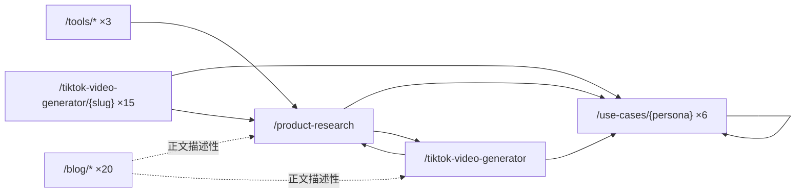

# Moras 内链优化方案 — 描述性锚文本 & 关键词变体

> **状态**：已归档（2026-08-26）。不再作为现行文档维护。

**创建**：2026-06-30 · **更新**：2026-06-30（v6 — 全量一致性修复）

---

## 一、问题诊断

### 1.1 当前内链的三重缺陷

| 缺陷 | 实例 | SEO 影响 |
|------|------|----------|
| **锚文本零信息量** | 所有卡片统一 `"See the playbook →"` | 搜索引擎无法通过锚文本理解目标页内容 |
| **锚文本高度重复** | 全站 70+ 个 `"See the playbook →"` 指向不同目标页 | 锚文本多样性为零 |
| **链接在卡片 UI 组件中** | 卡片是视觉导航组件，与正文流割裂 | 视为导航/UI 链接，权重大幅低于正文内链 |

### 1.2 博客页的参考做法

博客文章在正文中使用描述性上下文内链：

> "start with **our two-path setup guide** → `/blog/tiktok-shop-setup`"

产品页需要同样的模式：链接是句子中的自然短语。

### 1.3 受影响的页面

| 源页面 | 区段 | 卡片数 | 问题 |
|--------|------|--------|------|
| `/product-research` | Who it's for | 6 | 全部 `See the playbook →` |
| 15 个 TVG vertical 页 | Who it's for | 3/页 | 全部 `See the playbook →` |
| `/use-cases/{persona}` ×6 | Built for Other Roles | ~5/页 | 全部 `See the playbook →` |
| 3 个 `/tools/*` | 底部 CTA | 0（无内链） | 缺链到 `/product-research` |

---

## 二、核心原则

### 2.1 上下文内链优先

> 每条链接都是句子中的自然短语。删除链接后，句子仍然通顺。

### 2.2 锚文本一致性规则

> **同一目标页在同类源页面中使用相同风格的锚文本。** 例如指向 `/use-cases/affiliates`：
> - 在产品页中统一用 `TikTok Shop affiliates`
> - 在 TVG vertical 页中统一用 `{category} affiliates`
> - 在 Hub / 子页中统一用纯 persona 名

### 2.3 允许保留机械内链 section

以下页面在上下文描述段之后可保留结构化链接 section：

| 页面类型 | 形式 | 锚文本风格 |
|----------|------|----------|
| 产品页 / TVG vertical 页 | 底部卡片或 Related 行 | `{Persona} workflow →`（简洁一致） |
| Hub 页 | 卡片 grid | 卡片标题为链接 |
| 工具页 | "Related" 行 | 与正文内链相同的短语 |

---

## 三、逐页实施稿

### 3.1 `/product-research` — "Who it's for"（P0 🔴）

**统一规则**：所有 persona 锚文本使用 `{Persona}` 格式，不加 "TikTok Shop" 前缀（页面 context 已经明确是 TikTok Shop），不加额外修饰词。

```text
## Who Moras product research is built for

Different teams start from different places — but the need is the same:
pick something worth testing, then make the next video easier.

If you're an affiliate with showcase access but no clear product
direction, Moras surfaces commission-fit products so your posting time
goes into [affiliates](/use-cases/affiliates) with the best payout odds.
For [sellers](/use-cases/tiktok-sellers), the same feed surfaces products
worth stocking or seeding to your creator network. [Dropship and POD
teams](/use-cases/dropship) get product signals filtered to what's
selling, so every cut has a chance before you move on.

[Creators and KOCs](/use-cases/creators) get the same picks as full-time
affiliates — one session produces the posts you need for the week.
[Agencies and MCNs](/use-cases/agencies) pipe the same research feed to
every account, and [side hustlers](/use-cases/side-hustlers) get a
repeatable loop that fits around a day job.

Once you've shortlisted a product, [generate a shoppable
video](/tiktok-video-generator) — the next step is one tap away.
```

> 底部保留 6 张卡片，卡片标题为链接。卡片 CTA 统一为 `Learn more →`。

---

### 3.2 `/tiktok-video-generator` — "Built for Every TikTok Shop Shipper"（P0 🔴）

**统一规则**：persona 锚文本使用 `{Persona}` 格式，与 3.1 保持一致。

```text
## Built for every team that ships shoppable video

Each role gets a different way to ship more cuts every day — but every
one starts with [product research](/product-research). Moras connects the
pick to the publish button so you stop spending hours on the part AI can
handle.

For [affiliates](/use-cases/affiliates), the core loop is simple: pick a
high-payout SKU, generate five shoppable cuts with the affiliate link
baked in before lunch, and let the morning batch run.
[Sellers](/use-cases/tiktok-sellers) take the same product link and spin
up ten on-brand angles in an afternoon, then double down on the cuts that
move units. [Creators](/use-cases/creators) send an on-brief shoppable
video the brand can picture immediately, not a slide deck they'll forget.
[Side hustlers](/use-cases/side-hustlers) run an after-hours loop that
tests products without eating every evening, and
[agencies](/use-cases/agencies) get account rosters, review queues, and
per-account analytics.
```

> 底部保留 3 张卡片，卡片标题改为链接。卡片 CTA 统一为 `Learn more →`。

---

### 3.3 TVG Vertical 页（15 个）— "Who it's for"（P0 🔴）

**统一规则**：persona 锚文本使用 `{Category} {role}` 格式，品类词来自页面本身的品类描述。

```text
## Who this cleaning gadget video workflow is for

[Cleaning gadget affiliates](/use-cases/affiliates) batch scrubber, mini
vacuum, mop tool, and pet hair cuts — each 15-20 seconds, the exact
rhythm CleanTok viewers stay for. [Cleaning product
sellers](/use-cases/tiktok-sellers) generate kitchen, bathroom, car, and
small-space variants from one SKU in a single session.

Cleaning creators ship satisfying grime-removal shots, not generic
B-roll. Start with [product research](/product-research) to pick a
winner, then turn it into a cut that shows the mess and the reveal in one
sequence. If you're a [creator](/use-cases/creators) working around a day
job, this batch workflow fits between shifts — no studio, no filming.
```

**15 个 vertical 页锚文本**（统一 `{Category} {role}` 风格）：

| Vertical | → affiliates | → sellers |
|----------|-------------|----------|
| `cleaning-gadgets` | `Cleaning gadget affiliates` | `Cleaning product sellers` |
| `home-organization` | `Home organization affiliates` | `Home organization sellers` |
| `kitchen-gadgets` | `Kitchen gadget affiliates` | `Kitchen product sellers` |
| `lip-gloss` | `Beauty affiliates` | `Beauty product sellers` |
| `makeup-tools` | `Beauty tool affiliates` | `Beauty tool sellers` |
| `mattress` | `Mattress affiliates` | `Home product sellers` |
| `perfume` | `Fragrance affiliates` | `Fragrance sellers` |
| `pet-products` | `Pet product affiliates` | `Pet product sellers` |
| `phone-case` | `Phone case affiliates` | `Phone accessories sellers` |
| `protein-snacks` | `Food affiliates` | `Food product sellers` |
| `shapewear` | `Fashion affiliates` | `Fashion sellers` |
| `skincare` | `Skincare affiliates` | `Skincare sellers` |
| `sleep-products` | `Sleep product affiliates` | `Sleep product sellers` |
| `toiletry-bag` | `Travel affiliates` | `Travel accessories sellers` |
| `vacuum` | `Vacuum affiliates` | `Vacuum sellers` |

> 所有页面底部可保留 3 张卡片，卡片标题为链接，CTA 统一为 `Learn more →`。

---

### 3.4 `/use-cases` Hub 页（P1 🟡）

**统一规则**：Hub 页本身是导航页，锚文本使用纯 persona 名。

```text
## Built for the people who actually ship videos

Pick the role closest to your day. Moras turns product research, video
creation, captions, and feedback into one repeatable selling workflow.

Starting from zero with no samples? [Creators](/use-cases/creators) launch
accounts with daily content — no studio required. Showcase unlocked but
no idea which SKU to push? The [affiliate workflow](/use-cases/affiliates)
ranks products by commission × GMV × supply gap so you stop guessing.
Already posting but commission is flat? [Sellers](/use-cases/tiktok-sellers)
re-use the winning hook across a batch of cuts. Testing at scale?
[Dropship](/use-cases/dropship) teams iterate fast and let losers die
quietly. Running a roster? [Agencies](/use-cases/agencies) get review
queues and per-account analytics. Desk job comes first? [Side
hustlers](/use-cases/side-hustlers) follow an after-hours loop.

Choose your lane:
```

> 之后保留 6 张卡片 grid。卡片标题（`Affiliates`、`Sellers` 等）即为链接。移除 `"See the playbook"`。

---

### 3.5 `/use-cases/{persona}` 子页 — "Built for Other Roles Too"（P1 🟡）

**统一规则**：与 Hub 页一致，使用纯 persona 名。

以 `/use-cases/affiliates` 为例：

```text
## Moras adapts to every team on TikTok Shop US

The affiliate workflow surfaces high-commission SKUs and turns them into
shoppable cuts in one session. Other roles start from a different place —
Moras meets each one.

Storefront owners use the [seller workflow](/use-cases/tiktok-sellers)
for batch review and per-account analytics.
[Creators](/use-cases/creators) build consistent output from scratch — no
studio required. [Side hustlers](/use-cases/side-hustlers) follow a
repeatable loop within a few sessions a week.
[Dropship](/use-cases/dropship) teams iterate without ordering samples.
[Agencies](/use-cases/agencies) get account rosters and review queues —
the same pipeline, with the controls a team needs.
```

> 底部可保留 Related 行，锚文本统一为 `{Persona} workflow →`。

---

### 3.6 工具页（P2 🟢）

**修复**：三条锚文本改为与各自工具功能匹配。

| 工具页 | 锚文本 | 完整句子 |
|--------|--------|---------|
| `/tools/tiktok-hashtag-generator` | `pick a product before you tag it` | Hashtags are 5% of the work. **[Pick a product before you tag it](/product-research)** — the right tag on the wrong product won't convert. |
| `/tools/tiktok-caption-generator` | `find a winning product before you caption it` | Captions convert when the product is right. **[Find a winning product before you caption it](/product-research)** — then the caption writes itself. |
| `/tools/tiktok-shop-product-scorer` | `find products worth scoring first` | A score needs a shortlist. **[Find products worth scoring first](/product-research)** — then score the ones with real traction. |

> 三条锚文本风格一致：`{动词} {对象} before/after/first {工具用途}`。均指向同一个目标页但锚文本不重复。

---

## 四、全站锚文本一致性总览

**统一后的规则**：

| 源页类型 | 指向 persona 的锚文本风格 | 指向 product-research 的锚文本风格 |
|----------|------------------------|-------------------------------|
| 产品页（`/product-research`、`/tiktok-video-generator`） | 纯 persona 名（`affiliates`、`sellers`） | 动作短语（`generate a shoppable video`、`product research`） |
| TVG vertical 页（×15） | `{Category} {role}`（品类定制） | `product research` |
| Hub 页 | 纯 persona 名（`Creators`、`Sellers`） | — |
| Persona 子页（×6） | 纯 persona 名（`Creators`、`Sellers`） | — |
| 工具页（×3） | — | `{动词} {用途}`（与工具功能匹配） |

---

## 五、内链拓扑



---

## 六、实施优先级

| 优先级 | 页面 | 内链数 | 改动描述 | 排期 |
|--------|------|--------|---------|------|
| P0 🔴 | `/product-research` | 7 | 卡片→上下文段落 + 底部卡片 | Week 1 |
| P0 🔴 | `/tiktok-video-generator` | 6 | 卡片→上下文段落 + 底部卡片 | Week 1 |
| P0 🔴 | 15 TVG vertical 页 | 4/页 | 卡片→上下文段落 + 底部卡片 | Week 2-3 |
| P1 🟡 | `/use-cases` Hub | 6 | 新增描述段，卡片标题改链接 | Week 3 |
| P1 🟡 | 6 `/use-cases/{persona}` | 5/页 | 卡片→上下文段落 | Week 3-4 |
| P2 🟢 | 3 `/tools/*` | 1/页 | 底部新增 1 句含内链 | Week 4 |

---

## 七、验证 checklist

- [ ] 无任何 `"See the playbook"` 或等价通用 CTA
- [ ] 删除正文内链后句子仍通顺
- [ ] 同类型页面的锚文本风格一致（第五节规则表）
- [ ] 三条工具页锚文本指向相同目标但彼此不重复
- [ ] 所有新链返回 HTTP 200
- [ ] 移动端可读性正常

---

*数据来源：sitemap.xml，聚合页，页面实时 HTML 抓取*
