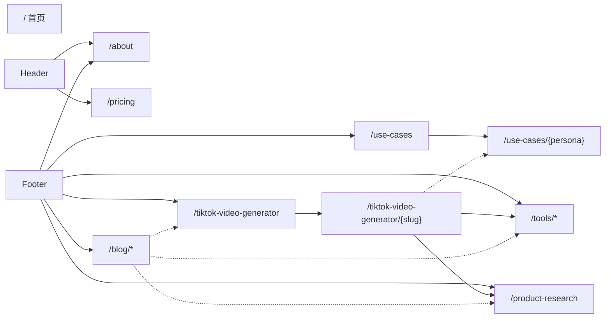

# Moras 站点页面结构

**站点**：[moras.ai](https://moras.ai/) · **更新**：2026-07-14 · **数据来源**：`sitemap.xml`（`site-sitemap.xml` + `seo-sitemap.xml`），聚合页内链，各 URL HTTP 200 校验

---

## 站点概览

| 项 | 值 |
|----|-----|
| 主域 | [https://moras.ai/](https://moras.ai/) |
| 已上线页面 | **56** |
| sitemap 收录但 404 | `/top-tiktok-shop-sellers` |
| iOS 入口 | [App Store — Moras](https://apps.apple.com/us/app/moras-create-earn-with-ai/id6755306262) |

首页 `/` 为独立 SPA，营销区块（Hero、Features、Pricing 等）以**锚点**呈现。`/pricing` 为独立定价页，同时首页也保留 Pricing 锚点区块。`/about` 现已独立为独立页（原为首页锚点/无独立 URL）。SEO 栏目页（Blog、Use cases、TikTok Video Generator、Pricing、About 等）共用同一套 Header / Footer。

---

## 导航结构

### Header（SEO 页）

| 标签 | 目标 | 类型 |
|------|------|------|
| Logo | `/` | 独立页 |
| Blog | `/blog` | 独立页 |
| Use cases | `/use-cases` | 独立页 |
| TikTok video generator | `/tiktok-video-generator` | 独立页 |
| Pricing | `/pricing` | 独立页 |
| About | `/about` | 独立页 |
| Download | [App Store](https://apps.apple.com/us/app/moras-create-earn-with-ai/id6755306262)（站外） | 无 moras.ai 独立页 |

> 各产品页和工具页（Product research、Tools 等）通过 Header 内下拉菜单及 Footer 链接可达。

### 首页 `/` 区块（锚点）

Hero · Features · Showcase · Feedback / Wall of Love · Pricing · 底部 CTA

**`<title>`**：`Moras - AI Commerce Producer for Viral Videos | K2 Lab`

### Footer（SEO 页）

| 区块 | 链接 |
|------|------|
| **Product** | [Product research](/product-research) · [TikTok video generator](/tiktok-video-generator) · [Hashtag generator](/tools/tiktok-hashtag-generator) · [Caption generator](/tools/tiktok-caption-generator) · [Product scorer](/tools/tiktok-shop-product-scorer) |
| **Resources** | [Blog](/blog) · [Use cases](/use-cases) |
| **Company** | [About](/about) · Vision · Careers（Vision/Careers 无独立页） |
| **Connect** | Contact（无独立页，返回 404）· [Terms](/terms) · [Privacy](/privacy) |

---

## 已上线页面清单

| 栏目 | 页面数 |
|------|--------|
| 静态页 | 9 |
| Product | 1 |
| Tools | 3 |
| Use Cases | 7 |
| TikTok Video Generator | 16 |
| Blog | 20 |
| **合计** | **56** |

### 静态页

| 路径 | 说明 | 备注 |
|------|------|------|
| `/` | 营销首页（SPA） | |
| `/landing` | 备用 Landing | robots: none |
| `/managedLanding` | 代运营模式 Landing（Done-for-you） | sitemap 收录，独立 Landing 页 |
| `/about` | 品牌介绍 / K2 Lab 背景 | **新增**，原为首页锚点 |
| `/pricing` | 定价页（Pro / Agency / Managed） | **新增**，独立页，首页同时保留 Pricing 锚点 |
| `/terms` | Terms of Service | |
| `/privacy` | Privacy Policy | |
| `/precheck-guidance` | App 预检指引 | |
| `/subscription` | 订阅与分润条款 | |

### Product

| 路径 | 说明 |
|------|------|
| `/product-research` | TikTok Shop 选品工具页 |

### Tools

| 路径 | 说明 |
|------|------|
| `/tools/tiktok-hashtag-generator` | Hashtag 生成器 |
| `/tools/tiktok-caption-generator` | Caption 生成器 |
| `/tools/tiktok-shop-product-scorer` | 商品评分器 |

### Use Cases（Hub + 6 Vertical）

| 路径 | 人群 |
|------|------|
| `/use-cases` | Hub |
| `/use-cases/affiliates` | 联盟客 |
| `/use-cases/agencies` | 机构 |
| `/use-cases/creators` | 创作者 |
| `/use-cases/dropship` | 代发 |
| `/use-cases/side-hustlers` | 副业者 **（新增）** |
| `/use-cases/tiktok-sellers` | TikTok 卖家 |

### TikTok Video Generator（Hub + 15 Vertical）

| 路径 | slug |
|------|------|
| `/tiktok-video-generator` | Hub |
| `/tiktok-video-generator/cleaning-gadgets` | cleaning-gadgets |
| `/tiktok-video-generator/home-organization` | home-organization |
| `/tiktok-video-generator/kitchen-gadgets` | kitchen-gadgets |
| `/tiktok-video-generator/lip-gloss` | lip-gloss |
| `/tiktok-video-generator/makeup-tools` | makeup-tools |
| `/tiktok-video-generator/mattress` | mattress |
| `/tiktok-video-generator/perfume` | perfume |
| `/tiktok-video-generator/pet-products` | pet-products |
| `/tiktok-video-generator/phone-case` | phone-case |
| `/tiktok-video-generator/protein-snacks` | protein-snacks |
| `/tiktok-video-generator/shapewear` | shapewear |
| `/tiktok-video-generator/skincare` | skincare |
| `/tiktok-video-generator/sleep-products` | sleep-products |
| `/tiktok-video-generator/toiletry-bag` | toiletry-bag |
| `/tiktok-video-generator/vacuum` | vacuum |

### Blog（Hub + 19 篇）

| 路径 | slug |
|------|------|
| `/blog` | Hub |
| `/blog/ab-testing-affiliate-videos` | ab-testing-affiliate-videos |
| `/blog/best-affiliate-programs-for-creators-2026` | best-affiliate-programs-for-creators-2026 |
| `/blog/ecommerce-terms-tiktok-shop` | ecommerce-terms-tiktok-shop |
| `/blog/faceless-tiktok-shop-videos` | faceless-tiktok-shop-videos |
| `/blog/how-does-tiktok-shop-work` | how-does-tiktok-shop-work |
| `/blog/how-to-be-successful-on-tiktok-shop-affiliate` | how-to-be-successful-on-tiktok-shop-affiliate |
| `/blog/how-to-get-brand-deals-without-a-big-following` | how-to-get-brand-deals-without-a-big-following |
| `/blog/how-to-learn-tiktok-shop` | how-to-learn-tiktok-shop |
| `/blog/how-to-make-money-on-tiktok` | how-to-make-money-on-tiktok |
| `/blog/how-to-sell-products-on-tiktok` | how-to-sell-products-on-tiktok |
| `/blog/shoppable-video-structure` | shoppable-video-structure |
| `/blog/tiktok-affiliate-side-hustle` | tiktok-affiliate-side-hustle |
| `/blog/tiktok-captions-hashtags` | tiktok-captions-hashtags |
| `/blog/tiktok-product-research` | tiktok-product-research |
| `/blog/tiktok-shop-beginner-guide` | tiktok-shop-beginner-guide |
| `/blog/tiktok-shop-data-analytics` | tiktok-shop-data-analytics |
| `/blog/tiktok-shop-no-sales` | tiktok-shop-no-sales |
| `/blog/tiktok-shop-setup` | tiktok-shop-setup |
| `/blog/tiktok-video-hooks` | tiktok-video-hooks |

---

## 内链枢纽

- **Header**：新增 About、Pricing 独立链接
- **Footer Company 区**：About 现指向独立页 `/about`（原为首页锚点）
- **Footer Product 区**：串联选品、Video Generator、三大工具
- **TVG Hub → Vertical**：Hub 卡片链至全部品类页
- **Vertical → Product / Tools**：选品内链；Captions / Hashtags 示例互链
- **Vertical ↔ Use Cases**：Who it's for playbook 互链（含新增 `/use-cases/side-hustlers`）
- **Blog ↔ 全站**：文章内链至 Product、TVG、Tools

---

## sitemap 收录但未上线

| 路径 | 状态 |
|------|------|
| `/top-tiktok-shop-sellers` | 404 — 在 `seo-sitemap.xml` 中收录，但页面返回 404 |

---

*sitemap 索引：[moras.ai/sitemap.xml](https://moras.ai/sitemap.xml)*
