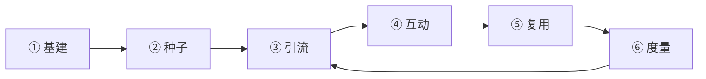

# Final Round AI — Community 运营 Playbook

> **目的**：可执行的 `/community` 运营 Pipeline——定位、竞品借鉴、六阶段闭环、周/月节奏、KPI、90 天路线图与团队分工。  
> **关联**：[finalround-community-forum.md](./finalround-community-forum.md)（线上审计、§4 优化待办、§7 竞品、§8 Blind/Reddit）· [finalround-project-tasks.md](../finalround-project-tasks.md) §2  
> **线上入口**：https://www.finalroundai.com/community  
> **Last updated**: 2026-06-04

---

## 0. 执行摘要

| 项 | 结论 |
|----|------|
| **社区定位** | 主域 **可搜索知识库** + 产品反馈 + 转化辅助；不是第二个 r/cscareerquestions |
| **竞品空白** | Copilot 赛道仅 **Final Round AI** 与 **VirtualInterview.ai `/forum`** 有公开论坛（见 [§7](./finalround-community-forum.md#7-公开-community-竞品调研2026-06-04)） |
| **运营形态对标** | 产品 → VirtualInterview；社区机制 → PrepLounge Q&A + 轻量 peer 互动 |
| **第三方分工** | Blind / Reddit = 舆情与选题；`/community` = 官方 SEO、规则、产品反馈（见 [§8](./finalround-community-forum.md#8-第三方公开社区blind-与-reddit)） |
| **90 天目标** | **150–200** 可索引主题 + 每周稳定互动；不追 PrepLounge 19k+ Q&A 体量 |
| **工程前置** | 先完成 [finalround-community-forum.md §4.1](./finalround-community-forum.md#41-p0--集成与可发现性) P0 基建，再加大运营投入 |

---

## 1. 定位（先定再运营）

### 1.1 与 Blind / Reddit 的分工

| 维度 | Final Round `/community` | Blind / Reddit |
|------|--------------------------|----------------|
| **角色** | 官方、可搜索、常青知识库 + 产品反馈 | 匿名吐槽、实时舆情 |
| **内容** | 个案提问、Weekly wins、Success Stories | 面经、伦理争论、工具评测 |
| **目标** | SEO 长尾 + 转化（→ Copilot / Mock Interview） | 不追求「比 Reddit 更火」 |
| **对标** | 产品形态：**VirtualInterview.ai `/forum`**；运营形态：**PrepLounge Q&A** |

**一句话**：Community = 「Stack Overflow 式面试问答」+ 「产品反馈板」。

### 1.2 与 Blog 的分工

| 渠道 | 适合 | 不适合 |
|------|------|--------|
| **Blog** | 常青指南、SEO 程序化、产品评测、结构化 How-to | 个人实时问答、争议性 offer 细节 |
| **Community** | 个案提问、经验串、产品反馈、Weekly 互动 | 大篇幅模板化 SEO 文 |

详见 [finalround-community-forum.md §4.4](./finalround-community-forum.md#44-与-blog-的分工避免重复)。

### 1.3 对外差异化叙事

> Final Round 是 **少数在官网提供公开、可搜索 Interview Community 的 AI 面试平台**（直接对标仅 VirtualInterview.ai）。我们在 **主域** 沉淀 STAR、HireVue、Amazon LP 等长尾问答，而不是把用户赶到 Discord。

---

## 2. 竞品可借鉴项（仅 public 论坛）

| 竞品 | 可抄 | 不抄 |
|------|------|------|
| **[VirtualInterview.ai](https://virtualinterview.ai/forum)** | 论坛与 mock / 题库 / 文章同域；免费档含 forum access（Terms） | 他们的体量和分类细节 |
| **[PrepLounge](https://www.preplounge.com/en/consulting-forum)** | Q&A 结构、置顶 SOP 帖、[give-and-get](https://www.preplounge.com/en/consulting-forum/preplounge-meetings-12449)（你帮别人 mock，别人帮你）、[Meeting Board](https://www.preplounge.com/en/meeting-board) 预约概念、可靠性 / 反馈 | 56 万用户量级、咨询 case 库 |
| **Exponent** | Weekly 互动、peer mock 节奏（可改成「Weekly wins」） | 封闭 Slack |
| **LockedIn AI** | Discord 作 **support 二线**（可选，非公网主社区） | 把 Discord 当主社区 |
| **Discourse 通用** | 5–10 种子帖、先邀 power user、全站链入、Community → Blog 闭环 | — |

**外部参考**：

- [The 2026 community-led growth playbook](https://www.ad-stack.ai/blog/community-led-growth-playbook/) — Community-to-content 飞轮
- [How to Optimize Community Content for AI Discovery](https://blog.discourse.org/2025/09/how-to-optimize-community-content-for-ai-discovery/) — 主题聚类、Accepted Answer、可解析 Q&A 格式
- [Community SEO: How to Rank with Skool, Circle & UGC](https://seosherpa.com/community-seo/) — 主域可索引 UGC 的价值

---

## 3. 运营 Pipeline（六阶段闭环）



与 [finalround-community-forum.md §4](./finalround-community-forum.md#4-优化待办下一阶段) 优化待办对齐：§4.1 → 阶段 ①；§4.2 → 阶段 ②–⑤；§4.3 → 阶段 ③–⑥。

---

### 阶段 ① 基建（P0，第 1–2 周）

**目标**：让人找得到、敢发帖、搜得到。

| 动作 | 说明 | 对齐任务 |
|------|------|----------|
| Pin 规则 + 一条 Welcome | 合并重复 Welcome；各分类 pin「About {category}」 | §4.1.4 |
| 全站入口 | Footer + Navbar；`/explore` → Community 已有 | §4.1.1 |
| SEO 基建 | canonical / www 统一；修复 `/community/sitemap.xml` 500 | §4.1.2、§4.1.3 |
| 标签体系 | `interview-copilot`、`mock-interview`、`hirevue`、`system-design` 等 | §4.2.3 |
| Organization `sameAs` | 主站 JSON-LD 增加 community URL | §4.2.6 |
| 审核 SLA | 规则已就绪；定 flag 响应（建议 **48h 内**） | §4.3.4 |

**负责人**：工程（Mohit）+ Community Owner。

**完成标准**：Footer / 产品页有 Community 入口；6 分类各有 About 置顶帖；sitemap 可抓取。

---

### 阶段 ② 种子（P0，第 3–6 周）

**目标**：**30–50 帖可索引内容**，每分类有「模板帖」，不是空板。

Discourse 最佳实践：先 **5–10 个高质量主题**，再邀 **20 个最活跃用户**（邮件列表、Mock 用户、Referral）定调。

#### 2.1 各分类种子帖（各 2–3 篇）

| 分类 | 种子帖类型 |
|------|------------|
| **Interview Prep** | 「Google PM behavioral 怎么 prep？」「HireVue 录制前 checklist」「STAR 模板串」 |
| **Resume & Career** | 「ATS 格式 checklist」「career switch 简历怎么写」 |
| **Success Stories** | 1 篇真实 offer 故事（脱敏）+ 邀请模板「Share your win」 |
| **Product Feedback** | 「Feature requests 怎么写才有效」 |
| **General** | Weekly wins #2、Introduction thread（已有可续） |
| **Site Feedback** | 「你希望 Community 增加什么分类？」 |

#### 2.2 PrepLounge 式 SOP 帖

像 [PrepLounge Meetings](https://www.preplounge.com/en/consulting-forum/preplounge-meetings-12449) 一样，在各分类 pin **固定格式指南**——「如何在本版发帖才能收到好回复」。已有 [How to ask for feedback](https://www.finalroundai.com/community/t/how-to-ask-for-resume-or-interview-feedback-and-actually-get-it/15)，可复用到 Resume & Career、Interview Prep。

#### 2.3 种子内容原则

- 种子帖可由团队撰写，但须 **像真人、可追问**
- 长期逐步替换为真实 UGC
- 标题含 **搜索意图关键词**（利于 SEO / AI 发现）

**完成标准**：每分类 ≥5 帖；≥10 条非官方回复。

---

### 阶段 ③ 引流（P1，第 7 周起持续）

**目标**：把 **产品流量** 和 **搜索流量** 导入 Community。

| 来源 | 动作 | 对齐任务 |
|------|------|----------|
| **产品内** | Mock / Copilot 结束后：「有问题？发到 Community」+ 预填分类 | §4.3.2 |
| **Blog** | 每篇高流量文底部 1 链到对应 Community 主题 | §4.2.1 |
| **interview-prep / interview-questions** | 页脚「Discuss in Community」 | §4.2.2 |
| **tech-layoffs** | 裁员帖 CTA：「在 Community 讨论 re-interview prep」 | — |
| **邮件 / Referral** | 新用户 onboarding 第 3 封邮件带 Community 链接 | — |
| **Blind / Reddit（只读）** | **不马甲推广**；把高频问题 **改写成 Community 主题** | §8.4、§4.3.5 |

**VirtualInterview 模式参考**：论坛与 **免费试用** 绑定——可考虑「注册主站即可浏览；发帖需账号」降低门槛。

**UTM 规范**：`?utm_source=community&utm_medium=referral&utm_campaign={page}`

**完成标准**：Community 来源流量 ≥ **5%** 新注册（90 天内）。

---

### 阶段 ④ 互动（P1，Weekly 节奏）

**目标**：从「39 帖静态库」变成「每周有新回复」。

#### 4.1 每周固定动作（约 3–5 小时/周）

| 日 | 动作 |
|----|------|
| **周一** | 发 **Weekly interview wins and challenges #N**（沿用已有模板） |
| **周三** | 在 **Interview Prep** 发 1 个「本周热点题」（来自 Blind/Reddit 监测，改写为中性提问） |
| **周五** | 回复所有零回复帖；给 Product Feedback 帖官方 ack |
| **随时** | `@` 产品同事回答 Copilot / Mock 技术问题（建立「官方在场」） |

#### 4.2 每月固定动作

| 动作 | 说明 |
|------|------|
| **AMA / Office Hours** | 1 次（可文字 AMA）：「PM 面试季 Q&A」——PrepLounge 用 Expert，Final Round 用内部或 guest |
| **精选帖** | 选 1 篇高回复帖，摘要进 Newsletter 或 Blog「Community highlights」 |
| **Blind / Reddit 扫描** | `site:reddit.com "Final Round AI"`、`site:teamblind.com interview copilot` → 更新 FAQ / 新主题 |

监测清单见 [finalround-community-forum.md §8.5](./finalround-community-forum.md#85-监测清单运营--增长)。

#### 4.3 轻量 peer 互动（Mock Buddy）

在 General 或 Interview Prep 开串：

- 「**Mock buddy thread** — 留言：角色 + 时区 + 想练 behavioral / coding」
- 规则：禁止卖课、禁止竞品硬广（与 [Community rules](https://www.finalroundai.com/community/t/read-this-before-posting-community-rules-and-content-standards/14) 一致）

比 PrepLounge 90 分钟 case 轻，但复用 **give-and-get** 心理；不必先做 Meeting Board v1。

#### 4.4 Blind/Reddit → Community 选题映射

| 外部高频话题 | Community 分类 |
|--------------|----------------|
| Amazon LP / behavioral | Interview Prep |
| HireVue / 异步视频 | Interview Prep |
| STAR / tell me about yourself | Interview Prep |
| ATS 简历格式 | Resume & Career |
| Copilot 是否 detectable | General（合规说明 + 链 FAQ） |
| Google PM / Meta coding 面经 | Interview Prep |

完整映射见 [finalround-community-forum.md §8.4](./finalround-community-forum.md#84-三方社区分工final-round-应如何配合)。

---

### 阶段 ⑤ 复用（P1，Community → Content 飞轮）

**目标**：每条好讨论变成可发现资产。

```
Community 好帖 → Blog 段落 / FAQ → 链回原帖 → Google/AI 引用 → 新用户进 Community
```

| 触发条件 | 产出 |
|----------|------|
| 某帖 ≥5 回复或 ≥100 views | Blog 短节「Community 都在问：XXX」 |
| 重复问 3 次的问题 | 写入 `/frequently-asked-questions` + Community pin |
| Success Story | 经同意 → Blog / 首页 testimonial（脱敏） |
| Product Feedback 聚类 | 产品 changelog + Community 回复「已收录」 |

**SEO / AI 优化技巧**（Discourse 官方）：

- 用描述性标题；回复采用 Q&A 结构
- 标记 Accepted Answer 或帖末总结解决方案
- 主题间内链、Tags 聚类（如 `hirevue`、`star-method`）
- 引用 Blog / FAQ 作为权威来源

---

### 阶段 ⑥ 度量（P1，Weekly dashboard）

| 指标 | 早期目标（0–90 天） | 工具 |
|------|---------------------|------|
| 新主题 / 周 | ≥3（含官方 1 + UGC 2） | Discourse |
| 回复率 | 零回复帖 < **30%** | Discourse |
| DAU / MAU | 环比即可 | Discourse / GA4 |
| 来自 Community 的注册 / 试用 | UTM 追踪 | Amplitude |
| 索引页数 | community 子 sitemap 条目增长 | GSC |
| 舆情 | Final Round 在 Reddit / Blind 提及情感 | 人工月检 |

**不追 PrepLounge 的 19k Q&A**；关注 **可索引 UGC 资产** 与 **互动稳定性**。

---

## 4. 90 天路线图

| 阶段 | 时间 | 重点 | 成功标准 |
|------|------|------|----------|
| **S1 基建** | 第 1–2 周 | P0 集成、pin、标签、sitemap | Footer / 产品页有入口；6 分类各有 About |
| **S2 种子** | 第 3–6 周 | 30+ 种子帖 + Weekly wins 连更 4 期 | 每分类 ≥5 帖；≥10 条非官方回复 |
| **S3 引流** | 第 7–10 周 | Blog / interview-prep 互链；产品内 CTA | Community 来源流量 ≥5% 新注册 |
| **S4 飞轮** | 第 11–13 周 | 首篇 Community→Blog；首次 AMA | 2 篇 Blog 引用 Community；GSC 有 community 展示 |

---

## 5. 团队分工（RACI）

| 角色 | 职责 |
|------|------|
| **Community Owner**（1 人，可 part-time） | Weekly wins、回复、选题、Blind/Reddit 监测、Moderation |
| **产品 / 工程** | SSO、产品内 CTA、sitemap、Discourse 主题品牌化 |
| **内容 / SEO** | Blog ↔ Community 互链、Community highlights 写文章 |
| **产品 PM** | Product Feedback 分类、changelog 闭环 |
| **Mohit** | Rewrite / canonical / 主站集成 |

---

## 6. 运营原则（避免踩坑）

| # | 原则 | 说明 |
|---|------|------|
| 1 | **不在 Reddit / Blind 灌水** | 只「听」再「在自家 Community 答」；违规推广易被反噬 |
| 2 | **Live Copilot 话题要克制** | Community 可讨论 prep 与 Mock；涉及「面试中作弊 / 检测」的帖，引导至 FAQ + 规则 |
| 3 | **异步优先** | Discourse 强项是可搜索线程；Discord 最多作 support 补充，非公网主社区 |
| 4 | **禁止 astroturf** | 不冒充用户刷帖；见 [§8.4](./finalround-community-forum.md#84-三方社区分工final-round-应如何配合) |
| 5 | **负面舆情不争辩** | 检测、退款、伦理类 → Product Feedback 或 FAQ 联动 |

---

## 7. Weekly Checklist（Community Owner）

复制到 Notion / 任务板，每周勾选：

### 周一

- [ ] 发布 Weekly interview wins and challenges #___
- [ ] 检查周末新帖，回复零回复帖

### 周三

- [ ] 发 1 条 Interview Prep 热点题（来源：Blind/Reddit 监测）
- [ ] 检查 Product Feedback，@ PM 需跟进项

### 周五

- [ ] 本周零回复帖清零或注明「等待用户补充」
- [ ] 记录本周 KPI：新主题数、回复数、Views Top 3

### 每月（第一周）

- [ ] Google：`site:teamblind.com "Final Round AI"`、`site:reddit.com "Final Round AI"`
- [ ] 更新选题 backlog（≥5 条待写 Community 主题）
- [ ] 选 1 篇高回复帖 → 提交 Blog / Newsletter
- [ ] 复核竞品是否新上 `/community`（更新 [§7](./finalround-community-forum.md#7-公开-community-竞品调研2026-06-04)）

---

## 8. 文档互引

| 文档 | 关系 |
|------|------|
| [finalround-community-forum.md](./finalround-community-forum.md) | 线上审计、§4 工程待办、§7 竞品、§8 Blind/Reddit |
| [finalround-project-tasks.md](../finalround-project-tasks.md) | Forum 任务 §2 |
| [finalround-site-structure.md](../finalround-site-structure.md) | `/community/` URL、sitemap |
| [blog/blog-interlinks.md](../blog/blog-interlinks.md) | Blog ↔ Community 互链 |
| [finalround-brand-visual.md](../finalround-brand-visual.md) | Discourse 主题品牌化 |
| [tech-layoffs/README.md](../tech-layoffs/README.md) | 类比：板块 SOP + 运维节奏 |

---

*Pipeline 与 KPI 每季度复核；线上 Topic 数以 [finalround-community-forum.md §1](./finalround-community-forum.md#1-线上现状审计2026-06-04) 为准。*
