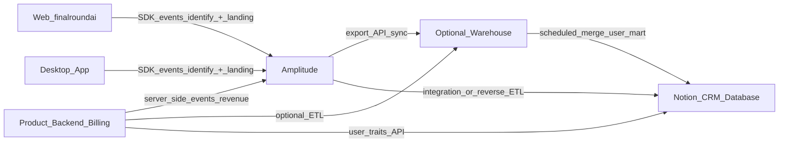

# Final Round AI — 数据归因方案（Notion CRM × Amplitude）

> **本文首要目的**：把 **注册** 与 **付费** 清晰归到 **① 营销渠道**（自然搜索、付费广告、外链、直访、社媒、邮件等）和 **② 首访落地页**（含大量 SEO 专题页/博客路径），从而 **逐页、逐活动** 判断 SEO 与投放效果，并支撑周会与投放迭代。  
> **职责补充**：在达成上述「经营可读」目标的前提下，说明以 **Amplitude 作行为与归因主事实源**、**Notion Database 作轻量 CRM/用户主数据协作面** 的边界、字段分工、同步链路与分阶段落地。  
> **方法参照**：[分析-GA-Sheets-归因流水线-zh.md](../../分析/分析-GA-Sheets-归因流水线-zh.md) 的「多源合并 + 用户级宽表 + 分阶段 Checklist」思路；**工具替换** 为 **Amplitude + Notion**（不默认依赖 GA4→BigQuery→Sheets 路径）。  
> **产品背景**：[finalround.md](./finalround.md)（Web + Desktop、Freemium、Interview Copilot 等）  
> **最后更新**：2026-04-24

**站点**：https://www.finalroundai.com/

---

## 0. 核心目标：要回答的归因问题

下面每一条都应在 **Amplitude** 中有稳定口径；Notion 只承载 **同口径摘要**，方便销售/运营协作，不作第二套「自填渠道真值」。

| 问题 | 典型切片维度 | 主要用途 |
|------|----------------|----------|
| **注册来自什么渠道？** | `utm_source` / `utm_medium`、Referrer 类型、是否付费流量 | 投放复盘、内容团队优先级 |
| **付费来自什么渠道？** | 同左 + 可单独定义 **末触/首次付费前触点** | ROAS、渠道预算分配 |
| **用户从哪个落地页（URL）进入并完成注册/付费？** | **首访路径或完整 URL**、Content Group、路径前缀 | **SEO 页面效果**、哪类落地页更带货 |
| **自然搜索（SEO）整包贡献多少？** | Organic 规则（无 UTM + 搜索引擎 Referrer 或 GSC 对齐）+ **落地页=内容 URL** | 验证专题页/博客/Programmatic 是否带来注册与收入 |
| **外链/引荐具体是哪些站？** | `referrer` 域名、合作活动 `utm_campaign` | 合作与 PR 效果 |

**直接结论**：

- **渠道** 靠 **UTM 规范 + Referrer/媒介推断规则** 统一成少数「可汇报大类」（见 §6）。  
- **落地页/SEO 效果** 必须单独固化 **`first_landing_path` 或等价的首次落地 URL**（及可选 `first_landing_url`），与 `first_touch_utm_*` 同时落库，缺一不可——仅有 UTM 无法回答「哪篇 SEO 页来了人」在大量 **自然流量无 UTM** 的场景。

---

## 1. 目标与能力边界

### 1.1 要交付什么

- **可运营的归因口径**：在 Amplitude 中稳定回答「首触/末触来自哪」「**落地页是哪一个**」「活动/渠道如何贡献 **注册、激活、付费**」；与 **UTM 规范、用户标识（`user_id`）** 一致。  
- **可协作的 CRM 视图**：在 **Notion Database** 中维护潜客/用户一条记录一行的「人」视图，含 **营销归因摘要（渠道 + 落地页）**、销售/CS 备注、标签与下一步；**不是** 替代数仓，而是 **人读 + 轻流程** 的落点。  
- **可选的分析落盘**：将「用户级结果表」同步到数据仓库 + BI 或 **Notion 属性**（二选一或并存），与参考文档中「先汇总、再进消费端」原则一致。

### 1.2 重要结论：一条用户级真值 = 多源合并

- **强业务/计费**（精确 `plan`、续费/退款等）往往来自 **产品后端/支付**；需通过 Identify 或 **服务器事件** 写回 Amplitude，分析产品内才完整。  
- **Notion 作为 CRM** 时，PII/流程字段在 Notion；**行为计数、渠道与落地页的技术真值** 以 **Amplitude（或经仓库汇总）** 为准，再同步 **只读摘要列** 到 Notion，避免双录冲突。

**推荐公式**：

```text
Amplitude（行为 + 首/末触 UTM + 首访落地 path/url + 关键事件）
  + 业务库/支付（计划与账单事实，可选经仓库）
  + 规则化同步/定时任务
  → 用户级宽表 或 直接 Summary 到 Notion 列
```

### 1.3 管道工程 vs 表后分析

| 层级 | 内容 | 典型承担方 |
|------|------|------------|
| **采集与治理** | UTM 规范、**首访落地页固化**、**SEO URL 可分组**、跨 Web/Desktop 的 `user_id`、事件字典、Notion 列口径、同步 | 数据/工程 + 增长 |
| **消费与决策** | Amplitude Chart/Notebook、Notion/BI 看板、**「按落地页/渠道看注册与付费」周会** | 增长、市场、SEO、销售 |

**落地顺序建议**：先跑通 **Identify + UTM + 首访落地 path + 核心转化事件** 与 **Notion 列字典**；再提高同步频率与数仓。

---

## 2. 总览架构

适用 **Final Round** 当前形态：**主站 Web + 桌面端**、同一账户体系。归因以 **产品端统一 `user_id`** 为 JOIN 键；匿名期策略在 §5 书面定义。



- **Web / Desktop → Amplitude**：经 SDK 发事件；**首次产生 `user_id` 时** 务必写入 **首触 UTM** 与 **首访落地 path**（或完整 URL 去 query），见 §4。  
- **Backend → Amplitude**（建议）：收入、订阅状态以 **Server-side** 减少漏报。  
- **Notion**：CRM 流程字段 + **从 Amplitude 同步的 `first_touch_*` + `first_landing_path` 摘要**。

---

## 3. 工具分工

### 3.1 Amplitude（归因与行为主事实源）

- **用户识别**：`user_id` = 与账户体系一致的业务 ID；跨 **Web/桌面** 一致。  
- **首触与落地**（**SEO 与渠道复盘共用**）：
  - **UTM**：`utm_source` / `utm_medium` / `utm_campaign`（按需 `utm_term`、`utm_content`）。  
  - **首访落地页**：`Page path` 或去 query 的 URL，在 **注册成功或首次 Identify** 时写入 **User Property**（如 `first_landing_path`），**默认不随后续浏览覆盖**（见 §7）。  
- **Referrer**：用于 **无 UTM 时** 区分自然搜索/外链/直访（与 §6 规则表一致）。  
- **归因读法**：内部书面定义 **拉新报表** 用首触还是末触；**付费报表** 是否单独看 **付费前末触** 或 **首次付费时触点**。在 Amplitude 用 Taxonomy/Attribution/漏斗 **按 `utm_*` 与 `first_landing_path` / Content Group 细分**。

**禁止**：仅在单次 pageview 内存 UTM/路径，**注册后不固化** —— 会导致 SEO 页与活动页效果 **在用户级全丢**。

### 3.2 Notion Database（CRM 协作面）

- **适合手填**：阶段、负责人、标签、下次跟进、合作伙伴名等业务标签。  
- **建议同步（系统写、只读）**：`first_touch_utm_*`、`first_landing_path`（或截断版）、`registered_at`、**是否付费/计划摘要**、关键行为计数。  
- **与 Amplitude 并列时**：**渠道与落地** 以 Amplitude/仓库为准；若销售填写「客户口述来源」，**单独一列** 标注为**主观来源**，不可覆盖 `first_touch_* (system)`。

### 3.3 与参考文档（GA+Sheets）的对应

| 参考文档中的层级 | Final Round 对应 |
|------------------|------------------|
| 网站埋点 + 落地维度 | Amplitude **Web + Desktop SDK** + **首访 path 用户属性** |
| 聚合到用户 | Cohort/Chart/漏斗 **按 path 分组**，或数仓 `user_mart` |
| Sheets 宽表 | 数仓 + **Reverse ETL → Notion** 或 **BI**；小团队可 CSV/自动化 |

---

## 4. 字段分层与「最小列集」设计

### 4.1 User Property（Amplitude，与渠道 + 落地页强绑定）

| 分组 | 属性（示例） | 说明 |
|------|--------------|------|
| **首触渠道** | `first_touch_utm_source` / `..._medium` / `..._campaign` | 在 **注册或首次 Identify** 时写入后极少变更；无 UTM 时配合 §6 用 `first_touch_channel` 等 **派生大类**（可选，规则固定） |
| **首访落地（SEO/活动页效果核心）** | `first_landing_path`（必填） / `first_landing_url`（可选，去敏感 query） | **第一次** 带业务意义的访问路径；用于按 **单页、目录前缀、Content Group** 看注册与付费。与站点 SEO 的 URL 结构对齐（见 §6.1） |
| 末触/最近 | `last_touch_utm_*` | 与首触**分栏**；活动期「本次活动末触」用 |
| 拉新时间 | `registered_at` | ISO 日期，与队列一致 |
| 商业摘要 | `plan_tier` / `sub_status` | 以后端/计费事件为准 |
| 地理与语言 | `country` / `signup_language` | 分群与地域投放 |

**落地原则**：同一语义 **一种命名**；Amplitude 与 Notion 维护 **一张映射表**。

### 4.2 派生「渠道大类」用于汇报（建议）

在仓库或 Amplitude 计算属性（若支持）中，将 (UTM, referrer, medium) **规则化** 为少量枚举，便于老板层看数：

| 渠道大类 | 规则思路（须工程/数据书面定版） |
|----------|----------------------------------|
| **Organic Search** | 无付费 UTM + Referrer 为 Google/Bing 等搜索引擎域名；或 GSC 对齐的着陆页在站内一致 |
| **Paid Search** | `utm_medium=cpc/ppc` 等 + 对应 source |
| **Paid Social** | 付费社媒 + UTM 约定 |
| **Social (organic)** | 自然社媒分享，无 UTM 时看 referrer 域名 |
| **Referral** | 外链站点（非搜索引擎、非本域） |
| **Email** | `utm_medium=email` 或邮件约定 |
| **Direct** | 无 UTM 且 referrer 空或内部策略定义的直访 |
| **Other / Unassigned** | 少量兜底，**目标占比持续下降** |

> **说明**：`first_landing_path` 解决 **「哪页」**；`first_touch_channel`（派生）解决 **「哪类流量」**；两者同时看，才能说清「**自然搜索下某篇博客是否带来付费**」。

### 4.3 Notion Database 列（CRM + 同步摘要）建议

| 列 | 来源 | 说明 |
|----|------|------|
| `user_id` | 业务/同步 | **与 Amplitude 一致** 的主键 |
| `first_touch_utm_source/medium/campaign` | 同步 | 与 §4.1 一致 |
| **`first_landing_path`** | **同步** | **与 Amplitude 一致**；周会快速筛「从 `/blog/…` 来的付费用户」 |
| `first_touch_channel`（可选） | 同步 | 派生大类，便于非技术同事筛选 |
| `CRM 阶段`、备注 | 人工 | 与系统列**视觉分区** |
| 计划/MRR 摘要 | 订阅系统或 Amplitude | 以财务口径为准 |

### 4.4 用户级结果表示例（逻辑表）

| user_id | first_touch_channel | first_touch_utm_source | first_touch_utm_medium | first_landing_path | plan_tier | upgraded_paywall_30d |
|---------|----------------------|------------------------|------------------------|--------------------|-----------|------------------------|
| `uuid-…` | organic_search | *(empty)* | *(empty)* | `/blog/ai-interview-copilot-guide` | pro | 1 |

- 行为类列由产品事件在 Amplitude 定义，与 [finalround-features.md](../finalround-features.md) 功能名对齐。

---

## 5. 分步实施 Checklist（Final Round 定制）

### 阶段 A：渠道 UTM + **落地页**（增长 + 市场 + **SEO 负责人**）

1. 制定 **UTM 命名表**（`source` 小写、**campaign 能对应到具体活动或广告系列**）。  
2. 所有对外的**广告/邮件/合作**链接 **必须带 UTM**；站内向外的分享链接同样遵守。  
3. **与站点信息架构对齐**：为 SEO 项目维护 **「路径前缀 ↔ 内容系列」** 表（如 `/blog/`、`/compare/`、专题 slug），便于在 Amplitude 用 **path 包含** 或 **Content Group** 做汇总。  
4. 在 **注册成功 / 首次 Set User Id** 时，将 **首访 path** 与 **首触 UTM** 一并 **$set 为 User Property**（见 §7）。  
5. 无 UTM 场景 **不要** 强行造假 UTM；用 **Referrer + §6 规则** 归入自然搜索/外链/直访等。

### 阶段 B：User ID 与事件（产品 + 数据）

1. **注册/登录成功** 即刻 **Identify** 与后端一致的 `user_id`。  
2. Web 与 Desktop **同一** `user_id`；若历史有匿名分裂，说明 **Alias/Merge** 策略。  
3. 定义 **15～25** 个高价值事件，至少包含：  
   - 转化：「**落地 → 注册完成**」「**开始结账/订阅成功**」  
   - 激活：与产品核心功能一致（如 mock interview 完成等，须产品定稿）  
4. 事件属性中带 **`$current_url` 或 `page_path` 快照**（在关键事件上）便于和首访 path 交叉验证。

### 阶段 C：收入与套餐

1. Server-side 或定时任务，保证 `plan_tier`、订阅状态与 **付费事件** 进 Amplitude。  
2. 多币种/试用/券：单开 **「收入口径」** 说明；Notion 只展摘要。  

### 阶段 D：Amplitude 内验证（**以 SEO/渠道问题为导向**）

1. **User Lookup 抽查**：注册用户是否都有 `user_id`、`first_landing_path`、`first_touch_utm_*`（无 UTM 时是否有合理 `first_touch_channel` 或原始 referrer 可查）。  
2. 建 **漏斗**：**Entry（可按 path 细分）→ 注册 → 激活 → 付费**；**复制一套按 `first_touch_utm_campaign` 细分**；**再复制一套只筛 `first_landing_path` 含某 SEO 前缀**。  
3. 建 **Data Table / Chart**：行为 **按 `first_landing_path` Top N** 看 **注册数、付费用户数、转化率**（若 Amplitude 版本支持；否则用 path 事件 + 付费事件在 Notebook/导出表实现）。  
4. 与 **GSC 着陆页**（若使用）**定性对齐**：GSC 展示多的 URL 是否对应 Amplitude 里 **首访该 path 的注册/付费** 上升，用于验证 SEO 方向。

### 阶段 E：Notion 与同步

1. 主库 **必填 `user_id`**，并同步 **`first_landing_path`** 与 `first_touch_*`。  
2. 选择 Hightouch/Census/自研/Make 等路径（见原 §4 表思路），**列映射**含落地页。  
3. 规定 **仅系统写** 渠道与落地列；人工备注分开。

### 阶段 F：可选数仓 + `user_mart`

- 在仓库中 `dim_user_attribution` 含 **`first_landing_path`、首末触、付费金额** 等，供 BI 与 **按 URL 的 LTV/ROAS 报表**。

### 阶段 G：首触/末触与首访落地的写入规则（**与参考文档 H 对应**）

- **首触 UTM**：首次稳定 `user_id` 时从上下文读取，**默认不随后续访问覆盖**。  
- **首访 `first_landing_path`**：**第一次** 进入站点的 **path**（或约定规则，如仅 marketing site 子域/路径）；**不** 用「最后一次注册前页」偷换，否则 SEO 会归因到站内跳转页。  
- **末触**：可更新 `last_touch_*` 或依赖报告末触模型；**首次付费** 若需单独口径，可增 `first_paid_*` 系列属性。  
- **不要** 用 Notion 手填渠道替代 **系统首触+落地**，除非明列为**主观字段**。

---

## 6. UTM、渠道与 **SEO 落地页** 规范

### 6.1 SEO 与落地页：站内路径约定

| 目的 | 做法 |
|------|------|
| **按「内容系列」看效果** | 在 Amplitude 配置 **Content Grouping** 或 路径分组：`/blog/*`、各专题根路径等，与产出的 SEO 页面结构一致。 |
| **按「单篇」看效果** | 依赖 **`first_landing_path` 精确到单页**；大流量页单独建 Saved Chart。 |
| **与站外广告区分** | 自然流量无 UTM；**站内从 SEO 页点 CTA 到注册** 仍应继承会话或把 **entry path** 固化在 **首次 Identify**，避免把落地记成仅 `/signup`。若存在跳转丢失，**必须** 产品侧用 **首屏 script** 将 entry URL 存 `sessionStorage` 到注册提交（书面方案）。 |
| **Programmatic/模板页** | URL 带参数或长 slug 时，**`first_landing_path` 去 query 存 path**，与站地图一致。 |

### 6.2 渠道与 UTM 场景清单

- **自然搜索（Organic）**：通常 **无 UTM**；用 **Referrer 搜索引擎** + `first_landing_path` 识别「从搜索进了哪一页」；**付费搜索** 仍用 `cpc/ppc` UTM。  
- **付费搜索 / 社媒 / 展示**：`utm_source`+`utm_medium`+`utm_campaign` 与广告平台命名表一致。  
- **外链 / PR / 目录**：`utm_source=ref_<站点简写>` 或 `medium=referral` + campaign；**无 UTM 时** 用 `referrer` 域名做 Referral 大类。  
- **邮件**：`newsletter` + `email` 等固定写法。  
- **产品内分享 / Ref**：`ref` 与 UTM 并存写入 User Property。  
- **桌面端首次打开**：安装来源参数需与 Web **同套** 规则写入 **首触+落地**，减少 Unassigned。

---

## 7. 路径与工具选型（简表）

| 路径 | 适用 | 注意 |
|------|------|------|
| **纯 Amplitude** | 早期 | 须完成 User Property 与 **按 path 的漏斗/表**；否则 SEO 题答不全 |
| **Amplitude + Notion 同步** | 中小规模 | **同步列含 `first_landing_path`** |
| **Amplitude → 数仓 → Notion/BI** | 要 SQL/按页 LTV | `user_mart` 以 `user_id` 合并 path 与收入 |

---

## 8. 最小可行列集（MVP）

| MVP | 放哪里 | 说明 |
|-----|--------|------|
| `user_id` | Amplitude + Notion 必填 | 全链路主键 |
| `first_touch_utm_source/medium/campaign` | Amplitude + Notion | **渠道/活动** |
| **`first_landing_path`** | **Amplitude + Notion** | **SEO/落地页效果；无此项无法逐页评估** |
| `registered_at` | 双端 | 队列与周报名 |
| `plan_tier` 或付费状态 | Amplitude/订阅 | 商业化 |
| 1～3 个激活事件 | Amplitude | 与激活定义一致 |
| **下一期** | — | 派生 `first_touch_channel`、**首次付费触点**、多触点、数仓 R/LTV |

---

## 9. 风险与治理

- **无 `first_landing_path`**：SEO 投入无法与用户级 **注册/付费** 链接，**本方案首要技术风险**；与「仅做 UTM」一样不可接受。  
- **ID 不统一**：Web/Desktop 各一套 ID → 重复用户与错归因。  
- **把「注册页 path」当落地**：若首访从长文进来却在 `/signup` 才 Identify，**必须** 用 **entry 存证** 策略（§6.1），否则落地页会系统性偏到注册页。  
- **Notion 不是数仓**：大行数、复杂 SQL 用 **数仓+BI**；**按页下钻** 在 Amplitude/BI 做，Notion 保留摘要。  
- **PII 与面试场景合规**、**财务口径** 以法务与计费系统为准，见前版表述。

---

## 10. 参考与延伸阅读

- 同思路（GA+Sheets 版）：[分析-GA-Sheets-归因流水线-zh.md](../../分析/分析-GA-Sheets-归因流水线-zh.md)  
- 产品上下文：[finalround.md](./finalround.md)  
- Amplitude：Attribution、Data Taxonomy、Identify、**Content Grouping**、Revenue、Export。  
- Notion：Database、API、Automations（以工作区 plan 为准）。  

---

## 11. 文档维护

- **UTM 表、路径/Sitemap 结构、`first_landing_path` 存证规则、核心事件名** 变更时，同步本文件 **§4～§6、§5-D**。  
- 每季度：Amplitude 抽查 **首访 path** 与 GSC/内部页面清单 **是否一致**；**Unassigned+Direct** 占比是否可解释。  
