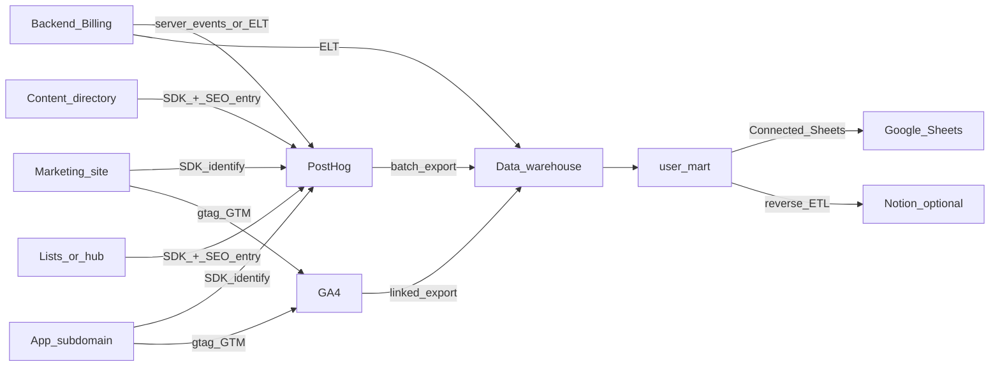

# Lessie AI — 数据归因方案（PostHog + GA4 × 数仓消费：Sheets / Notion）

> **本文档自洽**：不依赖内网、私有仓库或配套 Markdown；可单独转发。示例域名与路径为 **演示占位**（`example.com`），非客户名单或内部情报。  
> **首要目的**：把 **注册/试用** 与 **订阅/升级** 归到 **① 营销渠道**（自然搜索、付费、外链、直访、社媒、邮件等）和 **② 首访落地页**（主站、多语言落地、博客、**内容目录/聚合页子域** 等面向 SEO 的入口），用于 **按页、按活动** 判断内容与投放，并支撑周会。  
> **工具分工**：**PostHog** 承担产品行为与首触/落地 **主事实源**；**GA4** 承担站级渠道与 **GSC 定性对照**；**BigQuery**（或同类数仓）做 **用户级合并**；**Sheets/Notion** 仅作 **汇总结果的消费端**（不替代埋点与仓内真值）。  
> **方法骨架**：多源数据 **按 `user_id` 合并** → **平铺用户级表（`user_mart`）** → 分阶段落地（采集与治理、进仓、出表、协作）。  
> **最后更新**：2026-04-24

**公开站点**（与品牌对外信息一致时）：`https://lessie.ai/`；典型产品形态为 **多子域**（营销/应用/**Profile、List 类目录** 等，见 §6.1）。若对外分享需进一步匿名化，可将正文中的 `lessie` 字替换为「贵司品牌」、将域名替换为 `example.com`。

---

## 0. 核心目标：要回答的归因问题

以下在 **工程口径** 上优先以 **PostHog 人物属性 + 关键事件** 实现；**GA4** 用于全站与 **Search Console 着陆页** 的参照；**Sheets/Notion** 只接 **已汇总** 的宽表或摘要。

| 问题 | 典型切片维度 | 主要用途 |
|------|----------------|----------|
| **注册/试用来自什么渠道？** | UTM、Referrer、默认渠道、是否付费 | 投放复盘、内容优先级 |
| **付费/升级来自什么渠道？** | 同左 + 末触或「首次付费前触点」 | ROAS、渠道预算 |
| **从哪条 URL/路径 进入并转化？** | 首访 path、多语言前缀、子域/目录 | **SEO 与 Programmatic 页效果** |
| **自然搜索整包贡献？** | Organic 规则 + 落地内容 URL + GSC 着陆页 | 验证内容资产是否带来收入 |
| **外链/合作是哪些站？** | `referrer` 域名、合作 UTM | PR、友链、目录 |

**直接结论**：

- **渠道** 靠 **UTM 规范 + Referrer/媒介派生规则** 收敛为可汇报的大类。  
- **落地页/SEO 效果** 必须同时固化 **`first_landing_path`（及可选去 query 的 `first_landing_url`）** 与 **`first_touch_utm_*`**；仅有 UTM 无法覆盖大量 **无 UTM 自然流** 场景下「从哪页来、是否付费」。

---

## 1. 目标与能力边界

### 1.1 要交付什么

- **可运营口径**：在 PostHog 可稳定回答「首/末触来自哪」「首访落地点（路径/子域）去哪」「各渠道对 **注册、激活、付费** 的贡献」；`user_id` 与 UTM 全链路一致。  
- **经营视图**（二选一或并存）：**Google Sheets** 中可刷新的 **用户级宽表**；或 **Notion** 的「人」视图 + **只读系统列**（渠道/落地页摘要），见 §1.4。  
- **原则**：在数仓中 **先** 按 `user_id` 合并埋点、订阅/计费、首触/落地，**再** 进入 Sheets/Notion；避免在电子表格中手工拼接全链路 ETL。

### 1.2 多源真值 = PostHog + 业务系统 +（可选）GA4 在仓内对齐

- **强业务/计费**（套餐、积分/用量、续费等）以 **后端/支付/订阅系统** 为准；经 **服务端事件** 或 ETL 写入分析栈与数仓。  
- **PostHog**：产品行为、**人物属性**（`first_landing_path`、`first_touch_*`）的 **主实施面**；可 **Batch 导出** 至 BigQuery 等。  
- **GA4**：站级会话/渠道/首访用户等维度，便于与 **GSC** 对照；**用户级落地与渠道真值** 仍以 PostHog 侧定义 + 数仓派生为准，避免双端互相强覆盖。  
- **Sheets/Notion**：**消费层**；发生分歧时，以 **PostHog/数仓** 为解释口径。

**推荐数据流**：

```text
PostHog（行为 + 首/末触 UTM + 首访 path + 关键转化）
  + 业务库/支付（计划、用量/积分、订阅状态）
  + GA4 → BigQuery（可选：渠道校验、全站漏斗对照）
  → 数仓内 user_mart
  → Connected Sheets 和/或 Reverse ETL → Notion
```

### 1.3 Google Sheets 与 Notion：数仓之后放哪？

| 维度 | **Google Sheets** | **Notion Database** |
|------|--------------------|------------------------|
| **适合** | 用户级宽表、透视、与 Workspace 同事共享、Connected Sheets 定时刷 | CRM/协作：阶段、负责人、备注、**渠道摘要只读列**、轻流程 |
| **不适合** | 替代数仓、承载超大原始事件 | 主事实源、全量高并发报表唯一出口 |
| **与「汇总后出表」的契合** | **高**（结果表进 Sheet 是常见落地） | **中**（多作 CRM，需 **Reverse ETL** 或定时回写） |
| **建议** | **周会/增长** 用宽表主入口（或 BI 工具） | 销服协作时，**只同步只读列** + 人填列分区 |

**建议组合**：

1. **数仓**（以 BigQuery 为例）内 **`user_mart`** = PostHog 导出 + 用户/订阅维表 +（可选）GA4 日表校验列。  
2. **分析主入口**：**Connected Sheets** 连接 **`user_mart` 结果表**（**先** 在仓内聚合成 **行=用户** 的平铺表，**再** 连表，避免对原始大事件表直接拖拽）。  
3. **Notion**：**可选**；只同步 `user_id`、首触 UTM、**`first_landing_path`**、计划摘要等，**系统列** 禁止手改覆盖。  

**未上数仓的 MVP**：PostHog 定期导出/CSV + 定时进 Sheet，规模上升后切 **Batch export → 数仓**。

### 1.4 管道工程 vs 表后分析

| 层级 | 内容 | 典型承担方 |
|------|------|------------|
| **采集与治理** | UTM、多子域首访 path、跨子域 `user_id`、事件字典、Person 属性、GA/PostHog 双写规范 | 数据/工程 + 增长 |
| **汇总与出表** | 数仓中 `user_mart`、刷新节奏、Sheets/Notion 字段映射 | 数据 |
| **消费** | PostHog 看板、Sheets/BI、Notion 协作、GSC/GA 对照会议 | 增长、市场、SEO、销服 |

**落地顺序**：先跑通 **Identify + 首触 UTM + `first_landing_path` + 核心转化事件**；再 **GA4 双写/导出**；再 **进数仓 → Sheet**；最后 **按需** Notion。

---

## 2. 总览架构

典型为 **多子域、多语言路径** 的 B2B Web 产品；归因以 **与账户一致的 `user_id`** 为 JOIN 键。匿名期与子域间跳转须 **书面定义**（见 §5）。



- **`first_landing_path`** 必须能区分 **子域/路径**；跨子域时建议增加 **`first_landing_host`** 或 **统一单字段** 书写规范。  
- **GA4 与 PostHog** 在登录后使用 **同一 `user_id`**，勿用 **Client ID** 充当业务主键。  
- **计划、成功付费、积分消耗** 等，优先 **服务端** 与/或 **数仓事实表**。

---

## 3. 工具分工

### 3.1 PostHog（主事实源）

- **用户识别**：`user_id` = 业务主键；匿名与登录之间 **需 alias/merge 策略**（见 §5）。  
- **首触与落地**：UTM 全套；在 **注册成功或首次 Identify** 时 **$set** `first_landing_path` 等，**默认不随浏览覆盖**（见 §5-H）。  
- **Referrer**：无 UTM 时区分自然搜索/外链/直访。  
- **与 GA4**：**用户级** 以 PostHog 人物属性 + 数仓为准；GA4 用于 **全站** 与 **GSC 对照**。

**禁止**：只在单次会话里记 UTM，**不在 Identify 时固化** —— 会导致内容/SEO 落地 **用户级全丢**。

### 3.2 GA4（站级 + 对照）

- 默认渠道、首访用户、与 Google 生态的 **标准转化报表**。  
- 双写时 **统一 `user_id`**；`first_landing_path` 的 **业务真值** 以应用与 PostHog 为准（GA4/BQ 可用于 **对账、抽查**）。

### 3.3 数仓（以 BigQuery 为例）

- PostHog **Batch export** 至 BigQuery 见官方文档（`posthog.com` 上 “Batch export BigQuery”）。  
- **GA4 关联同项目/数据集的导出** 为常见做法。  
- 在仓内 **聚合成平铺的 `user_mart`**，再供 **Connected Sheets** 或 BI。

### 3.4 Google Sheets 与 Notion

- **Sheets**：接 **`user_mart` 结果表**，做下钻与周会。  
- **Notion**：客情与流程；从 `user_mart` 或 PostHog 同步的 **只读** 列。

### 3.5 与「经典 GA+数仓+Sheets」链路的对应（概念层，无外链）

| 概念层 | 本方案中 |
|--------|----------|
| 网站埋点 + 落地 | PostHog Web SDK + GA4 数据流 + **人物属性** 固化落地 |
| 聚合到用户 | 数仓 `user_mart`；或早期仅在 PostHog 内 Cohort/Insight |
| 宽表进表格 | **Connected Sheets ← 已汇总表**；MVP 可用定期导出 |
| Notion | CRM，**不** 替代数仓汇总 |
| 主数据/计费 | 业务库 ETL → 数仓，按 `user_id` JOIN |

---

## 4. 字段分层与「最小列集」设计

### 4.1 Person 属性 / 与下游表同构

| 分组 | 属性（示例） | 说明 |
|------|--------------|------|
| **首触** | `first_touch_utm_source` / `…_medium` / `…_campaign` | 首次 Identify/注册 写入；无 UTM 时派生 `first_touch_channel` |
| **首访落地** | **`first_landing_path`（建议必填）**；多子域时用 `host`+`path` 或单字段规范，例如 `//content.example.com/foo/bar` 形式 | 内容/目录/博客 **按页** 复盘 |
| 末触 | `last_touch_utm_*` | 与首触分栏 |
| 拉新 | `registered_at` | ISO 日期 |
| 商业 | `plan_tier`、用量/积分区间等 | 以后端/计费为准 |
| 地域/语言 | `country` / `locale` | 分群与本地化 |

**原则**：**一种语义、一种命名**；与 **内部事件命名表**（由产品与数据共同维护）一致。

### 4.2 派生「渠道大类」（汇报）

| 渠道大类 | 规则思路（须书面定版） |
|----------|------------------------|
| **Organic Search** | 无付费 UTM + 搜索引擎类 Referrer |
| **Paid Search / Social / …** | UTM medium 约定 |
| **Referral** | 外站 Referrer |
| **Email** | `utm_medium=email` 等 |
| **Direct** | 无 UTM 且 referrer 空或按内规 |
| **Other** | 兜底，占比应可解释、可控 |

### 4.3 Google Sheets 出表列（来自 `user_mart`）

| 列 | 说明 |
|----|------|
| `user_id` | 业务主键 |
| `first_touch_utm_*` / `first_touch_channel` | 与 §4.1 一致 |
| **`first_landing_path` 或等效「首访显示」** | 按页下钻 **必备** |
| 套餐/收入简版 | 以财务/订阅源为准 |
| 1～3 个 **主行为** 的 30/90 天次数 | 由 PostHog 事件在仓内聚合；事件名与 **内部事件表** 对齐 |
| 可选 | 与 GA4 渠道/会话结论对比的 **QA 标志列** |

### 4.4 Notion（若启用）

| 列 | 说明 |
|----|------|
| `user_id` | 与 PostHog 一致 |
| 首触 UTM、**`first_landing_path`** | **只读** |
| 客户阶段、**主观听说的来源**、备注 | 人工；**不得** 覆盖系统首触列 |

### 4.5 结果行示例（逻辑占位，非真实数据）

| user_id | first_touch_channel | first_touch_utm_source | first_landing_path | plan_tier | key_usage_30d |
|---------|--------------------|------------------------|--------------------|-----------|---------------|
| `…` | organic_search | *(空)* | `/blog/topic-a` | Pro | 42 |

---

## 5. 分步实施 Checklist

### 阶段 A：UTM + 落地页/多子域

1. 制定 **UTM 命名表**；外投、邮件、合作链接 **全量** 带参。  
2. 明确 **多语言** 在 `first_landing_path` 中 **是否带语言段** 及 Content Group 规则。  
3. 为 **内容目录/列表类** 子域或路径建 **「前缀 → 内容类型」** 映射。  
4. 在 **注册/首次 Set User ID** 时，写入 **首访 path（+ host 若需要）** 与 **首触 UTM**。  
5. 无 UTM 时 **不造假**；用 Referrer + §6 归大类。

### 阶段 B：User ID 与事件

1. 登录/注册后 **立即 Identify**；`user_id` = 业务 ID。  
2. 若从 **长文入口** 在注册/登录页才识别，必须用 **首访存证**（`sessionStorage`/首屏落 entry URL），避免落地被记成仅注册/登录页。  
3. 定义 **15～25** 个高价值事件，至少含：落地 → 注册/试用、**核心产品动作**、**付费/订阅**、**关键用量/积分**；**事件名** 与 **内部事件命名表** 一致。  
4. 关键事件带 **`page_path` 或等价快照**，便于与 `first_landing_path` 对账。

### 阶段 C：计费与主数据

1. 套餐、积分、状态以 **数据库 + 支付/订阅 webhook** 为准；**服务端** 发 PostHog 与/或 进数仓。  
2. 多币种/折扣：维护 **唯一下钻** 的 **收入/订阅口径** 说明。

### 阶段 D：双栈验证

1. **Person 抽查**：`user_id`、`first_landing_path`、首触。  
2. PostHog：按 `first_landing_path`、按 campaign 等细分。  
3. GA4 + **GSC**：全站/着陆页趋势与 PostHog 侧首访是否 **同向**（定性即可）。  
4. `Direct/Other` 异常占比 → 回查 UTM 与存证，以及外链是否漏标。

### 阶段 E：数仓与 `user_mart`

1. 打开 **GA4、PostHog** 到 **同一或可归并** 的数据集。  
2. 建 **`user_mart`**：按 `user_id` 联用户维/订阅。  
3. 用 **定时任务** 写 **结果表**；避免在表格里对原始海量事件做拖曳查询。

### 阶段 F：Google Sheets

1. **Connected Sheets** 连 **结果表**。  
2. 含 PII 时 **行级/列级权限** 与 **脱敏** 由 Workspace/政策保障。  
3. 周会固定透视维：`first_touch_channel` × `first_landing_path` 前缀 × 套餐 等。

### 阶段 G：Notion（可选）

1. 选 **子集**（如付费/企业）或全量只同步摘要。  
2. 选定 **Reverse ETL/自动化** 工具与 **刷新频率**。  
3. 明确 **只读/人工** 列分区（同 §4.4）。

### 阶段 H：首触/末触/首访落地 规则

- **首触 UTM**：首次稳定 `user_id` 时写入，**默认不覆写**。  
- **`first_landing_path`**：第一次 **有业务意义** 的访问路径（**勿** 用「注册前最后一跳」替「首入站来源页」，除非有书面例外）。  
- **末触**：独立属性或报表模型。  
- **首次付费**（如需要单独口径）：`first_paid_*` 或事实表时间戳。

---

## 6. UTM、渠道与 SEO/多子域

### 6.1 主站、应用、内容子域 的 `first_landing_path`

| 目的 | 做法 |
|------|------|
| 区分子域 | 显式 `host` **或** 单字段统一规则（**团队内唯一**） |
| 多语言 | 对 `/{lang}/` 等前缀与 Content Group **事先约定** |
| Programmatic 单页 | 存 path 时 **去 query**，与索引 URL 一致 |
| 从内容页 CTA 到应用/注册 | **存证** 首入站 path，避免仅记到应用/注册子路径 |

### 6.2 常见渠道与 UTM 场景

- **自然搜索**：多无 UTM；`first_landing_path` + Referrer。  
- **付费/邮件/外链**：**应** 带 UTM。  
- **社媒自然贴**：无 UTM 时看 Referrer 域名。  

---

## 7. 路径与工具选型

| 路径 | 适用 | 注意 |
|------|------|------|
| **仅 PostHog** | 早期 | 必做 Person 与 path 细分；全站/搜索侧建议加 **GA4** |
| **PostHog + 数仓 + Sheets** | 规模与规范 | `user_mart` 先、再连表；**成本与调度** 书面化 |
| **+ Notion** | 需要 CRM | 只摘要、只读列 |
| **无数仓 MVP** | 小流量 | 导出+Sheet；上量后上 Batch export |

**结论**：**宽表/归因** → **Sheets 或 BI**；**人读协作** → **Notion**；**真值** → **PostHog + 数仓**。

---

## 8. 最小可行列集（MVP）

| MVP | 放哪里 | 说明 |
|-----|--------|------|
| `user_id` | PostHog + Sheet +（若有）Notion | 全链路主键 |
| `first_touch_utm_source/medium/campaign` | 同上 | 活动/渠道 |
| **`first_landing_path`** | 必 | 子域/多语言/按页 复盘 **必备** |
| `registered_at` | 多端一致 | 队列与周期 |
| 套餐/付费态 | 后端/PostHog | 商业 |
| 1～3 个激活/主行为指标 | PostHog | 与北极星一致 |
| **GA4 安装** + 关键转化 | 站级 | 与 GSC/全站 **强烈建议** 同步建设 |
| **下一期** | — | 末触/首次付费、多触点、按 path 的 LTV、Notion 全量成本评估 |

---

## 9. 风险与治理

- **未固化 `first_landing_path`**：内容/SEO 投入难与用户级 **注册/收入** 关联（**主要技术风险**）。  
- **PostHog 与 GA4 的 `user_id` 不一致**：跨工具无法对齐。  
- **多子域未定义 entry**：落地会系统偏向 **仅应用/仅注册页**。  
- **用 Notion 手填顶掉系统渠道**：**主观** 与 **系统** 必须 **分列**。  
- **把 Sheet 当交易库/实时 OLTP**：行数/公式过大应 **上收** 到数仓/BI。  
- **合规**：跨境、**联系人/邮件** 等处理以法务与产品条款为准；**对外转发** 前自行删去本稿不需要的业务细节。

---

## 10. 公开参考（可独立打开）

- PostHog 文档：搜索 **Person properties**、**Batch export BigQuery**、**Cohorts**。  
- Google 文档：搜索 **GA4 BigQuery 导出**、**Connected Sheets BigQuery**、**流量来源与范围**。  
- 本文不链入任何 **私有** 或 **按路径才可访问的** 内部文档；若你方有内部 UTM/事件/口径纸，**单独维护** 并在变更时与 §4～§6、§5-D 对齐即可。

---

## 11. 文档维护

- UTM 表、多子域/多语言 **`first_landing_path` 规则**、**事件名、收入/订阅口径** 变更时，需同步本稿 **相关章节** 与**内部**事件命名/口径说明（**不在** 本文件内引用该说明的路径）。  
- 建议每季度：PostHog 中首访与 **GSC/收录 URL** 是否一致、**Direct+Other** 是否可解释。  
