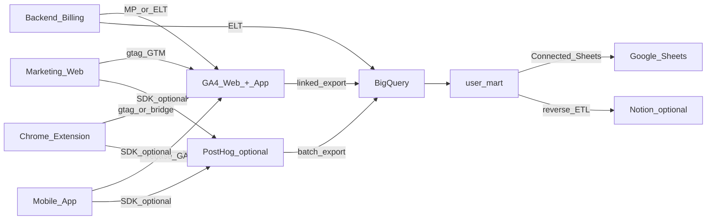

# ThetaWave — 数据归因方案（以 GA4 为主 × 数仓消费：Sheets / Notion，PostHog 为产品深描）

> **本文档自洽**：不依赖内网、私有仓库或配套 Markdown；可单独转发。示例域名与路径为 **演示占位**（`example.com`、`/feature-a`），非客户名单或内部情报。  
> **首要目的**：把 **注册/试用** 与 **Pro 订阅/升级** 归到 **① 营销渠道**（自然搜索、付费、外链、直访、社媒、邮件、Chrome 网上应用店等）和 **② 首访落地页**（首页、**独立功能页**、**场景/人群 Use case 页**、博客等），用于 **按页、按活动** 判断内容与投放，并支撑周会。  
> **工具分工（本稿定调）**：**GA4**（+ **GTM**）为 **站级/渠道/与 GSC 同生态** 的 **主事实源**；**BigQuery 关联导出** 为 **用户级/会话级归并与周会出表** 的主路径；**PostHog** 承担 **产品内行为、核心学习事件、与 GA 关键事件可对账的细颗粒度**（**不** 替代 GA4 在「渠道+全站+BQ」中的主轴地位）。**网站数据流** 为主；若启用 **应用** GA 分析，须与 Web 的 `user_id` **书面对齐**。**Sheets/Notion** 仅作 **汇总结果的消费端**。  
> **方法骨架**：**GA4 → BigQuery** 与 业务/订阅、（可选）PostHog 导出 **按 `user_id` 合并** → 平铺 **`user_mart`** → 分阶段落地。  
> **产品形态提示**：典型为 **营销站 Web** + **Chrome 扩展** + **移动 App** 并存；归因与跨端 **同一业务 `user_id`** 强相关，见 §2、§5-B。  
> **最后更新**：2026-04-24

**公开站点**（与品牌对外信息一致时）：`https://thetawave.ai/`。若对外分享需匿名化，可将品牌与域名替换为「贵司」与 `example.com`。

---

## 0. 核心目标：要回答的归因问题

以下在 **工程口径** 上：经营侧 **以 GA4（及 BQ 导出表）+ `user_id` 合并** 为主；**GSC 着陆页** 与 **GA4 全站/着陆维度** 天然同向；**PostHog** 用于产品内高价值行为与与 GA **转化/关键事件** 的交叉验证。**Sheets/Notion** 只接 **已汇总** 的宽表或摘要。

| 问题 | 典型切片维度 | 主要用途 |
|------|----------------|----------|
| **注册/试用来自什么渠道？** | UTM、Referrer、GA 默认/自定义渠道、扩展/应用安装来源 | 投放、内容、商店页优化 |
| **付费/升级来自什么渠道？** | 同左 + 末触或「首次付费前触点」 | ROAS、渠道预算 |
| **从哪条 URL/路径 进入并转化？** | 首访/落地（用户级或路径分组）、**功能页/Use case 前缀**、博客 | **SEO 独立功能页与场景页** 的效果 |
| **自然搜索整包贡献？** | Organic 规则 + 落地 URL + GSC 着陆页 + **GA4 自然渠道** | 验证「AI note taker / notes generator」等词群下的页面是否带来收入 |
| **外链/合作是哪些站？** | `referrer` 域名、合作 UTM、GA 参照 | PR、校园、目录 |

**直接结论**：

- **渠道** 以 **UTM 规范 + GA4 采集/媒介规则** 为主，Referrer/商店来源 **与 GA 口径书面一致** 后，派生为可汇报大类。  
- **落地页** 在 GA 生态内需 **用户级首访/落地**（**用户级自定义维度、或 BQ 内由首次含业务意义的 `page_location`/path 派生**），并与 **`first_touch_utm_*`（GTM/URL）** 齐套；大量 **自然流无 UTM**，不能仅靠广告参数复盘 **按功能页/Use case 页**。

---

## 1. 目标与能力边界

### 1.1 要交付什么

- **可运营口径**：在 **GA4 报表 +（强烈建议）BigQuery** 中稳定回答 **渠道、着陆、关键转化**；在 **同套 `user_id`** 下与 **订阅/付费** 合并；`first_landing_path`（或等效）**与 GSC/索引 URL 可对账**。**PostHog** 用于回答「**核心学习行为、Pro 相关深度**」并与 GA 转化 **对齐命名与抽查**。  
- **经营视图**：**Google Sheets** 用户级宽表（多来自 **BQ + Connected Sheets**）；或 **Notion**「人」视图 + **只读系统列**。  
- **原则**：在数仓中 **先** 合并 **GA4 导出**、业务订阅、首触/落地，**再** 进 Sheets/Notion。

### 1.2 多源真值

- **套餐/试用/退款/学生资格** 等以 **后端与支付** 为准；**Measurement Protocol / 服务端** 将关键商业字段 **回写 GA4 与/或** 进数仓。  
- **GA4**：**全站与渠道、与 GSC 对话** 的 **主界面**；**BigQuery** 中 **用户/会话/事件** 为 **`user_mart` 的骨架**。登录后须在 GA4 中通过 **User-ID** 上报 **与业务一致的 `user_id`**，**勿** 用 `client_id` 做商业 JOIN。  
- **PostHog**：**产品行为**、**人物/事件** 的 **辅助事实源**；可 Batch 导至 BigQuery，与 `user_mart` **按 `user_id` 左连或子集**（深度指标列）。**用户级「经营首访」** 的 **主口径** 仍以 **GA+仓内派生** 定版，避免与 GA4 周会主数字打架。  
- **移动与扩展**（若单独 SDK）：**登录后与 Web 共用的业务 `user_id`** 为 JOIN 键；匿名安装期规则见 §2。

**推荐数据流**：

```text
Web/扩展/应用：gtag + GTM → GA4（+ User-ID；关键转化、尽量以服务端/Measurement Protocol 补全）
  → BigQuery（GA4 关联导出）
  + 业务库/支付（Pro、试用、学生价标记等）→ 数仓
  + PostHog（可选：产品事件 Batch → 同或相邻数据集，按 user_id 合并）
  → user_mart
  → Connected Sheets 和/或 Reverse ETL → Notion
```

### 1.3 Google Sheets 与 Notion

| 维度 | **Google Sheets** | **Notion** |
|------|--------------------|------------|
| **适合** | 用户级宽表、周会透视、**Connected Sheets ← BigQuery** | CRM/协作、**只读** 渠道与落地摘要 |
| **不适合** | 替代 BQ 做全量事件计算 | 分析真值主库 |

**建议组合**：`user_mart` 在数仓中落盘 → **Sheets/BI 为主**；Notion 按需同步摘要列。**MVP** 无数仓时：**GA4 探索式报表 + 受控 CSV/导出** 进 Sheet，上量后 **以 BQ 为主**；PostHog 导出作为 **产品列** 补充。

### 1.4 管道工程 vs 表后分析

| 层级 | 内容 | 承担方 |
|------|------|--------|
| **采集** | UTM、**多入口首访**（见 §2）、`user_id`、**GTM/GA4 数据层**、（可选）PostHog 事件字典、**GA 与 PH 关键事件名对齐表** | 数据/工程 + 增长 |
| **汇总** | BQ 中 `user_mart`、刷新、字段映射 | 数据 |
| **消费** | **GA4、Looker/Sheets、** GSC/周会、（可选）PostHog 看板 | 增长、市场、内容 |

**落地顺序**：**GTM + GA4 `user_id` + 首访/首触 写入规则（见 §5-H）+ 关键转化** → **BigQuery 导出** → `user_mart` → Sheet；**按需** PostHog 与 Notion。

---

## 2. 总览架构（Web + 扩展 + 可选移动，**GA4 中枢**）

多入口并存时，**同一账户** 在 **首访固化** 与 **跨端识别** 上需单独设计，避免「只记到 `/auth/signup` 或应用壳路径」。



**跨端与首访落地（须书面定版）**：

- **自 Web 进入**：用户级 `first_landing_path` = 首次有业务意义的 **营销站 path**（如 `/notes-generator`），**不** 在后续进 `/app/...` 时默认用会话末页覆盖（见 §5-H：以 **首条业务事件、首屏存证 或 仓内 `min_by` 规则** 固化）。  
- **自扩展首次使用**：可能无站内容页面；可约定：① 扩展安装/首次打开经 **GTM/测量** 写入 **商店来源** 与 **campaign** 类字段；② 用户 **首次在 Web 登录/注册** 时 **再** 与 Web 同套 **用户级落地** 对齐（可并存 **`acquisition_source=chrome_webstore`** 与 `first_landing_path=虚拟或首登站 path`）。**禁止** 团队内对「首访」与 GA4 **默认「会话/首次互动」** 不说明差异就混用。  
- **自移动应用进入**：与 Web 账号打通后 **同一 `user_id`**；应用商店无 UTM 时，用 **平台活动参数 + 首启** 进 GA/仓 **说明列**。

**`user_id`**：Web/应用 GA **与** PostHog（若用）**同一业务 ID**；**勿** 用 `client_id` 作商业宽表主键。

---

## 3. 工具分工

### 3.1 GA4（**主事实源：渠道、全站、BQ、GSC 对照**）

- **GTM/数据层**：全站 UTM 与首屏 **entry 存证**（供用户级落地 **首次写入** 或 BQ 派生 **一致**），与 §6 路径分组对齐。  
- **关键事件 / 转化**：注册、试用、**升级 Pro 等** 以 **数据层+标记** 为准，并与后端 **抽查一致**；重要收入建议 **服务端/Measurement Protocol** 补全。  
- **用户级首访/落地**：用 **用户范围自定义定义**（若可用且合规）**或** 完全在 **BigQuery** 中由 `events_` 表 + `user_pseudo_id`/`user_id` 规则落 **`first_landing_path`**，与 **GSC URL** 去 query 对账。  
- **GSC + GA4**：周会 **着陆页/查询** 与 **自然渠道** 趋势 **以 GA+GSC 为主叙事**。  
- **若单独建「应用」GA 属性**：报表与 Web **不自动合并**；`user_mart` 中 **按你方规则** 合并或分栏展示。

### 3.2 PostHog（**产品深描、与 GA 对账，非渠道主轴**）

- **用于**：**核心学习产出**、功能深度、细分漏斗、**Feature** 类实验；**人物属性** 可与 **仓内** `user_mart` 的「产品 30/90 天行为」列 **同源**（以 PH 聚合适配）。  
- **禁止**：在经营周会上 **以 PostHog 渠道维度** 覆盖 **GA4 已采纳的渠道定义** 而无书面映射。  
- **事件**：与 **内部事件表、GA4 关键事件名** 尽量 **一一映射或对照表**（不强制同名，**须** 有表）。

### 3.3 数仓（以 BigQuery 为主）

- **GA4 关联导出** 为核心输入表；用户/订阅维表、（可选）PostHog 聚合表 → 平铺 **`user_mart`** → Connected Sheets 或 BI。

### 3.4 Sheets 与 Notion

- 与 **「GA4 + BQ + 数仓 + 消费端」** 方案一致：**Sheets** = 用户级宽表与下钻；**Notion** = 协作与 **只读** 渠道/落地摘要（**不** 替代 BQ/GA 主口径）。

### 3.5 与「多源进仓再出表」的对应（概念层）

| 概念 | 本方案 |
|------|--------|
| 站级 + 渠道 + 全站 | **GA4**（+ GSC） |
| 用户级首访/落地/转化骨架 | **BigQuery** 中 `user_id` 级表 + 业务 JOIN |
| 产品深指标 | **PostHog** 聚合进 `user_mart` 或独立产品表 |
| 进表格 | **汇总后** 连 Sheet |
| 计费 | 后端 JOIN `user_id` |

---

## 4. 字段与最小列集

### 4.1 维表字段 / 出表同构（**经营侧以 GA+仓 为主**）

| 分组 | 属性（示例） | 说明 |
|------|--------------|------|
| 首触 | `first_touch_utm_source` / `…_medium` / `…_campaign` | 自 URL/GTM 或 BQ 首见；无 UTM 时派生 `first_touch_channel`（与 **GA4 渠道分组** 可对照） |
| 首访落地 | **`first_landing_path`（建议必填）**；可选 **`first_landing_url` 去 query** | **BQ 派生** 或 **首屏存证+用户 CD**；对 **多独立功能页、/for-*** 等按前缀下钻；占位示例：`/lecture-to-notes` |
| 扩展/商店 | 可选 `extension_install_source` 或等效 | 与 `first_landing_path` **并存** |
| 末触 | `last_touch_utm_*` 或 GA 探索末触 | 与首触分栏 |
| 拉新 | `registered_at` | |
| 商业 | `plan`（如 free/Pro）、**学生价标记** 等 | 以后端为准 |
| 地域/语言 | `country` / `locale` | EdTech 常做美英澳等分群 |
| 产品深描（可选） | PostHog 聚合成 **1～3 个用量列** | 附在 `user_mart`，**非** 渠道真值来源 |

### 4.2 渠道大类（汇报用）

| 渠道大类 | 规则思路（书面定版，**与 GA4 分组/细分数一致或可对账**） |
|----------|------------------------|
| Organic / Paid / Social / Email / Referral / Direct / Other | 与 UTM、Referrer、**商店/扩展活动** 一致；**Other** 应可逐条解释原因 |

### 4.3 `user_mart` 建议列

| 列 | 说明 |
|----|------|
| `user_id` | 业务主键，与 **GA4 `user_id`、** 订阅表一致 |
| 首触 UTM 与/或 `first_touch_channel` | **以 BQ+规则** 与 GA4 对账 |
| **`first_landing_path`** 或等效 | 按功能页/场景页/博客 下钻 **必备** |
| 扩展/应用补充来源 | 若存在 |
| 套餐与收入简版 | 财务/订阅源 |
| 1～3 个 **核心产品行为** 30/90 天 | **PostHog 或** GA4+命名事件 **二选一或并存**，与内部表一致 |
| 可选 | **GA4 会话/首用户** 对账列、**PostHog 汇总的** 产品深描列 |

### 4.4 Notion（可选）

| 列 | 说明 |
|----|------|
| `user_id` | 与 `user_mart` / GA4 一致 |
| 首触 UTM、**`first_landing_path`** | **只读**（自 BQ/同步） |
| 客户阶段、**主观听说的来源**、备注 | 人工；**不得** 覆盖系统首触与落地列 |

### 4.5 行示例（占位）

| user_id | first_touch_channel | first_landing_path | plan | key_usage_30d |
|---------|--------------------|--------------------|------|-----------------|
| `…` | organic_search | `/notes-generator` | Pro | 18 |

---

## 5. 分步实施 Checklist

### 阶段 A：UTM + **路径地图（功能页 / Use case / 博客）**

1. 维护 **UTM 命名表**；广告、KOL、邮件、校园、联盟链 **全量** 带参。  
2. 将 **站内地标路径** 分组：核心功能、**人群/场景**（如 `/for-*`）、**博客**、**价格/注册**；与 **GTM / GA4 内容组** 一致。  
3. 在 **GTM/首屏** 落实 **存证** 与 **首次 `user_id` 时** 写入 **首触 + 首访落地**（**用户级** 规则见 §5-H）。  
4. 无 UTM 时用 Referrer/搜索引擎 + §6 归大类，**与 GA4 默认规则** 对齐文档。

### 阶段 B：User ID、事件、**跨端**（**GA4 优先**）

1. Web/应用：登录/注册后 **立即** 设定 **与账号一致的 `user_id`** 于 **GA4**（GTM/配置+代码）。  
2. 长文/功能页到 `/auth/signup` 再识别时，**存证** 首入站 **进数据层/仓内规则**，**不得** 让 `first_landing` 在经营口径上只等于注册页。  
3. 扩展/移动：按 §2 把 **来源** 打进 **可进 GA/仓** 的字段；**merge/alias** 文档化。  
4. 定义 **关键事件**：**GA4 内** 为 **转化与里程碑** 主套；**PostHog** 为 **更细** 的 15～25 个高价值产品事件（**对照表** 维护）。  
5. 关键事件带 `page_path` 或**表面**（Web/扩展/应用）便于 **GA+PH+后端** 对账。

### 阶段 C：计费与学生身份

1. Pro、试用、退款、**学生验证状态** 以 **后端+支付** 为准，并进入 `user_mart`；**建议** 关键付费 **进 GA/MP** 防漏。  
2. **单一收入/ARPU 口径** 成文，与 **GA4 收入类标记** 一致或说明差异。

### 阶段 D：**GA4、GSC、BQ** 与（可选）PostHog 验证

1. **GA4 探索 / BQ 抽查**：`user_id`、**用户级落地**、渠道。  
2. 按 `first_landing_path` 前缀看 **注册与 Pro 转化**（用 **`user_mart` 或 BQ 查询**）。  
3. **GSC + GA4**：着陆与趋势是否同向。  
4. 高 **Direct/Other** → 查 UTM、**存证**、**扩展直装**；与 **(not set)** 渠道。  
5. **（可选）** PostHog：同批用户 **关键行为** 与 GA **关键事件** 数量级是否一致（**抽查**）。

### 阶段 E：数仓与 `user_mart`

1. **GA4 `events_` 表、** 用户/订阅/（可选）PostHog 表 **可 JOIN `user_id`**。  
2. 产出 **行=用户** 平铺表；定时刷新。

### 阶段 F：Sheets

1. **Connected Sheets ← BigQuery** 或合规导出。  
2. 含 PII 时：**行级/列级权限** 与 **脱敏**。  
3. 周会维：**渠道 × 功能页/场景页前缀 × 套餐**；可选 **扩展来源**。

### 阶段 G：Notion

1. 定子集、映射、**只读** 策略（**字段来自 BQ/RT**）。

### 阶段 H：首触 / 首访 写入规则（**以 GA+仓 定版**）

- 首触 UTM：在 **可稳定 `user_id`** 时与 **首次绑定**，**与 GTM/URL 解析** 一致。  
- `first_landing_path`：第一次 **有业务意义** 的营销站访问，**在 BQ 或用户 CD 中** 与 **「会话内 landing 页」** 区分定义并 **成文**（避免与 GA4 UI 中「着陆地」默认项混淆）。  
- 末触、首次付费：从 **事件事实表** 或 **GA+仓** 独立派生。

---

## 6. UTM、渠道与 **SEO 路径**（**GA+GSC 主叙事**）

### 6.1 功能页、场景页、博客

| 目的 | 做法 |
|------|------|
| 按产品能力对比转化 | **GA4 探索 / BQ** 中 path 前缀或 **Content group** 对应策略线；与 **GSC 着陆** 对关键词与 URL |
| 单页优化 | `first_landing_path` 精确到单 path；**GA4 探索** 大流量单页可存视图 |
| 去 query | 与索引 URL 一致，与 **GSC** 对账 |
| 注册/进 App 壳 | **GTM 存证** 首入站，避免在报告中 **全归** `/app/...` 或仅注册页 |

### 6.2 常见场景

- **自然搜索**：**GSC 着陆** + **GA4 自然** + 用户级 `first_landing_path`。  
- **付费/外链/邮件**：UTM + **GA4 活动/来源** 一致。  
- **Chrome 网上应用店**：活动/UTM 到安装页 + **与首次回站** 的 `user_id` 链；与 §2 一致。  
- **应用商店（iOS/Android）**：按平台把 **活动参数** 收入 **可进仓字段**。

---

## 7. 路径与工具选型

| 路径 | 适用 | 注意 |
|------|------|------|
| **仅 GA4 界面 + 无 BQ** | 极小流量/验证 | **用户级首访/落地** 能力受限；尽快上 **BQ** |
| **GA4 + BigQuery + Sheets** | **主目标态** | **先** `user_mart` **再** 连表；`user_id` 必稳 |
| + PostHog | 要产品深指标 | 与 **GA 关键事件** 对照；**不** 双主渠道 |
| + Notion | 协作/客诉 | 只摘要、只读 |
| 无数仓 MVP | 过渡 | 受控导出+Sheet；**上量以 BQ 为准** |

**结论**：**经营真值** = **GA4 + BigQuery** + 业务；**产品深** = PostHog（可选）；**宽表** = Sheets/BI；**人读** = Notion；**跨端** `user_id` 与首访 **书面一致** 即成功一半。

---

## 8. 最小可行列集（MVP）

| MVP | 放哪里 | 说明 |
|-----|--------|------|
| `user_id` | **GA4** + 订阅 + `user_mart` + Sheet +（若有）Notion | **Web/扩展/应用** 与 GA **同一套** |
| 渠道/首触/落地 | **GA4 + BQ 派生** 为主 | UTM+规则与 **GSC** 可对账 |
| **`first_landing_path`** | **必**（BQ/用户级逻辑） | 功能页/场景页/博客 复盘 **核心** |
| 可选 `first_landing_url` 去 query | BQ | 与 GSC/站点地图一致 |
| 关键转化事件 | **GA4 标记** + 后端抽查 | 注册、试用、**Pro/付费** |
| 1～3 个主行为 | **GA4 命名事件** 或 **PostHog→仓** | 与内部事件表一致 |
| **GTM + 存证** | 站点 | 防落地偏到仅注册页 |
| **下一期** | — | 末触、多触点、LTV 按 path、**应用属性** 与 Web 合并规则 |

---

## 9. 风险与治理

- **无 BQ 却要求用户级 `first_landing` 全站可审计**：在 GA4 UI 中 **易与会话维度混淆**；**上 BQ 或** 强约束 **用户 CD + GTM** 方案。  
- **无 `first_landing_path` 或仅记注册页**：SEO 与内容 **无法** 与付费 **一一** 对账。  
- **Web/扩展/移动 `user_id` 分裂**：与 **GA/订阅** 三边错行。  
- **PostHog 与 GA4 各有一套「渠道/来源」** 却无 **映射表**：周会双数字打架。  
- **把 Sheet 当交易库或实时 OLTP**：行数/公式重时 **上收** BQ/BI。  
- **学生优惠** 等若误作「渠道」：须 **分栏**。  
- **合规**：学生数据、**邮箱**、录音等以条款与法律为准；**对外** 前删敏感列。

---

## 10. 公开参考（可独立检索）

- **Google / GA4**：User-ID、关键事件、BigQuery 关联导出、GTM、Measurement Protocol、Connected Sheets、GSC 着陆与流量、内容分组。  
- **PostHog**（作补充时）：Batch export、事件/人物、Identify/alias。  
- **Chrome：扩展** 安装与活动 URL（以当前官方文档为准）。  
- 不引用内网与私有路径；**内部** UTM、**GA-PH 对照表、** 事件名 **单独** 维护，变更时与 §4～§6、§5-D 同步。

---

## 11. 文档维护

- **路径分组、** **GTM 存证、** **BQ 中 `first_landing` 派生** 变更时，同步 **§4、§5-A、§5-H、§6**。  
- **跨端 `user_id` 或** GA **应用+Web** 规则变更时，同步 **§2、§5-B**。  
- 每季度：**BQ 中首访 path** 与 **GSC/索引 URL**；**Direct+Other**；**GA 与** PostHog **关键事件** 抽查一致性。
