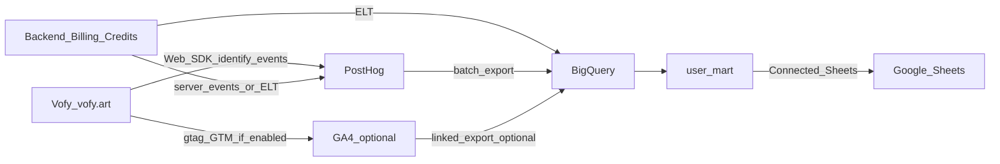

# Vofy — 数据归因与经营宽表方案（PostHog × 数仓 × Google Sheets）

> **本文档自洽**：不依赖内网、私有仓库或配套 Markdown；可单独转发。文中产品信息与官网公开描述一致时使用品牌名 **Vofy** 与域名 **vofy.art**。  
> **首要目的**：把 **注册 / 激活** 与 **订阅、积分（Credits）相关经营动作** 归到 **① 营销渠道**（自然搜索、付费、外链、直访、社媒、邮件等）和 **② 首访落地页**（首页、Studio、**`/apps` 工具长尾页** 等），用于 **按页、按活动** 复盘内容与投放，并支撑周会口径。  
> **工具分工（本稿定调）**：**PostHog** 承担 **产品行为** 与 **首触 / 末触、首访落地** 的 **主事实源**；**BigQuery**（或同类云数仓）做 **按 `user_id` 的多源合并**；**Google Sheets** 仅作 **已汇总结果表的消费端**（不替代埋点与仓内真值）。**GA4** 为 **可选**：用于与 **Google Search Console** 全站/着陆趋势 **对照**，不在本方案中取代 PostHog 的用户级人物属性主轴。  
> **方法骨架**：多源数据 **按业务 `user_id` 合并** → 平铺 **用户级结果表（`user_mart`）** → 分阶段落地（采集与治理、进仓、出表、协作）。  
> **最后更新**：2026-05-07

---

## 0. 核心目标：要回答的归因问题

以下在 **工程口径** 上优先以 **PostHog 人物属性 + 关键事件** 实现；需要与搜索侧周报对话时，可用 **GA4 + GSC** 做 **定性对照**。**Sheets** 只接 **已汇总** 的宽表或摘要。

| 问题 | 典型切片维度 | 主要用途 |
|------|----------------|----------|
| **注册 / 登录来自什么渠道？** | UTM、Referrer、默认渠道大类、是否付费流 | 投放复盘、合作评估 |
| **付费 / 升级 / 积分购买与什么渠道相关？** | 同左 + 末触或「首次付费前触点」（须书面定义） | 预算与 ROAS |
| **从哪条路径进入并转化？** | 首访 path（如 `/apps/…` vs `/studio/…`） | **SEO、Programmatic 工具页、Studio 引流** 的效果 |
| **自然搜索整包贡献？** | Organic 规则 + 落地 URL +（可选）GSC 着陆页 | 验证内容资产是否带来收入 |
| **外链 / 目录 / KOL 来自哪些站点？** | `referrer` 域名、合作 UTM | PR、友链、目录投放 |

**直接结论**：

- **渠道** 靠 **UTM 规范 + Referrer / 媒介派生规则** 收敛为可汇报的大类。  
- **落地页 / SEO 效果** 必须同时固化 **`first_landing_path`**（及按需 **主机名 / 子路径规则**）与 **`first_touch_utm_*`**；仅有 UTM 无法覆盖大量 **无 UTM 自然流** 场景下「从哪页来、后续是否付费」的用户级关联。

---

## 1. 目标与能力边界

### 1.1 要交付什么

- **可运营口径**：在 PostHog 能稳定回答「首 / 末触来自哪」「首访落在 **Studio 还是某个 App 工具页**」「各渠道对 **注册、核心生成、付费 / 积分购买** 的贡献」；**`user_id` 与 UTM 在全链路一致**。  
- **经营视图**：**Google Sheets** 中可定时刷新的 **用户级宽表**（行 ≈ 用户，列 = 归因摘要 + 商业字段 + 少量聚合行为指标）。  
- **原则**：在数仓中 **先** 按 `user_id` 合并埋点导出、订阅 / 积分主数据、首触 / 落地字段，**再** 进入 Sheets；避免在表格里手工拼接完整 ETL。

### 1.2 多源真值从哪里来

- **强业务 / 计费**（套餐、**Credits 余额与消耗**、退款状态等）以 **后端 / 支付 / 订阅系统** 为准；经 **服务端事件** 或 **定时 ETL** 进入数仓。  
- **PostHog**：页面与产品内行为、**人物属性**（如 `first_landing_path`、`first_touch_*`）的 **主实施面**；支持 **Batch Export** 至 BigQuery。  
- **（可选）GA4**：站级会话、默认渠道、与 **GSC** 对齐的着陆趋势；**用户级落地与渠道真值** 仍以 PostHog 侧定义 + 数仓派生为准，避免双端无映射地互相覆盖。  
- **Google Sheets**：**消费层**；口径分歧时，以 **PostHog / 数仓** 为解释依据。

**推荐数据流（概念）**：

```text
PostHog（行为 + 首末触 UTM + 首访 path + 关键转化）
  + 业务库 / 支付（计划、Credits、订阅状态）
  +（可选）GA4 → BigQuery — 渠道校验、全站漏斗对照
  → 数仓内 user_mart
  → Connected Sheets（或合规的定时导出）
```

### 1.3 Google Sheets 在链路中的位置

| 维度 | 说明 |
|------|------|
| **适合** | 用户级宽表、透视、与 Google Workspace 同事共享；**Connected Sheets** 定时刷新 **结果表** |
| **不适合** | 替代数仓；对 **原始海量事件表** 做反复全表拖拽 |
| **实践要点** | 在 BigQuery 内 **先聚合成「行 = 用户」的平铺表**，再连接 Sheets，控制查询成本与表格体量 |

**未上数仓的 MVP**：PostHog 定期导出 / CSV + 受控进 Sheet；流量与字段增多后切换 **Batch Export → BigQuery → Scheduled Query → 结果表**。

### 1.4 管道工程 vs 表后分析

| 层级 | 内容 | 典型承担方 |
|------|------|------------|
| **采集与治理** | UTM、`first_landing_path`、跨路由存证、`user_id`、事件字典、PostHog Person 属性 | 工程 + 增长 / 数据 |
| **汇总与出表** | 数仓中 `user_mart`、刷新节奏、Sheets 列映射 | 数据 |
| **消费** | PostHog 仪表盘、Sheets / BI、（可选）GSC / GA4 对照会议 | 增长、市场、管理层 |

**落地顺序建议**：先跑通 **Identify + 首触 UTM + `first_landing_path` + 核心转化事件**；再 **PostHog → BigQuery**；再 **`user_mart` → Sheet**；最后按需加 **GA4** 做站级对照。

---

## 2. 总览架构（Vofy 语境）

Vofy 为 **浏览器内 Web 产品**：**一体化 AI 创意工作室**（图像 / 视频 / 特效）+ **`/apps` 下大量单用途工具页**。归因以 **与账户一致的 `user_id`** 为 JOIN 键；**匿名期**与 **「先玩后注册」** 须有 **书面合并规则**（见 §5）。



- **`first_landing_path`** 应能区分 **首页、Studio 路径、`/apps/{slug}`** 等；若存在多主机名，建议增加 **`first_landing_host`** 或在单字段内使用团队统一的书写规范。  
- **可选 GA4** 与 PostHog 在登录后使用 **同一业务 `user_id`**，勿用 **客户端随机 ID** 充当商业主键。  
- **积分扣减、成功支付、订阅周期** 等优先 **服务端** 真值 + **数仓事实表**。

---

## 3. 字段分层与「最小列集」

### 3.1 Person 属性 / 与 `user_mart` 同构（示例）

| 分组 | 属性（示例） | 说明 |
|------|--------------|------|
| **首触** | `first_touch_utm_source` / `medium` / `campaign` | 首次 Identify / 注册时写入；无 UTM 时派生 `first_touch_channel` |
| **首访落地** | **`first_landing_path`（建议必填）** | **按页复盘 Apps 与 Studio 的必备字段**；程序化 URL 建议 **存 path 时与索引 URL 规则一致**（如统一是否带 query） |
| **末触** | `last_touch_utm_*` | 与首触分栏存储 |
| **拉新** | `registered_at` | ISO 时间，与主数据一致 |
| **商业** | `plan` / `tier`、订阅 `status`、**Credits 相关摘要** | 以 **后端 / 计费** 为准 |
| **场景** | `surface`：`studio` / `apps` 等 | 便于分工作台与工具站流量 |

**原则**：**一种语义、一种命名**；与内部 **事件命名表** 一并维护。

### 3.2 渠道大类（汇报用，须书面定版）

| 渠道大类          | 规则思路（示例）                    |
|-------------------|-------------------------------------|
| Organic Search    | 无付费 UTM + 搜索引擎类 Referrer   |
| Paid Search/Social| 按 `utm_medium` 约定               |
| Referral          | 外站 Referrer                       |
| Email             | `utm_medium=email` 等               |
| Direct            | 无 UTM 且 Referrer 空或按内规      |
| Other             | 兜底，占比应可解释                  |

### 3.3 Vofy 特有用法提示

- **Apps 长尾页**：建议在事件属性中带 **`app_slug` 或规范化的 path**，便于在数仓中做 **「用户 × 工具」** 聚合或独立 Mart。  
- **Studio 多模型**：关键事件带 **`model`**、**任务类型**（图 / 视频）等稳定枚举，便于后续按模型复盘。  
- **Credits**：**余额与消耗** 以业务库为准；PostHog 可记录 **购买 / 失败 / 额度用尽** 等 **可运营事件**，但 **不** 作为财务唯一真值。

### 3.4 Google Sheets 出表列（来自 `user_mart`）

| 列 | 说明 |
|----|------|
| `user_id` | 业务主键 |
| `first_touch_utm_*` / `first_touch_channel` | 与 §3.1 一致 |
| **`first_landing_path`** | **必备** |
| 套餐 / 订阅简版、**Credits 摘要** | 以计费 / 仓内维表为准 |
| 1～3 个 **主行为** 的 30 / 90 天次数 | 由 PostHog 事件在仓内聚合 |
| 可选 | 与 GA4 渠道结论对比的 **QA 标志列** |

### 3.5 逻辑示例行（占位，非真实数据）

| user_id | first_touch_channel | first_touch_utm_source | first_landing_path | plan_tier | key_usage_30d |
|---------|---------------------|------------------------|--------------------|-----------|-----------------|
| `…` | paid_social | `instagram` | `/apps/ai-kissing-video` | Pro | 28 |

---

## 4. 分步实施 Checklist

### 阶段 A：UTM + 首访落地（含 `/apps` / Studio）

1. 制定 **UTM 命名表**；广告、邮件、KOL、合作链接 **全量** 带参。  
2. 约定 **`first_landing_path`**：是否包含语言前缀、`/apps/*` 与 `/studio/*` 的规范写法。  
3. 在 **注册成功或首次稳定 Identify** 时写入 **首访 path** 与 **首触 UTM**；**禁止** 仅在单次会话中持有 UTM 却 **不在用户级固化**。  
4. 用户经 **长路径**（如从某 App 页点到登录）时，用 **首入站存证**（如首屏 entry URL / session 存证）避免落地被记成 **仅登录页**。

### 阶段 B：User ID 与事件

1. 登录 / 注册后 **立即 `identify`**；`user_id` **等于** 内部账户 UUID。  
2. **匿名 → 登录** 的合并策略成文（PostHog `alias` / 服务端规则等）。  
3. 定义 **约 15～25** 个高价值事件：落地 → **注册 / 登录**、**核心生成提交**、**导出 / 下载**、**付费墙 / 套餐 / Credits 购买**、关键失败（如 **额度不足**）。  
4. 关键事件带 **`page_path` 或等价快照**，便于与 `first_landing_path` 对账。

### 阶段 C：计费与主数据入仓

1. 订阅、**Credits**、支付状态以 **数据库 + Webhook** 为准；**服务端** 发 PostHog 与 / 或 直接进入数仓。  
2. JOIN 键 **统一 `user_id`**；多币种 / 折扣时维护 **唯一收入口径** 说明。

### 阶段 D：双栈验证（若启用 GA4）

1. **Person 抽查**：`user_id`、`first_landing_path`、首触 UTM。  
2. PostHog：按 `first_landing_path`、campaign 细分漏斗。  
3. **GA4 + GSC**：全站 / 着陆趋势与 PostHog 侧首访是否 **同向**（定性即可）。  
4. `Direct` / `Other` 占比异常 → 回查 UTM 与 entry 存证。

### 阶段 E：数仓与 `user_mart`

1. 配置 **PostHog Batch Export → BigQuery**（数据集、权限、分区 / 延迟）。  
2. 在仓内按 **官方导出 schema** 解析事件，**按 `user_id` 聚合** 行为列。  
3. **LEFT / INNER JOIN** 用户维表、订阅 / **Credits** 表，输出 **平铺结果表**；用 **Scheduled Query** 或等价调度 **日更 / 日复**。  
4. **禁止** 在 Sheets 上对原始事件大表做「随手全表查询」。

### 阶段 F：Google Sheets

1. **Connected Sheets** 连接 **`user_mart` 结果表**，设置刷新频率。  
2. 含邮箱等 PII 时按公司政策做 **列级权限与脱敏**。  
3. 周会固定透视维示例：`first_touch_channel` × **`first_landing_path` 前缀** × 套餐 / Credits 分段。

### 阶段 G：首触 / 末触 / 首访落地规则（书面）

- **首触 UTM**：首次稳定用户识别时写入，**默认不覆写**。  
- **`first_landing_path`**：第一次 **有业务意义** 的入站路径（**勿** 默认用「注册前最后一跳」替代「真正的外站着陆内容页」，除非书面例外）。  
- **末触**：独立属性或独立报表字段。  
- **首次付费 / 首次积分购买**（若单独口径）：可用 **`first_paid_at`** 或事实表时间戳。

---

## 5. 路径与工具选型（简表）

| 路径 | 适用 | 注意 |
|------|------|------|
| **PostHog + BigQuery + Sheets** | **Vofy 主推荐形态** | `user_mart` 先行；**成本与调度** 书面化 |
| **PostHog only（无数仓）** | 早期验证 | 必须做好 **Person + path**；规模上限低 |
| **+ GA4** | 要强对齐 **GSC / Google 广告生态** | 与 PostHog **同一 `user_id`**；报表上明确 **谁主谁辅** |
| **Zapier 等逐条写入 Sheet** | 极小流量试点 | 难支撑复杂聚合与审计 |

**结论**：**宽表与归因** → **Sheets 或 BI**；**真值** → **PostHog + 业务库 + 数仓**。

---

## 6. 最小可行列集（MVP）

| MVP 项 | 说明 |
|--------|------|
| `user_id` | 全链路主键 |
| `first_touch_utm_source` / `medium` / `campaign` | 活动 / 渠道 |
| **`first_landing_path`** | **必备**，区分 **Apps / Studio / 首页** |
| `registered_at` | 队列与周期 |
| `plan` 或订阅 `status` 一类 + **Credits 摘要（若可同步）** | 商业 |
| 1～3 个激活 / 主行为指标 | 与北极星一致 |
| **下一期** | 末触、首次付费、按 `app_slug` 的 LTV、多窗口指标 |

---

## 7. 风险与治理

- **未固化 `first_landing_path`**：**SEO 与 `/apps` 投入** 难以与用户级 **注册 / 收入** 关联（常见最大技术风险）。  
- **仅会话内 UTM、未在 Identify 时写入 Person**：用户级渠道 **整体丢失**。  
- **PostHog 与（若有的）GA4 的 `user_id` 不一致**：无法对账。  
- **把 Sheet 当交易库 / 实时 OLTP**：应 **上收** 到数仓或 BI。  
- **合规**：联系人、精确位置等字段进表须符合 **隐私政策与区域法规**；对外转发前删除不必要的商业细节。

---

## 8. 公开参考（可直接打开）

- [PostHog：Batch Export 至 BigQuery](https://posthog.com/docs/cdp/batch-exports/bigquery)  
- [PostHog：Identify 与用户识别](https://posthog.com/docs/data-identify)  
- [Google Cloud：BigQuery Connected Sheets](https://cloud.google.com/bigquery/docs/connected-sheets)  
- [Google Analytics：GA4 BigQuery 导出](https://support.google.com/analytics/answer/9823238)（若启用 GA4）  
- [Google Search Console](https://search.google.com/search-console)（着陆页与查询，与 GA4 对照使用）

---

## 9. 文档维护

- **UTM 表**、**`first_landing_path` 规则**、**事件名**、**收入与 Credits 口径** 变更时，同步更新本稿相关章节及**内部**事件字典（内部字典可不对外附链，但与本文 §3、§4 保持一致）。  
- 建议每季度检查：PostHog 首访 path 与 **收录 URL / GSC** 是否可对齐；**Direct + Other** 是否可解释。

---

*Vofy · PostHog 归因与经营宽表 · 对外共享稿*
