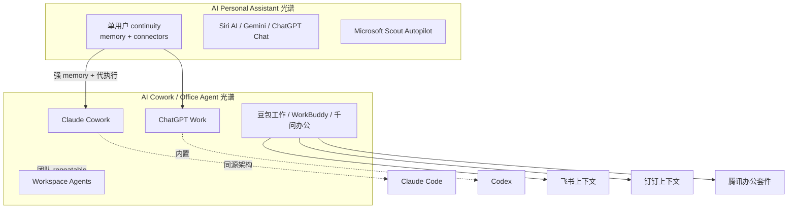

# 深度搜索报告 — AI Personal Assistant 与 AI Cowork（办公 Agent）

> **检索基准日**：2026-09-01  
> **时间范围**：2025 年以来，侧重 2026 H1–H2 产品动态  
> **检索约束**：按 web-deep-search-spec v1.4，未读取本地客户文档  
> **Loop 轮次**：6 轮（R1 英文广度 ×2 主题 · R2 官方 Tier 0 fetch · R3 竞品/反响 · R4 中文轴 · R5 交叉验证 · R6 收敛）  
> **来源统计**：Tier 0 12 · Tier 1 8 · Tier 2 6  
> **置信度摘要**：两概念的定义与代表产品骨架已由 Tier 0/1 互证；市场份额数字存在 Tier 1 与 SEO 咨询稿分歧，报告以 Sensor Tower（经 TechTimes 转引）为主、First Page Sage 为辅并标注单源。

---

## 1. 执行摘要

**AI personal assistant（个人 AI 助手）** 在 2026 年的行业共识是：面向**单个用户**、跨会话保留上下文、连接日历/邮件/文件等工具、并在用户确认或授权后**代为执行**——区别于「一问一答、会话即忘」的 chatbot。分类轴包括 reactive vs proactive、消费级语音助手 vs 专业工作助手、以及 assistant → agent 光谱（记忆深度、主动性、执行半径）。代表产品：ChatGPT、Gemini、Claude、Apple **Siri AI**（WWDC26 重塑）、Microsoft **Copilot/Scout**；国内语境下豆包/通义等通用助手向办公延伸，但「personal」强调单用户连续性，与团队 workspace agent 有边界。

**AI Cowork（办公协作 Agent）** 是 2026 年迅速成型的**新品类/交互范式**：用户描述目标而非步骤，Agent 在多步任务中自主规划、调用连接器/本地文件/浏览器，交付可验收成品（文档、表格、幻灯片、报告）。**Claude Cowork** 是 Anthropic 对该品类的命名产品（2026-01 research preview → 2026-04 GA）；**OpenAI ChatGPT Work**（2026-07）被多家 Tier 1 媒体明确对标 Cowork；国内同期出现 **豆包工作**、**千问办公**、**腾讯 WorkBuddy 企业版**，竞争焦点从「模型参数」转向「企业上下文 + 工具链执行」。社区反响（HN）普遍认可 agentic 委托价值，但担忧数据上传、VM 体积、approval fatigue 与安全边界。

---

## 2. 搜索过程摘要

| 轮次 | 新增 query 示例 | 本轮增量发现 |
|------|----------------|--------------|
| R1 | `AI personal assistant definition 2026` · `site:openai.com workspace agents` | 建立 personal assistant 定义轴；OpenAI Workspace Agents / ChatGPT Work 官方口径 |
| R2 | `site:claude.com Cowork overview` · `site:apple.com Siri AI personal assistant` · `site:microsoft.com Scout Autopilot` | Cowork = Claude Code 同源 agentic 架构；Apple Siri AI；Microsoft Scout Autopilot 品类 |
| R3 | `Claude Cowork ChatGPT Work Hacker News` · `Cursor Sand Claude Cowork rival` | HN 反响；Cursor 内部 Sand 对标 Cowork（The Information，单源 Tier 1） |
| R4 | `豆包工作 飞书 2026` · `腾讯 WorkBuddy 企业版` · `千问办公 钉钉` | 国内「办公 Agent」三线：字节/腾讯/阿里；上下文+IM 打通为差异化 |
| R5 | `Sensor Tower State of AI 2026 ChatGPT market share` · `IBM AI agents vs assistants` | 助手市场份额；IBM reactive/proactive 分类互证 |
| R6 | 交叉验证 Cowork 时间线（Anthropic release notes + Fortune + 官方 docs） | 时间线收敛；ChatGPT agent 模式已 deprecated，统一为 Work |

---

## 3. 搜索意图拆解

| 意图 | 检索词示例 | 结果状态 |
|------|------------|----------|
| **概念 A — Q1：AI personal assistant 是什么** | `what is personal AI assistant` · `site:apple.com Siri AI` | 已覆盖 |
| **概念 A — Q2：有哪些类型** | `reactive proactive AI assistant` · `site:ibm.com agents vs assistants` | 已覆盖 |
| **概念 A — Q3：知名产品/方案** | `Sensor Tower AI assistant market share 2026` | 已覆盖（份额为「AI assistant」广义，非 personal 窄类） |
| **概念 B — Q1：Cowork 是什么** | `site:claude.com/docs/cowork` · `ChatGPT Work OpenAI` | 已覆盖 |
| **概念 B — Q2：有哪些类型** | `workspace agents vs personal agent` · `enterprise office agent China` | 已覆盖 |
| **概念 B — Q3：知名产品/方案** | `Claude Cowork` · `豆包工作` · `WorkBuddy` · `千问办公` · `Cursor Sand` | 已覆盖（Sand 待官方确认） |
| 竞品对照 | `ChatGPT Work vs Claude Cowork` | 已覆盖 |
| 社区反响 | `site:news.ycombinator.com Cowork` | 已覆盖 |
| 中文语境 | 财新/36氪/阿里云开发者社区 | 已覆盖 |

---

# 第一部分：AI Personal Assistant

## 4. 核心发现（多源验证）

### 4.1 AI personal assistant 是什么

| 结论 | 来源 A | 来源 B | 置信度 |
|------|--------|--------|--------|
| 面向**单个用户**处理日程、邮件、任务、简报等「行政/知识工作」，而非团队协作为主的平台 | [IBM — AI Agents vs Assistants](https://www.ibm.com/think/topics/ai-agents-vs-ai-assistants) T1 | [Apple — Siri AI Newsroom](https://www.apple.com/newsroom/2026/06/apple-introduces-siri-ai-a-profoundly-more-capable-and-personal-assistant/) T0 | 已确认 |
| 与 chatbot 的核心差异：**跨会话记忆**、**工具/应用集成**、**代执行**（非仅生成文本） | [IBM](https://www.ibm.com/think/topics/ai-agents-vs-ai-assistants) T1 | [Microsoft Learn — Scout overview](https://learn.microsoft.com/en-us/microsoft-scout/overview) T0 | 已确认 |
| 2026 行业光谱：assistant（偏 reactive、等用户开口）与 agent（偏 proactive、多步规划）边界模糊，「personal agent」指跨平台、持久记忆、可确认后执行 | [IBM](https://www.ibm.com/think/topics/ai-agents-vs-ai-assistants) T1 | 学术研究 [ETH Zurich proactive VA review PDF](https://cocoa.ethz.ch/downloads/2024/05/2823_Berube%20et%20al.%202024%20-%20Proactive%20Voice%20Assistants.pdf) T2 | 很可能 |

**可操作定义（综合 Tier 0/1）：**

> **AI personal assistant** = 以 LLM 为内核、绑定**一个自然人**的工作与生活上下文，在授权范围内连接日历/邮件/文件/消息等系统，提供问答、起草、提醒与**代操作**；强版本具备跨设备会话同步、个人 context 检索与主动简报能力。

**与相邻概念边界：**

| 相邻概念 | 边界 |
|---------|------|
| Chatbot | 会话结束即失忆；通常无连接器与写回 |
| Team / workspace agent | 服务团队 repeatable workflow；RBAC、共享 agent catalog |
| Enterprise Copilot | 默认嵌入 M365/Workspace；组织策略优先于个人 continuity |
| Voice assistant (Siri/Alexa) | 历史偏设备控制与短指令；2026 起向 personal context 延伸（Siri AI） |

### 4.2 AI personal assistant 有哪些类型

分类依据综合 **IBM（交互模式）**、**Apple/Microsoft（生态 vs 跨应用）**、**学术（proactive 行为）**：

| 类型（分类依据） | 特征 | 典型场景 | 来源 |
|-----------------|------|----------|------|
| **Reactive assistant** | 用户 prompt 后才响应；记忆有限或会话级 | 快速问答、单次起草 | [IBM T1](https://www.ibm.com/think/topics/ai-agents-vs-ai-assistants) |
| **Proactive assistant / agent** | 基于 context 主动提醒、简报、建议下一步 | 晨间简报、会议前材料、风险预警 | IBM T1 · ETH proactive VA T2 |
| **Ecosystem-bound personal assistant** | 深度绑定单一 OS/套件（Apple/Google/Microsoft） | 系统级 App 操作、端侧隐私 | [Apple Siri AI T0](https://www.apple.com/newsroom/2026/06/apple-introduces-siri-ai-a-profoundly-more-capable-and-personal-assistant/) |
| **Cross-platform professional assistant** | 连接器 + 云端 memory；偏知识工作者 | 邮件 triage、跨 app 调研 | OpenAI/Anthropic 产品文档 |
| **Always-on Autopilot** | 独立身份/后台运行；定时 heartbeat | 会议协调、交付物跟踪 | [Microsoft Scout T0](https://www.microsoft.com/en-us/microsoft-365/blog/2026/06/02/introducing-microsoft-scout-your-always-on-personal-agent/) |
| **Consumer vs professional** | 消费者：计时/音乐/智能家居；专业：inbox+calendar 深度 | 个人生活 vs 工作行政 | 行业对比（Vellum 等，T2 线索，非定稿份额） |

**易混淆点：** 厂商 marketing 混用 "assistant" / "agent" / "copilot"。以**是否默认跨会话记住「你」**、**是否能在连接器上写回**、**是否在没有 prompt 时发起动作** 三轴判断更稳。

### 4.3 知名产品 / 代表方案

| 场景或类型 | 代表产品 | 备注 | 来源 |
|-----------|----------|------|------|
| 通用对话 + 向 Work 升级 | **ChatGPT** | Sensor Tower：2026-05 全球 AI assistant 用户份额约 **46.4%** | [TechTimes 引 Sensor Tower T1](https://www.techtimes.com/articles/318556/20260617/chatgpts-ai-assistant-market-share-falls-below-50-first-time-gemini-claude-surge.htm) |
| Google 生态 personal context | **Google Gemini** | 份额约 **27.7%**；Workspace/Android 分发 | 同上 |
| 专业/企业偏好 | **Claude** | 份额约 **10.3%**；付费转化率行业最高（Sensor Tower 称 13% 付费，单源） | 同上 |
| 端侧 personal context | **Siri AI** | WWDC26 发布；跨 iMessage/邮件/照片检索；2026 晚些 beta | [Apple Newsroom T0](https://www.apple.com/newsroom/2026/06/apple-introduces-siri-ai-a-profoundly-more-capable-and-personal-assistant/) |
| M365 always-on | **Microsoft Scout** | Autopilot 品类；桌面 agent + M365 数据；Frontier 私测 | [Microsoft 365 Blog T0](https://www.microsoft.com/en-us/microsoft-365/blog/2026/06/02/introducing-microsoft-scout-your-always-on-personal-agent/) |
| 嵌入办公套件 | **Microsoft 365 Copilot** | 广义的 workspace 内 assistant | Microsoft Inside Track T1 |
| 国内通用助手 | 豆包、通义千问、文心等 | C 端 personal；2026 向「工作 Agent」延伸见第二部分 | 财新/网易 T1–T2 |

**市场份额说明：** 「Personal assistant」无 W3Techs 式独立统计；上表为 **generative AI chatbot/assistant** 广义口径。First Page Sage（2026-07）给出 ChatGPT **51.3%** web 聊天机器人份额，与 Sensor Tower **46.4%**「True Audience」不完全一致——**并列引用，不合并为单数字**。

---

# 第二部分：AI Cowork（办公 Agent / 委托式工作）

## 4. 核心发现（续）

### 4.1 Cowork 是什么

| 结论 | 来源 A | 来源 B | 置信度 |
|------|--------|--------|--------|
| **Claude Cowork** = Anthropic 品牌名；agentic workspace，与 Claude Code **同源架构**，非终端 UI | [claude.com/docs/cowork/overview T0](https://claude.com/docs/cowork/overview) | [Anthropic Help — Get started with Cowork T0](https://support.claude.com/en/articles/13345190-get-started-with-claude-cowork) | 已确认 |
| 交互范式：**委托 outcome**（描述目标 → Agent 规划多步 → 交付成品），区别于 Chat 的 turn-by-turn | Anthropic Help T0 | [Claude Academy — What is Cowork T0](https://academy.claude.com/courses/introduction-to-claude-cowork/what-is-cowork) | 已确认 |
| **ChatGPT Work** = OpenAI 对同一范式的命名；取代原 ChatGPT agent 模式 | [OpenAI index T0](https://openai.com/index/chatgpt-for-your-most-ambitious-work/) | [OpenAI Help — agent deprecated T0](https://help.openai.com/en/articles/11752874-chatgpt-agent) | 已确认 |
| 品类泛称「Cowork」在媒体/竞品语境中 ≈ **knowledge work agent / office agent**（不限 Anthropic） | [Fortune — Claude Cowork launch T1](https://fortune.com/2026/01/13/anthropic-claude-cowork-ai-agent-file-managing-threaten-startups/) | [The Next Web — Cursor Sand T1](https://thenextweb.com/news/cursor-sand-ai-agent-claude-cowork-rival) | 很可能 |

**可操作定义：**

> **AI Cowork（品类）** = 用户以自然语言委托**多步知识工作**；Agent 在沙箱/云/本地授权目录中读取文件、调用 MCP 连接器与浏览器，并行子任务，输出**可编辑交付物**；支持定时任务与跨设备续作。  
> **Claude Cowork** = 上述范式在 Claude 产品内的实现（Chat 旁路 Cowork 标签页）。

### 4.2 Cowork 有哪些类型

| 类型（分类依据：部署与组织边界） | 特征 | 典型场景 | 来源 |
|-------------------------------|------|----------|------|
| **Desktop personal cowork** | 本地文件夹 + Desktop app；VM/沙箱执行 | 个人知识整理、报告、表格 | Anthropic docs T0 |
| **Cloud session cowork** | 会话与文件存 Claude 账号；关盖继续 | 长任务、移动端续看 | Anthropic release notes T0 |
| **ChatGPT Work（个人委托）** | Chat/Work/Codex 并列；GPT-5.6；内置 browser | 调研、deck、表格、站点 | OpenAI T0 |
| **Workspace agents（团队）** | 可共享、API trigger、Slack；RBAC | 销售 brief、采购审批、会议跟进 | [OpenAI Help workspace agents T0](https://help.openai.com/en/articles/20001143/) |
| **Enterprise office agent 平台（中国）** | 深度绑定 IM/知识库（飞书/钉钉/腾讯套件） | 周报、尽调、流程自动化 | 财新/腾讯云 T1 |
| **Always-on workplace autopilot** | 后台 heartbeat、子 agent | 会议协调、风险 surfacing | Microsoft Scout T0 |
| **Developer tool 向 office 延伸** | Cursor **Sand**（内部代号，未官宣 GA） | 邮件/表格/文档 | The Information via TechTimes T1（单源） |

### 4.3 知名 Cowork / 办公 Agent 产品地图

| 区域 | 产品 | 状态（2026-09） | 差异化 | 来源 |
|------|------|----------------|--------|------|
| 全球 | **Claude Cowork** | 2026-04-09 GA（macOS/Windows）；2026-07 web/mobile beta（Max 先行） | Claude Code 架构；Skills/Plugins/MCP | Anthropic release notes T0 |
| 全球 | **ChatGPT Work** | 2026-07 发布；Pro/Enterprise/Edu 先行 | 取代 agent mode；Scheduled Tasks；Codex 内置 | OpenAI T0 |
| 全球 | **ChatGPT Workspace Agents** | Enterprise/Business；API trigger | 团队 repeatable workflow | OpenAI Help T0 |
| 全球 | **Microsoft Scout** | Frontier / 私测 | M365 原生；Autopilot | Microsoft T0 |
| 全球 | **Cursor Sand** | 内部 dogfood；**公开 GA 未确认** | 开发者用户基础 + MCP | The Next Web T1 |
| 中国 | **豆包工作** | 2026-08-25 发布 | 飞书上下文；云电脑长任务；TRAE/扣子并入 | [财新 T1](https://www.caixin.com/2026-08-25/102477698.html) |
| 中国 | **腾讯 WorkBuddy 企业版** | 2026-06 AI 产业大会 | 腾讯文档/网盘/乐享；Agent Suite | [新浪财经 T1](https://finance.sina.com.cn/jjxw/2026-06-09/doc-iniauvas6486062.shtml) |
| 中国 | **千问办公 QwenWork** | 2026-08 公测 | 钉钉 25+ IM 能力；QoderWork/悟空/MuleRun 整合 | [阿里云开发者社区 T1](https://developer.aliyun.com/article/1754480) |

---

## 5. 时间线（Cowork 赛道）

| 日期 | 事件 | 来源（Tier） |
|------|------|-------------|
| 2026-01-12 | Claude Cowork research preview（macOS，Max） | Fortune T1 · Anthropic release notes T0 |
| 2026-01 | Cowork 开放 Pro | Anthropic release notes T0 |
| 2026-04-09 | Claude Cowork GA；Enterprise 管控（RBAC、OTEL） | [claude.com/blog/cowork-for-enterprise T0](https://claude.com/blog/cowork-for-enterprise) |
| 2026-06-02 | Microsoft Scout / Autopilot 品类发布 | Microsoft 365 Blog T0 |
| 2026-06 | 腾讯 WorkBuddy 企业版发布 | 新浪财经 T1 |
| 2026-07-07 | Cowork web/mobile beta（Max 先行） | Anthropic release notes T0 |
| 2026-07-09 | OpenAI ChatGPT Work 发布 | OpenAI index T0 |
| 2026-07-09 | The Information：Cursor 内部 Sand 对标 Cowork/Work | TechTimes T1 |
| 2026-08-03 | 阿里千问办公公测 | 网易/凤凰网 T1 |
| 2026-08-25 | 字节豆包工作发布；飞书深度打通 | 财新 T1 |

---

## 6. 实体关系

**关系要点：**

- **Personal assistant** 强调「谁的服务对象」—— 一个自然人及其跨天 context。  
- **Cowork** 强调「怎么交互」—— 委托整段工作，而非单轮 QA。  
- 2026 产品现实：ChatGPT Work、Cowork、Scout、豆包工作 同时覆盖两侧，**品类标签正在合并**。

---

## 7. 增量信息

### 7.0 增量对照表（多源 diff）

| 增量主张 | 相对 Tier 0 的新增点 | 首见来源 | 互证来源 | 验证结果 | 置信度 |
|---------|---------------------|---------|---------|---------|--------|
| ChatGPT **agent 模式下线**，统一为 Work | Help Center 明确 deprecated | OpenAI Help T0 | Lead with AI T2 | 已确认 | 已确认 |
| Cowork 在 **Linux VM** 内运行（非直接本机 shell） | Felix Anthropic 工程师 HN 解释 | HN T2 | Simon Willison gist T2 | 很可能 | 很可能 |
| Cursor **Sand** 存在且对标 Cowork | 内部 6 月 rollout | The Information → TechTimes T1 | The Next Web T1 | 很可能（双 Tier 1 一致） | 很可能 |
| Sand 是否公开发布 | 官方未宣布 | TechTimes T1 | — | 待核实 | 单源 |
| 豆包工作继承飞书**权限内**企业上下文 | 官方对外口径 | 财新 T1 | 网易 T1 | 已确认 | 已确认 |
| Claude 付费转化率 13% | Sensor Tower 数据 | TechTimes T1 | — | 待核实 | 单源 Tier 1 |
| ChatGPT 全球份额首次 **<50%**（2026-03） | True Audience 口径 | TechTimes 引 Sensor Tower T1 | Sensor Tower blog T1 | 很可能 | 很可能 |

### 7.1 已验证增量信息

| 增量事实 | 来源 | 置信度 |
|---------|------|--------|
| OpenAI 将个人长任务与团队 repeatable 区分为 **Work** vs **Workspace Agents** | [OpenAI Academy](https://openai.com/academy/workspace-agents/) T0 | 已确认 |
| Anthropic Cowork 2026-04 GA 后增加 Enterprise RBAC、OTEL、usage analytics | [cowork-for-enterprise](https://claude.com/blog/cowork-for-enterprise) T0 | 已确认 |
| 国内三巨头 2026-07/08 集中发布办公 Agent，卖点均为 **IM/套件上下文** 而非裸模型 | 财新 · 阿里云开发者社区 T1 | 很可能 |
| HN 用户反馈 ChatGPT Work computer use + Gmail connector 对表单/邮件场景实用 | [HN item 49504625](https://news.ycombinator.com/item?id=49504625) T2 | 社区舆情 |

### 7.2 未通过验证的传闻

| 传闻/主张 | 来源 | 拒绝原因 |
|----------|------|---------|
| Cursor Sand 一定在 Q3 2026 公开发布 | 多家科技媒体 | 无 Tier 0；Cursor 未官宣 |
| 「Agent 真生产渗透率仅 11%」 | workbuddy.cn 首页 | 非 Tier 0/1；可能为营销口径 |
| First Page Sage「ChatGPT 51.3%」与 Sensor Tower「46.4%」合并为单一事实 | SEO 咨询稿 | 方法论不同，不可合并 |

### 7.3 权威媒体解读

- **Fortune（2026-01）**：Cowork 被定位为可管理本地文件的 general-purpose agent，对「文件/文档类」初创构成替代威胁。  
- **TechTimes / The Next Web（2026-07）**：办公 Agent 进入三国杀——Cowork、ChatGPT Work、Cursor Sand；SpaceX 收购 Cursor 可能改写 Sand 路线图。  
- **财新（2026-08）**：字节以豆包工作统一 TRAE/扣子/飞书 AI 能力，行业从模型战转向 **Agent 落地战**。

### 7.4 社区与舆论反响

**Claude Cowork（HN）：**

- 正面：降低非技术用户接触 agentic workflow 的门槛；「Claude Code 友好 UI + 默认沙箱」。  
- 顾虑：本地文件夹授权可能导致文件作为 Input 上传 Anthropic；VM bundle ~10GB；prompt injection；approval fatigue 与安全 trade-off（Felix 回复承认 trade-off）。

**ChatGPT Work（HN）：**

- 正面：connector + 内置 browser 填表、邮件草稿等「真实省时间」用例。  
- 困惑：与 Claude Code mobile / Codex 能力重叠；Work vs Chat 边界需用户学习。

**总体：** 技术社区 **skeptical but engaged**——认可能力，强调数据边界与产品命名混乱。

### 7.5 争议与风险

| 风险 | 说明 | 来源 |
|------|------|------|
| 数据离开设备 | Cowork 云会话；敏感文件夹 scope | Anthropic Help · HN T2 |
| 组织连接器 RBAC | Workspace Agents 使用 creator 个人 connector 时他人可间接访问 | OpenAI Help T0 |
| 监管/地域 | Siri AI 初期不在 EU iOS/watchOS、不在中国 | Apple Newsroom T0 |
| 生态锁定 | Cowork/Work 深度绑定各自 connector 商店 | 多家 T1 |

### 7.6 竞品与行业对照

| 维度 | Claude Cowork | ChatGPT Work | 豆包工作 | WorkBuddy |
|------|--------------|--------------|---------|-----------|
| 核心范式 | 委托 + 本地/云文件夹 | 委托 + Work/Codex/browser | 委托 + 飞书 context | 委托 + 腾讯套件 |
| 团队共享 | Enterprise 管控 | Workspace Agents | 企业版/飞书权限 | Agent Suite |
| 长任务 | Scheduled tasks | Scheduled Tasks | 云电脑 | 云端持续运行 |
| 定价 | Claude Pro/Team 内含 | ChatGPT 各档 plan | 订阅+30 天试用（报道） | 140–999 元/月档（官网） |

### 7.7 中文语境

- **「办公 Agent」** 成为 2026 下半年中文科技媒体高频词；三家策略：  
  - **字节**：飞书 context + 组织收编（TRAE、扣子 → 豆包）  
  - **腾讯**：WorkBuddy 为「统一 Agent 入口」+ 文档/网盘/乐享  
  - **阿里**：千问办公独立 Agent + 反向调用钉钉  
- **易观** 被新浪财经引用：2026-03 PC 端 AI 原生办公智能体访问量 WorkBuddy 第一——**单源 Tier 1，待第二来源互证**。

---

## 8. 分歧与待核实

| 项 | 说法 A | 说法 B | 建议 |
|----|--------|--------|------|
| AI assistant 市场份额 | Sensor Tower：ChatGPT 46.4%（2026-05） | First Page Sage：ChatGPT 51.3%（2026-07） | 引用时注明口径（True Audience vs web chatbot traffic） |
| Cursor Sand 发布时间 | 媒体：2026 Q3 可能受 SpaceX 收购影响 | Cursor：无官方公告 | 标注「内部产品，未发布」 |
| Personal assistant vs agent | IBM：agent 更 proactive | 厂商：混用品牌词 | 用三轴（memory / initiative / execution）自行判定 |

---

## 9. 对用户问题的直接回答

### 9.1 AI personal assistant 是什么？

面向**单个用户**的 AI 软件，在其授权下连接日历、邮件、文件与消息，**跨会话记住 context**，并可在确认后**代执行**任务；区别于只回答问题的 chatbot，也区别于默认服务团队的 workspace agent。2026 代表演进：Apple **Siri AI**（端侧 personal context）、Microsoft **Scout**（always-on Autopilot）、ChatGPT/Claude/Gemini 在 Chat 模式下的 personal 化能力。

### 9.2 AI personal assistant 有哪些类型？

1. **Reactive vs proactive**（IBM / 学术界）  
2. **Consumer voice vs professional work**（Siri/Alexa vs inbox-calendar 深度助手）  
3. **Ecosystem-bound vs cross-platform**（Apple/Google/Microsoft vs 连接器型）  
4. **Assistant ↔ agent 光谱**（记忆深度、是否多步规划、执行半径）  
5. **Always-on autopilot**（Scout 类后台协调）

### 9.3 AI personal assistant 有哪些知名产品？

- **全球**：ChatGPT、Google Gemini、Claude、Microsoft Copilot/Scout、Apple Siri AI  
- **统计**：广义 AI assistant 市场 ChatGPT ~46–51%、Gemini ~23–28%、Claude ~10%（来源口径见 §8）  
- **国内**：豆包、通义等通用助手；专业「personal executive assistant」型独立产品 públic 信息少于美国市场

---

### 9.4 Cowork 是什么？

**两层含义：**  
1. **Claude Cowork（产品）**：Anthropic 在 Claude Desktop/Web/Mobile 中的 agentic 工作区，与 Claude Code 同源，委托多步任务、读写授权文件、经 MCP 连工具。  
2. **Cowork（品类）**：2026 行业对「**委托式知识工作 Agent**」的统称；OpenAI **ChatGPT Work** 为直接对标；国内 **豆包工作 / WorkBuddy / 千问办公** 为生态型对标。

### 9.5 Cowork 有哪些类型？

- 个人 desktop/cloud **cowork 会话**（Cowork、ChatGPT Work）  
- **团队 workspace agents**（可共享、API 调度）  
- **Enterprise office agent 平台**（IM+知识库上下文）  
- **Always-on autopilot**（Scout）  
- **从 dev tool 外溢的 office agent**（Cursor Sand，待发布）

### 9.6 Cowork 有哪些知名产品/方案？

| 产品 | 厂商 | 状态 |
|------|------|------|
| Claude Cowork | Anthropic | GA；web/mobile beta |
| ChatGPT Work | OpenAI | 2026-07  rollout |
| Workspace Agents | OpenAI | Enterprise/Business |
| Microsoft Scout | Microsoft | Frontier/私测 |
| 豆包工作 | 字节跳动 | 2026-08 发布 |
| WorkBuddy 企业版 | 腾讯 | 2026-06 发布 |
| 千问办公 | 阿里 | 2026-08 公测 |
| Cursor Sand | Cursor/SpaceXAI | 内部，未 GA |

---

## 10. 参考链接（按 Tier 排序）

### Tier 0 官方

- https://claude.com/docs/cowork/overview  
- https://support.claude.com/en/articles/13345190-get-started-with-claude-cowork  
- https://claude.com/blog/cowork-for-enterprise  
- https://openai.com/index/chatgpt-for-your-most-ambitious-work/  
- https://help.openai.com/en/articles/20001143/  
- https://help.openai.com/en/articles/11752874-chatgpt-agent  
- https://www.apple.com/newsroom/2026/06/apple-introduces-siri-ai-a-profoundly-more-capable-and-personal-assistant/  
- https://www.microsoft.com/en-us/microsoft-365/blog/2026/06/02/introducing-microsoft-scout-your-always-on-personal-agent/  
- https://learn.microsoft.com/en-us/microsoft-scout/overview  
- https://www.workbuddy.cn/  
- https://cloud.tencent.com/document/product/1831/134332  
- https://www.aliyun.com/product/qwenwork  

### Tier 1 权威媒体

- https://fortune.com/2026/01/13/anthropic-claude-cowork-ai-agent-file-managing-threaten-startups/  
- https://www.techtimes.com/articles/318556/20260617/chatgpts-ai-assistant-market-share-falls-below-50-first-time-gemini-claude-surge.htm  
- https://sensortower.com/blog/state-of-ai-2026  
- https://www.ibm.com/think/topics/ai-agents-vs-ai-assistants  
- https://www.caixin.com/2026-08-25/102477698.html  
- https://finance.sina.com.cn/jjxw/2026-06-09/doc-iniauvas6486062.shtml  
- https://developer.aliyun.com/article/1754480  
- https://thenextweb.com/news/cursor-sand-ai-agent-claude-cowork-rival  

### Tier 2 补充（反响/社区/研究）

- https://news.ycombinator.com/item?id=46593022  
- https://news.ycombinator.com/item?id=49504625  
- https://news.ycombinator.com/item?id=47220118  
- https://cocoa.ethz.ch/downloads/2024/05/2823_Berube%20et%20al.%202024%20-%20Proactive%20Voice%20Assistants.pdf  

---

*本报告按 web-deep-search-spec v1.4 生成，检索日 2026-09-01，共 6 轮 loop。*
