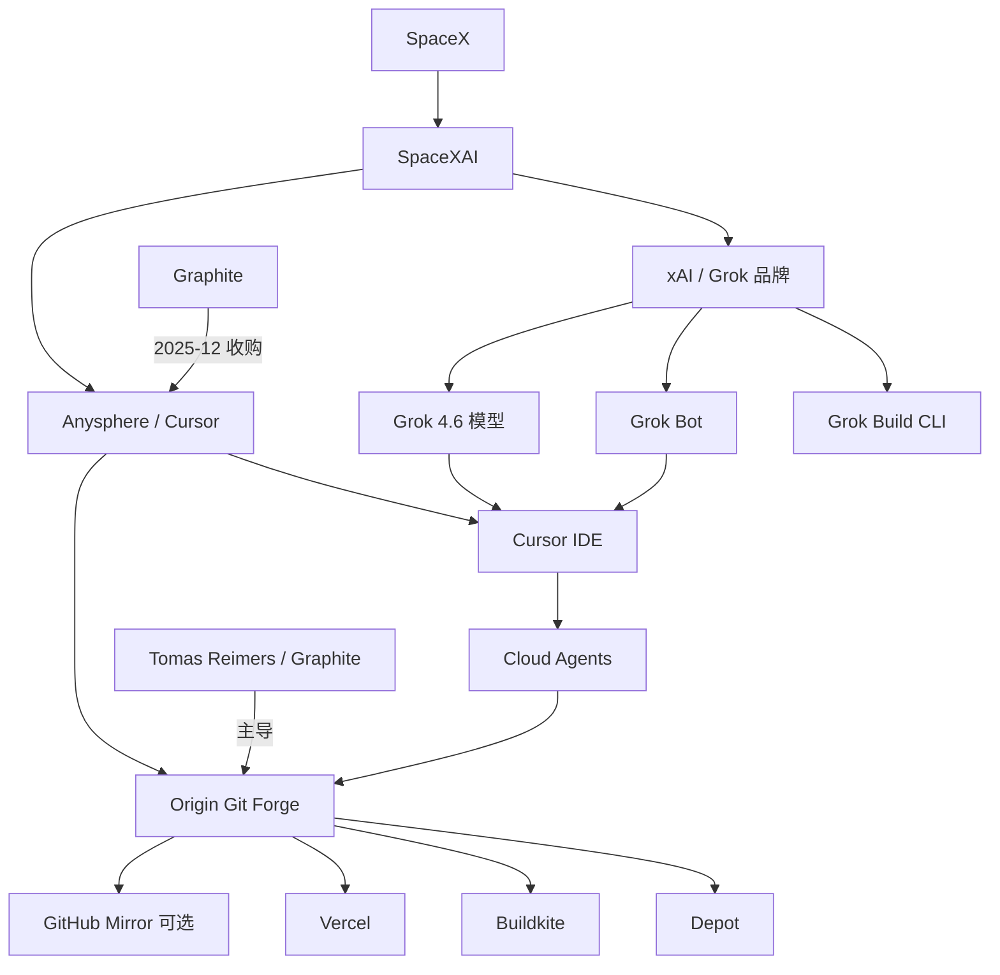

# 深度搜索报告 — Grok / Cursor Origin

> **检索基准日**：2026-08-21  
> **时间范围**：2025-12 至 2026-08-21（默认近 90 天优先最新）  
> **检索约束**：按 web-deep-search-spec v1.2，未读取本地客户文档  
> **Loop 轮次**：7 轮  
> **来源统计**：Tier 0 12 · Tier 1 11 · Tier 2 6  
> **置信度摘要**：核心产品事实已由官方文档 + 多家 Tier 1 互证；SpaceX 收购与 Beta 上线时间线已确认；数据治理、独立定价、Grok Build 直连 Origin 等待官方澄清项已隔离至 §7.2 / §8。

---

## 1. 执行摘要

公开信息中**不存在名为「Grok Origin」的独立产品**。**Origin** 是 **Cursor**（Anysphere）推出的 AI 原生 Git 代码托管平台（git forge），现隶属 **SpaceX → SpaceXAI** 生态，与 **Grok**（Grok 4.6 模型、Grok Bot、Grok Build）为同一母公司下的互补产品，而非同一 SKU。

**时间线**：2026-06-16 Compile 大会首次演示 Origin（当时为候补/waitlist，目标秋季 GA）；2026-08-14 SpaceX 完成对 Cursor 的收购；2026-08-17 Origin **Early Beta** 向全部付费计划（Pro / Teams / Enterprise）分阶段 rollout；同日 GitHub 发生 **7 小时 47 分**全球降级（Tier 0：[GitHub Status](https://www.githubstatus.com/)），成为 Tier 1 解读 Origin launch 叙事的关键背景。

**产品要点**：Origin 支持自建仓库、GitHub 双向 mirror（GitHub 可保持 source of truth）、PR 审查与合并、Cloud/Local Agent 同界面操作；首发集成 **Vercel**（PR 预览部署）、**Depot**、**Buildkite**（可跑现有 GitHub Actions workflow）；公开 **Origin API**（`https://api.cursor.com/v1/origin`，Alpha/Early Beta）。底层存储系统 **Continuity**（WAL + S3）已在官方工程博客披露。

**与 Grok 关系**：Grok 4.6（2026-08-12）与 Cursor 联合训练并在 Cursor 全计划可用；Grok Bot（2026-08-11）面向 Cursor Ultra / Teams Premium，与 Origin 无官方直接集成声明。Origin 开发由 Graphite 联合创始人 **Tomas Reimers** 主导（2025-12 Cursor 收购 Graphite）。

**已验证增量**：Enterprise 组织默认**开启 Origin 能力**，管理员可 opt-out（Tier 0）；**Origin 原生托管代码的数据保留/训练使用条款尚未单独发布**（Tier 1 多源一致，官方文档未覆盖）；社区反响**偏 skeptical**，主要顾虑 SpaceX 归属、数据治理、namespace 不可变更、仓库默认私有。

---

## 2. 搜索过程摘要

| 轮次 | 新增 query 示例 | 本轮增量发现 |
|------|----------------|--------------|
| R0 | 意图拆解：`Cursor Origin` / `Grok Origin` 歧义、`Compile` 时间线 | 确认主体为 Cursor Origin，非 Grok 独立产品 |
| R1 | `site:cursor.com Origin`、`site:x.ai Grok Cursor 2026` | 官方文档/Changelog/API；Grok 4.6、Grok Bot 发布日期与 Cursor 集成 |
| R2 | `VentureBeat Cursor Origin GitHub outage`、`TechCrunch SpaceX Cursor acquisition` | Tier 1 launch 解读；收购关闭；GitHub 宕机与 Rauch 引语 |
| R3 | `Cursor Graphite acquisition`、`GitHub status August 17 2026`、`enterprise opt-out Origin` | Graphite→Origin 技术脉络；GitHub 官方 incident 时长；Enterprise opt-out 官方口径 |
| R4 | `site:news.ycombinator.com Cursor Origin`、`reddit Cursor Origin 2026` | HN 热帖观点分布；Tomas Reimers 官方回复 |
| R5 | `Cursor Origin 36氪`、`Mindgard git.exe Cursor`、`Grok Build Origin integration` | 中文 Tier 1（36氪 Compile 稿）；CVE-2026-63093；Grok Build 集成传闻无官方源 |
| R6 | `Reuters OpenAI GitHub alternative The Information`、`The Register GitHub outage August 17` | 行业竞品对照（OpenAI 自建 forge）；GitHub 根因分析互证 |

---

## 3. 搜索意图拆解

| 意图 | 检索词示例 | 结果状态 |
|------|------------|----------|
| 澄清「Grok Origin」歧义 | `Grok Origin product`、`Cursor Origin official` | 已覆盖：无 Grok Origin，仅有 Cursor Origin |
| 时间线 announce→beta→现状 | `Compile 2026 Origin`、`changelog origin-code-hosting` | 已覆盖 |
| 产品功能/API/集成 | `cursor.com/docs/origin`、`Origin API v1` | 已覆盖 |
| 与 Grok 生态关系 | `Grok 4.6 Cursor`、`Grok Bot`、`Grok Build` | 已覆盖（Build↔Origin 直连：官方未覆盖） |
| 增量：opt-out、宕机、Graphite、定价、安全 | 长尾 query 见 §2 | 部分覆盖；独立 Origin 定价：权威源未覆盖 |
| 社区/KOL 反响 | `HN Cursor Origin`、`Guillermo Rauch Origin` | 已覆盖 |
| Tier 1 解读 | VentureBeat、TechCrunch、SiliconANGLE、36氪 | 已覆盖 |
| 中文语境 | `36氪 Cursor Origin`、`网易 Cursor Origin` | 部分覆盖（36氪 Tier 1；网易 Tier 2） |
| 传闻验证 | §2.8 diff | 见 §7.0–§7.2 |

---

## 4. 核心发现（多源验证）

### 4.1 产品定名与生态归属

| 结论 | 来源 A | 来源 B | 置信度 |
|------|--------|--------|--------|
| 无「Grok Origin」独立产品；正确名称为 **Cursor Origin** | [Cursor Origin 文档](https://cursor.com/docs/origin) T0 · 2026-08 | [Origin Changelog](https://cursor.com/changelog/origin-code-hosting) T0 · 2026-08-17 | 已确认 |
| Cursor 现隶属 SpaceX，运行于 SpaceXAI 部门 | [Cursor is now a part of SpaceX](https://cursor.com/blog/joining-spacex) T0 · 2026-08-14 | [TechCrunch 收购关闭稿](https://techcrunch.com/2026/08/15/spacex-officially-closes-its-cursor-acquisition/) T1 · 2026-08-15 | 已确认 |
| Grok 4.6 在 Cursor 可用，与 Origin 为不同产品层 | [Introducing Grok 4.6](https://x.ai/news/grok-4-6) T0 · 2026-08-12 | [Grok 4.6 Model Card](https://media.x.ai/v1/website/card-4p6-4cd2dc57.pdf) T0 · 2026-08-17 | 已确认 |

Origin 是 Cursor 的 **git forge**（代码 forge / 托管层），Grok 系列是 **模型与 Agent 产品**（Grok 4.6 编辑器内模型、Grok Bot 云端同事、Grok Build 终端编码 Agent）。二者通过 SpaceXAI 战略协同，但官方未将 Origin 品牌化为 Grok 子产品。

### 4.2 Origin 功能与架构

| 结论 | 来源 A | 来源 B | 置信度 |
|------|--------|--------|--------|
| Early Beta：建库、git push/pull、GitHub mirror、PR、浏览搜索 | [Origin 文档](https://cursor.com/docs/origin) T0 | [Forum 发布公告](https://forum.cursor.com/t/origin-code-hosting/168670) T0 · 2026-08-17 | 已确认 |
| GitHub mirror 时 GitHub 仍为 source of truth；可 Detach 转为 Origin 独占 | [mirror-github 文档](https://cursor.com/docs/origin/mirror-github) T0 | [Changelog](https://cursor.com/changelog/origin-code-hosting) T0 · 2026-08-17 | 已确认 |
| 首发 App 集成：Vercel、Depot、Buildkite | [Changelog](https://cursor.com/changelog/origin-code-hosting) T0 | [SiliconANGLE](https://siliconangle.com/2026/08/17/cursor-launches-origin-code-hosting-service-to-compete-with-github/) T1 · 2026-08-17 | 已确认 |
| Origin API 基址 `https://api.cursor.com/v1/origin`，OAuth/GitHub App 风格 | [Origin API 文档](https://cursor.com/docs/api/origin) T0 | [API Changelog](https://cursor.com/docs/api/origin/changelog) T0 · 2026-08-19 | 已确认 |
| 存储后端 **Continuity**（WAL + S3，针对 Agent 高并发读写） | [Git at any scale 博客](https://cursor.com/blog/git-at-any-scale) T0 · 2026-08 | [HN Tomas 引述该文](https://news.ycombinator.com/item?id=49334209) T2 · 2026-08 | 已确认 |

**访问与限制（Tier 0）**：
- 仅 **Pro / Teams / Enterprise** 付费计划；Free 不可用；分阶段 rollout。
- 须先 claim **codebase namespace**（`cursor.com/codebase/{owner}/{repo}`）；Beta 内 namespace **不可更改**。
- 当前 Origin 仓库默认 **Cursor 团队成员私有**（Tomas Reimers HN 回复）；非公开 GitHub 替代品式开放浏览。
- Legacy Privacy Mode 团队须先切换 Privacy Mode 才能启用 Origin。

### 4.3 Graphite 收购与 Origin 技术来源

| 结论 | 来源 A | 来源 B | 置信度 |
|------|--------|--------|--------|
| 2025-12-19 Cursor 宣布收购 Graphite（stacked PR / code review） | [Graphite is joining Cursor](https://cursor.com/blog/graphite) T0 · 2025-12-19 | [Axios](https://www.axios.com/pro/enterprise-software-deals/2025/12/19/cursor-buys-code-review-platform-graphite) T1 · 2025-12-19 | 已确认 |
| Graphite 继续独立运营；Origin 为收购后「更激进」整合方向 | [Graphite 官方博客](https://cursor.com/blog/graphite) T0 | [VentureBeat](https://venturebeat.com/infrastructure/cursor-launches-origin-code-hosting-platform-as-github-outage-exposes-opening-in-ai-coding-race) T1 · 2026-08-17 | 很可能 |
| Graphite 联创 Tomas Reimers 在 Compile 演示 Origin 并主导开发 | [36氪 Compile 报道](https://www.36kr.com/p/3856900885337093) T1 · 2026-06-17 | [HN Tomas 身份自述](https://news.ycombinator.com/item?id=49334209) T2 · 2026-08 | 很可能 |

### 4.4 Enterprise 默认开启与 opt-out

| 结论 | 来源 A | 来源 B | 置信度 |
|------|--------|--------|--------|
| Origin 向全部付费用户 rollout，**Enterprise 管理员可 opt-out** | [Changelog](https://cursor.com/changelog/origin-code-hosting) T0 · 2026-08-17 | [Origin 文档](https://cursor.com/docs/origin) T0（Admins can disable Origin from dashboard） | 已确认 |

**重要澄清**：opt-out 指 **组织是否启用 Origin 功能**，并非自动将代码上传至 Origin。用户仍需主动 claim namespace、建库或选择 GitHub sync。Tier 1（VentureBeat 等）将 Enterprise 默认开启解读为「治理决策被动生效」，属于政策含义分析，非自动托管事实。

### 4.5 定价

| 结论 | 来源 A | 来源 B | 置信度 |
|------|--------|--------|--------|
| Early Beta 期间 Origin **包含在现有付费 Cursor 计划中**，无单独 Origin SKU 公告 | [Origin 文档](https://cursor.com/docs/origin) T0 | [Changelog](https://cursor.com/changelog/origin-code-hosting) T0 | 已确认 |
| 独立 Origin 定价、超额用量计费 | — | — | **权威源未覆盖** |

---

## 5. 时间线

| 日期 | 事件 | 来源（Tier） |
|------|------|-------------|
| 2025-12-19 | Cursor 宣布收购 Graphite | T0 [blog/graphite](https://cursor.com/blog/graphite)；T1 [Axios](https://www.axios.com/pro/enterprise-software-deals/2025/12/19/cursor-buys-code-review-platform-graphite) |
| 2026-04 | SpaceX 与 Cursor 宣布 GPU 合作及收购期权 | T1 [TechCrunch 6/16 稿](https://techcrunch.com/2026/06/16/spacex-to-acquire-cursor-for-60b-in-stock-days-after-blockbuster-ipo/) |
| 2026-06-16 | **Compile 2026**：演示 Origin、1.5T+ 自研模型方向、iOS Beta；同日宣布 SpaceX $60B 收购协议 | T1 [36氪/InfoQ](https://www.36kr.com/p/3856900885337093)；T1 [TechCrunch](https://techcrunch.com/2026/06/16/spacex-to-acquire-cursor-for-60b-in-stock-days-after-blockbuster-ipo/) |
| 2026-08-11 | **Grok Bot** Early Beta（含 Cursor Ultra / Teams Premium） | T0 [x.ai/news/introducing-grok-bot](https://x.ai/news/introducing-grok-bot) |
| 2026-08-12 | **Grok 4.6** 发布，Cursor 与 Grok Build 同步可用 | T0 [x.ai/news/grok-4-6](https://x.ai/news/grok-4-6) |
| 2026-08-14 | SpaceX **完成** Cursor 收购（Effective Time） | T0 [blog/joining-spacex](https://cursor.com/blog/joining-spacex)；T1 [Bloomberg Law](https://news.bloomberglaw.com/mergers-and-acquisitions/spacex-completes-its-60-billion-cursor-acquisition) |
| 2026-08-17 上午 | **Origin Early Beta** 开始向付费用户 rollout | T0 [Changelog](https://cursor.com/changelog/origin-code-hosting) |
| 2026-08-17 13:28–21:15 UTC | GitHub 全球降级 7h47m（PR/API/SSO/Copilot 等） | T0 [GitHub Status](https://www.githubstatus.com/) |
| 2026-08-19 | Origin API 新增 PR Labels 等 endpoint | T0 [API Changelog](https://cursor.com/docs/api/origin/changelog) |
| 2026-08-21（检索日） | Origin 仍为 Early Beta；Agent-native 功能官方称「即将推出」 | T0 文档/Changelog |

---

## 6. 实体关系

**关系摘要**：
- **Origin** = 代码托管 / PR / CI 控制面（forge 层）
- **Grok 4.6** = Cursor 内可用模型（与 Origin 无强制绑定）
- **Grok Bot** = 独立 App，云端 VM 同事（Ultra/Teams Premium）
- **Grok Build** = xAI 终端编码 Agent（默认 Grok 4.6）
- **SpaceX 收购** 将 editor + forge + model 栈置于同一母公司，引发数据治理讨论

---

## 7. 增量信息

### 7.0 增量对照表（多源 diff）

| 增量主张 | 相对 Tier 0 的新增点 | 首见来源（Tier） | 互证来源 | 验证结果 | 置信度 |
|---------|---------------------|-----------------|---------|---------|--------|
| Enterprise Origin 默认开启、管理员 opt-out | 官方仅一句「except enterprise orgs whose admins opt out」；未展开治理流程 | [VentureBeat](https://venturebeat.com/infrastructure/cursor-launches-origin-code-hosting-platform-as-github-outage-exposes-opening-in-ai-coding-race) T1 · 2026-08-17 | [Origin 文档](https://cursor.com/docs/origin) T0 | 已确认（政策层面） | 已确认 |
| Origin 原生代码**无单独数据保留/训练/subprocessor 条款** | Tier 0 文档无 Origin 托管数据治理专章 | VentureBeat T1 | [The Register 间接](https://www.theregister.com/saas/2026/08/19/github-blames-8-hour-outage-on-autoscaling-fail-and-vs-code-retry-storm/5289547) 行业语境 T1 | 已确认（缺失本身） | 已确认 |
| GitHub 8/17  outage **7h47m**（非 6h42m） | — | [GitHub Status](https://www.githubstatus.com/) T0 | [The Register](https://www.theregister.com/saas/2026/08/19/github-blames-8-hour-outage-on-autoscaling-fail-and-vs-code-retry-storm/5289547) T1 | 已确认 | 已确认 |
| Matt Palmer：「本想更早发布，但 GitHub 宕机」 | Tier 0 未收录 | VentureBeat T1（转引 X） | [The New Stack](https://thenewstack.io/cursor-origin-github-alternative/) T2 | 很可能 | 很可能 |
| Guillermo Rauch 借宕机推广 Origin+Vercel | Tier 0 未收录 | VentureBeat T1 | SiliconANGLE T1 | 已确认（引语存在） | 已确认 |
| Tomas Reimers 主导 Origin；Compile 首次演示 | Tier 0 6 月无正式 docs | VentureBeat T1 | 36氪 T1；HN T2 | 很可能 | 很可能 |
| Cursor 合并 PR 中 ~35% 由 Agent 自主完成 | 官方未公布 | VentureBeat T1（转引 RuntimeWire） | — | 待核实 | 待核实 |
| Compile 演示：单库 **22.6 commit/s** 等性能数字 | 8 月 Beta changelog 未重复 | 36氪 T1 · 2026-06-17 | 网易转载 T2 | 很可能（单源 Tier 1 演示数据） | 很可能（单源） |
| **Grok Build 将集成 Origin** | 无官方公告 | SiliconANGLE T1 推测 | 无第二源 | 验证失败 | — |
| 付费用户「代码已默认托管在 SpaceX」 | 与 Tier 0「须 claim namespace 建库」矛盾 | TechTimes T?（非白名单） | — | 验证失败 | — |
| Grok CLI「自动上传整个 codebase」作为 Origin 风险证据 | 未在 Tier 0/1 与 Origin 直接关联 | HN T2 评论 | — | 待核实 | 待核实 |

### 7.1 已验证增量信息

| 增量事实 | 来源 | 置信度 | 备注 |
|---------|------|--------|------|
| Enterprise 默认启用 Origin，管理员可 dashboard 关闭 | [Changelog](https://cursor.com/changelog/origin-code-hosting) T0；VentureBeat T1 | 已确认 | 不等于自动同步 GitHub 代码 |
| Origin 原生托管的数据治理条款（保留期、训练使用、subprocessor）**尚未单独发布** | VentureBeat T1 · 2026-08-17 | 已确认 | 镜像模式仍受 GitHub 条款约束 |
| 收购关闭 3 天后即 ship Origin Beta | T0 Changelog 2026-08-17 + T0 blog 2026-08-14 | 已确认 | SpaceXAI 首个重大产品动作叙事 |
| GitHub 宕机：13:28–21:15 UTC，峰值 API ~20% 错误、archive ~50% | [GitHub Status](https://www.githubstatus.com/) T0 | 已确认 | VentureBeat「6h42m/20:22 UTC」与 Tier 0 不符，以 Tier 0 为准 |
| Vercel PR 预览 + merge 生产部署；Depot/Buildkite 跑 GHA workflow | Changelog T0 + VentureBeat T1 | 已确认 | — |
| Graphite 收购价「well above $290M Series B」 | Axios T1 · 2025-12-19 | 很可能 | 单源 Tier 1，无精确金额 |
| Compile 时 Origin 目标「秋季 GA」，实际 Beta 提前至 8/17 | 36氪 T1 · 2026-06-17 | 很可能 | 单源 Tier 1 |
| CVE-2026-63093：Windows Cursor 仓库根目录 `git.exe` 自动执行 RCE | [NVD](https://nvd.nist.gov/vuln/detail/cve-2026-63093) 监管；VentureBeat T1 | 很可能 | VentureBeat 称曾拒 patch；NVD 记录 2026-08-14 分析 |

### 7.2 未通过验证的传闻

| 传闻/主张 | 来源（Tier） | 拒绝原因 |
|----------|-------------|---------|
| 存在产品「**Grok Origin**」 | 社区混称（T2） | 与 Tier 0 产品命名矛盾；无任何官方 SKU |
| **Grok Build 将/已与 Origin 深度集成** | [SiliconANGLE](https://siliconangle.com/2026/08/17/cursor-launches-origin-code-hosting-service-to-compete-with-github/) T1 文末推测 | 仅「Another possibility」；无 Tier 0/第二 Tier 1 证实 |
| 全部付费用户代码**已默认**托管在 SpaceX/Origin | TechTimes、TheNextWeb（非 §2.3 白名单） | 与 Tier 0「须 claim namespace + 建库/sync」矛盾；农场/二次解读 |
| Cursor 合并 PR **35% 来自 Agent** | VentureBeat 转引 RuntimeWire（非白名单） | 无 Tier 0 或第二 Tier 1 独立证实 |
| Grok CLI 上传 codebase 等于 Origin 训练政策 | HN T2 | 未找到 Tier 0/1 将两事件因果关联 |
| Origin 已完整承接 Graphite stacked PR / merge queue | 网易、SitePoint（非白名单/T2） | Tier 0 Beta 功能列表未包含；官方称 agent-native features ship soon |
| 「Quantum位」专项报道 Origin | 检索范围内 | **权威源未覆盖**（仅 36氪/InfoQ 转述 Compile） |

### 7.3 权威媒体解读

**VentureBeat**（2026-08-17，Michael Nuñez）：将 Origin 定位为「** wedge 策略**」——不逼迁 GitHub，而以 mirror + 双向 PR sync 降低迁移风险；认为 Agent 时代 PR 队列成为新瓶颈（引用 DORA、Stack Overflow、GitLab 调查）；强调 SpaceX 收购后「editor + host + model」垂直整合的 CISO 难题；指出 Origin 定价/安全架构/数据条款/迁移工具仍空白。

**TechCrunch**（2026-06-16 / 2026-08-15）：收购为 SpaceXAI 追赶 Anthropic/OpenAI 的算力+产品组合；Cursor 在 Anthropic Claude Code 压力下份额下滑的行业背景；关闭收购后强调 GPU 舰队与 Grok 4.6 协同。

**SiliconANGLE**（2026-08-17）：Origin 为收购后首个 major product update；强调 Git 兼容、Vercel/Depot/Buildkite 连接器；对 Grok Build 集成仅为猜测性一句。

**36氪 / InfoQ**（2026-06-17）：中文 Tier 1 最完整 Compile 记录——Origin 为「智能体原生 GitHub 竞争者」、Graphite+Origin 垂直整合「AI 软件工厂」叙事、Tomas 演示、秋季 GA 与候补名单。

**The Register**（2026-08-19）：GitHub 根因（Istio sidecar 自动扩展配置错误 + VS Code retry storm）；文末点出 Cursor Origin beta 与行业 forge 多元化趋势。

**Reuters**（2026-03-03，转引 The Information）：OpenAI 因 GitHub 频繁 outage 自建内部 forge——为 Origin 提供竞品/行业对照（非直接竞品已 GA）。

### 7.4 社区与舆论反响

**Hacker News** — [Cursor launches Origin, GitHub alternative](https://news.ycombinator.com/item?id=49334209)（2026-08-17，高互动）：

| 观点桶 | 占比（定性） | 代表顾虑 |
|--------|-------------|---------|
| **Skeptical / 反对** | ~45–55% | SpaceX/Musk 数据信任；付费才能 claim org 名；私有仓库非公开 GitHub 替代；vendor lock-in |
| **技术好奇 / 有条件的支持** | ~25–35% | Continuity 架构；Tomas/Graphite 团队信誉；GitHub 可靠性疲劳 |
| **中立 / 观望** | ~15–25% | 先用 mirror 模式；等 fediverse/Forgejo 互操作 |

**官方/KOL 声音**：
- **Tomas Reimers**（HN）：Beta 刻意与 GitHub 功能 parity 起步；未来几周加强 Agent 集成、自动 merge 状态；仓库暂限团队私有。
- **Guillermo Rauch**（X，VentureBeat 引述）：Origin + Vercel 在线调侃 GitHub 宕机；自称团队亦受 GitHub 影响。
- **Matt Palmer**（SpaceXAI/Cursor，X）：发布延迟与 GitHub 宕机有关（因 onboarding 需 import GitHub）。

**Reddit**：检索范围内**未见**与 HN 同级权威长帖；主要讨论分散在 X 与 HN。

**情绪分布总结**：事实层面认可「GitHub 可靠性问题 + Agent PR 洪峰」；观点层面对 **SpaceX 托管源码** 信任度显著低于对 Graphite 工程能力的认可。

### 7.5 争议与风险

| 风险域 | 内容 | 来源 |
|--------|------|------|
| **数据治理** | Origin 原生托管代码的数据保留、训练使用、subprocessor、导出工具未单独发布 | VentureBeat T1；Tier 0 文档缺口 |
| **所有权集中** | SpaceX 收购后 editor + forge + Grok 模型同一母公司 | T0 blog；VentureBeat T1 |
| **Enterprise 默认开启** | 未主动决策的组织可能 unaware Origin 能力已启用 | T0 Changelog + T1 解读 |
| **Namespace 不可变** | Beta 内 codebase 名不可改，引发「抢注/parasite」社区抱怨 | T0 文档；HN T2 |
| **安全** | CVE-2026-63093 git.exe RCE；VentureBeat 指披露响应迟缓 | NVD；VentureBeat T1 |
| **可靠性** | Origin 自身 uptime 记录尚短；SpaceXAI 被 HN 质疑运维记录 | HN T2 观点 |
| **锁定** | mirror 设计降低风险，但 Tier 1 警告长期可能削弱 GitHub-soT 承诺 | VentureBeat T1 |

### 7.6 竞品与行业对照

| 对标 | 差异要点 | 来源 |
|------|---------|------|
| **GitHub** | Origin 主打 Agent-scale forge + IDE 内 PR；GitHub 仍占 incumbent；Agent HQ 保留 substrate | VentureBeat T1；GitHub Status T0 |
| **Graphite** | 继续独立 stacked PR 产品；Origin 为托管层，整合路线未完全公开 | T0 Graphite blog |
| **OpenAI 自建 forge** | 内部/潜在商用，因 outage 驱动；尚未 GA | Reuters T1 · 2026-03-03 |
| **Codeberg / Forgejo** | 社区指开源联邦替代；HN 呼吁互操作 | HN T2 |
| **GitLab** | 未在本次 launch 被官方对标；行业仍为 human-scale forge | — |

### 7.7 中文语境

| 来源 | 类型 | 口径摘要 |
|------|------|---------|
| [36氪 / InfoQ](https://www.36kr.com/p/3856900885337093) | Tier 1 | Compile 最全中文稿：Origin=智能体原生 Git 平台、Graphite 整合、SpaceX 600 亿美元收购、秋季 GA |
| [网易科技转载](https://www.163.com/dy/article/L4MDJBQ70511DPVD.html) | Tier 2 | 8/17 Beta 上线深度技术解读；Continuity、Detach from GitHub、Agent scale |
| [华尔街见闻转载（网易）](https://www.163.com/dy/article/L4JP8G8A05198NMR.html) | Tier 2 | 标题党「干掉 GitHub」；内容与 Tier 1 事实大致一致但含未验证性能数字 |
| **量子位、晚点、少数派** | — | 检索范围内**未见** Origin 专项 Tier 1 报道 |
| **V2EX / 中文 Twitter** | — | 检索范围内**未见显著权威讨论** |

---

## 8. 分歧与待核实

| 项 | 说法 A | 说法 B | 建议 |
|----|--------|--------|------|
| GitHub 8/17 outage 时长 | GitHub Status：**7h47m**（13:28–21:15 UTC） | VentureBeat：**6h42m**，20:22 UTC 恢复叙事 | **以 Tier 0 GitHub Status 为准** |
| SpaceX 收购生效日 | Bloomberg Law / 监管文件：**2026-08-14** | TechCrunch 新闻稿日期：**2026-08-15** | 生效日 8/14；8/15 为媒体报道日 |
| git.exe 漏洞状态 | Mindgard（2026-07）：长期未修 | NVD（2026-08-14 分析）；TechRepublic：7/13 patch | 以 **CVE-2026-63093 + 升级 Cursor** 为缓解；细节待官方安全公告 Tier 0 |
| Agent PR 占比 35% | VentureBeat 引 RuntimeWire | 官方未公布 | 不作事实陈述；待 Cursor 官方或第二 Tier 1 |
| Compile 性能数字 vs Beta | 36氪：22.6 commit/s 等 | 8 月官方 Beta 材料未重复 | 标注为 Compile 演示数据，非 GA SLA |

---

## 9. 对用户问题的直接回答

1. **「Grok Origin」是否存在？**  
   **否。** 正确产品名为 **Cursor Origin**。Grok 是 SpaceXAI 旗下模型/Agent 品牌（Grok 4.6、Grok Bot、Grok Build），与 Origin 同属生态但非同一产品。

2. **时间线？**  
   - **Announce/演示**：2026-06-16 Compile（waitlist，目标秋季 GA）  
   - **Beta rollout**：2026-08-17 Early Beta（付费计划，分阶段）  
   - **当前状态（2026-08-21）**：仍为 Early Beta；Agent-native 功能、完整 Graphite stacked workflow 尚未 GA

3. **Origin 是什么？**  
   Cursor 内置 Git 托管平台：仓库、PR、浏览搜索、GitHub 双向 sync、Cloud Agent、Origin CLI、Origin API（v1/origin）、Vercel/Depot/Buildkite 集成；底层 Continuity 存储。

4. **与 Grok 关系？**  
   - Grok 4.6：Cursor 内模型，联合训练  
   - Grok Bot：独立 App，Ultra/Teams Premium  
   - Grok Build：xAI 终端 Agent  
   - **无官方「Grok Origin」或 Grok Build↔Origin 直连集成**（SiliconANGLE 推测已驳回）

5. **增量信息核实？**  
   - ✅ Enterprise opt-out：**已确认**  
   - ✅ GitHub 8/17 outage 7h47m：**已确认**  
   - ✅ Graphite→Origin 技术线：**很可能**  
   - ✅ 数据条款缺失：**已确认（缺失）**  
   - ❌ 默代码已上 SpaceX：**验证失败**  
   - ❌ Grok Build 集成 Origin：**验证失败**

6. **社区反响？**  
   HN **偏 skeptical**（~45–55% 负面/信任顾虑），技术派认可 Graphite 团队与 Continuity 思路；Rauch/Palmer 提供 launch 叙事。

7. **中文媒体？**  
   **36氪/InfoQ** 有 Compile 权威稿；量子位等 Tier 1 **未找到** Origin 专项报道。

---

## 10. 参考链接（按 Tier 排序）

### Tier 0 官方

- https://cursor.com/docs/origin — Origin 产品文档（Early Beta）
- https://cursor.com/docs/origin/mirror-github — GitHub 镜像策略
- https://cursor.com/docs/origin/integrations — Automations / Cloud Agents 集成
- https://cursor.com/docs/api/origin — Origin API（Alpha/Beta）
- https://cursor.com/docs/api/origin/changelog — API Changelog（2026-08-17 起）
- https://cursor.com/changelog/origin-code-hosting — Beta 发布公告（2026-08-17）
- https://cursor.com/blog/git-at-any-scale — Continuity 存储架构（2026-08）
- https://cursor.com/blog/graphite — Graphite 收购（2025-12-19）
- https://cursor.com/blog/joining-spacex — SpaceX 收购完成（2026-08-14）
- https://x.ai/news/grok-4-6 — Grok 4.6（2026-08-12）
- https://x.ai/news/introducing-grok-bot — Grok Bot（2026-08-11）
- https://www.githubstatus.com/ — GitHub 2026-08-17 incident 官方记录

### Tier 1 权威媒体

- https://venturebeat.com/infrastructure/cursor-launches-origin-code-hosting-platform-as-github-outage-exposes-opening-in-ai-coding-race — VentureBeat · 2026-08-17
- https://techcrunch.com/2026/06/16/spacex-to-acquire-cursor-for-60b-in-stock-days-after-blockbuster-ipo/ — TechCrunch · 2026-06-16
- https://techcrunch.com/2026/08/15/spacex-officially-closes-its-cursor-acquisition/ — TechCrunch · 2026-08-15
- https://siliconangle.com/2026/08/17/cursor-launches-origin-code-hosting-service-to-compete-with-github/ — SiliconANGLE · 2026-08-17
- https://www.axios.com/pro/enterprise-software-deals/2025/12/19/cursor-buys-code-review-platform-graphite — Axios · 2025-12-19
- https://news.bloomberglaw.com/mergers-and-acquisitions/spacex-completes-its-60-billion-cursor-acquisition — Bloomberg Law · 2026-08-14
- https://www.36kr.com/p/3856900885337093 — 36氪/InfoQ Compile 报道 · 2026-06-17
- https://www.theregister.com/saas/2026/08/19/github-blames-8-hour-outage-on-autoscaling-fail-and-vs-code-retry-storm/5289547 — The Register · 2026-08-19
- https://www.reuters.com/business/openai-is-developing-alternative-microsofts-github-information-reports-2026-03-03/ — Reuters（转引 The Information）· 2026-03-03
- https://nvd.nist.gov/vuln/detail/cve-2026-63093 — NVD CVE-2026-63093

### Tier 2 补充（反响/社区）

- https://news.ycombinator.com/item?id=49334209 — HN 主帖 · 2026-08-17
- https://news.ycombinator.com/item?id=49348141 — HN「Git at any scale」讨论
- https://forum.cursor.com/t/origin-code-hosting/168670 — Cursor Forum 发布讨论 · 2026-08-17
- https://thenewstack.io/cursor-origin-github-alternative/ — The New Stack · 2026-08-18
- https://www.163.com/dy/article/L4MDJBQ70511DPVD.html — 网易转载 · 2026-08
- https://mindgard.ai/blog/cursor-0day-when-full-disclosure-becomes-the-only-protection-left — Mindgard 安全披露 · 2026-07

---

*本报告按 web-deep-search-spec v1.2 生成，检索日 2026-08-21，共 7 轮 loop。*
